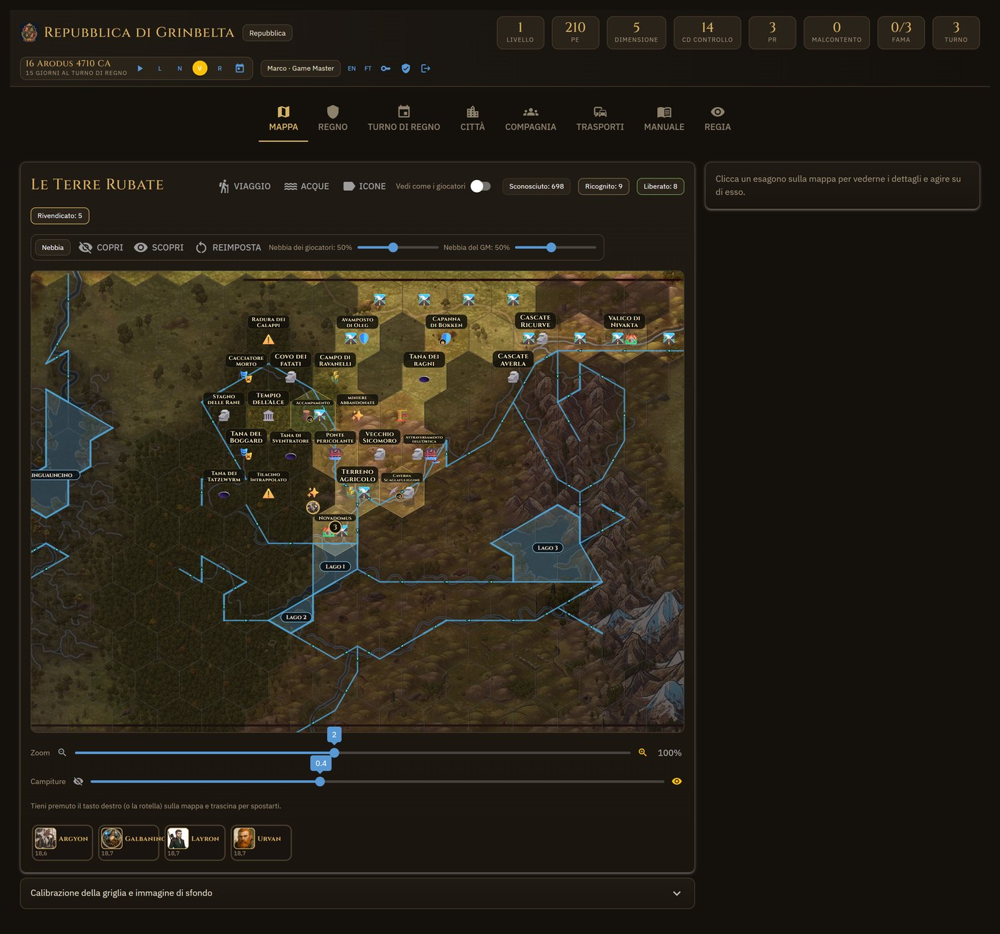
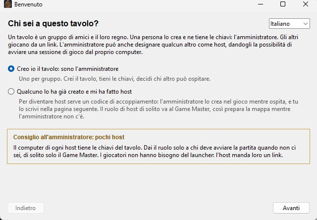
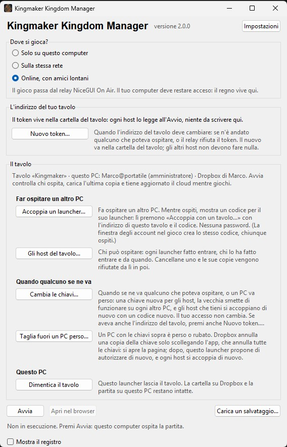

# Kingmaker Kingdom Manager

*Read this in English: [README.md](README.md).*

Un'app web da tenere sul proprio PC per gestire la **parte di costruzione del regno** della
campagna **Kingmaker** di Pathfinder 2e: la scheda del regno, il Turno di Regno con tutte le sue
attività, gli insediamenti costruiti lotto per lotto, e una **mappa a esagoni** su cui il gruppo
esplora, rivendica e viaggia — a piedi e in barca — mentre il Game Master prepara e rivela. Tutti
giocano la stessa partita dal proprio browser; il GM può pubblicarla su internet con un comando.

Esiste perché il sottosistema del regno è tanta contabilità: Dadi Risorsa, Consumo, soglie di
Malcontento, Rovine, quarantanove attività con quattro esiti ciascuna, settantasei strutture,
costi di viaggio fra terreni e fiumi. L'app fa i conti, mostra cosa cambierebbe un tiro, e
**aspetta un clic**: niente si applica in silenzio.



L'interfaccia è in **italiano e in inglese**, e ogni giocatore sceglie la sua lingua dall'intestazione.
I testi delle regole vengono dalla wiki italiana [pf2.altervista.org](https://pf2.altervista.org/wiki/Regni)
e, per l'inglese, dalla fonte ufficiale [Archives of Nethys](https://2e.aonprd.com/).

## Cosa fa

- **Scheda del regno** — caratteristiche e Rovine, le sedici Abilità di Regno con il modificatore
  e il tiro a un clic, i Ruoli di Governo ricoperti da personaggi veri, i talenti, i Prodotti, PR
  e Dadi Risorsa, il Consumo.
- **Turno di Regno** — le quattro fasi con i loro passi, pulsanti dedicati per quelli automatici
  (tirare i Dadi Risorsa, raccogliere dai Siti di Lavoro, pagare il Consumo, controllare gli
  eventi casuali, convertire i PR in PE, salire di livello), e ogni attività come finestra:
  requisiti, costo, CD, i quattro esiti, il tiro, gli effetti proposti da confermare.
- **Città** — la Griglia Urbana come in un city-builder: nove isolati da quattro lotti, il
  catalogo delle strutture filtrato per quello che puoi pagare, sovrappopolamento, macerie,
  confini e la crescita da Villaggio a Metropoli.
- **Mappa** — una griglia esagonale allineata sulla tua immagine. Stato, terreni, elementi,
  strade, terreni agricoli, siti di lavoro; le Attività di Regione tirate dall'esagono; la nebbia;
  i segreti del GM rivelati un esagono o un elemento alla volta.
- **Viaggi** — trascini una freccia come in un gioco di strategia e vedi attività e giorni; la
  strada segue la mano esagono per esagono, i fiumi bloccano o costano secondo ponti e guadi, le
  barche seguono l'acqua disegnata, i gruppi sparsi si ritrovano nel punto migliore. Tutto il
  tavolo vede la freccia che stai tirando.
- **Acque** — fiumi, laghi, ponti, guadi e correnti disegnati sulla mappa, o proposti leggendo
  l'immagine; si scambiano come carta JSON.
- **Compagnia e Trasporti** — personaggi con ritratto e segnalino, veicoli dal catalogo delle
  regole posati sulla mappa, salire e scendere.
- **Il tempo** — il Calendario di Absalom; il GM fa scorrere i giorni e i viaggi avanzano da soli
  finché il mese chiude il Turno di Regno.
- **Account** — ruoli di amministratore, Game Master, giocatore e spettatore; un giocatore non
  riceve mai quello che non conosce.

Altre schermate e la guida completa sono nella [guida utente](docs/it/guida-utente.md)
(in inglese: [docs/user-guide.md](docs/user-guide.md)).

## Scaricare

La via più semplice, senza Python e senza terminale: l'app installata, dall'[ultima
release](https://github.com/MarcoMungaiCoppolino/kingmaker-kingdom-manager/releases/latest).

- **Windows** — `Kingmaker-Kingdom-Manager-<versione>-Setup.exe`. Si installa solo per il tuo
  utente (niente permessi di amministratore), sotto `%LOCALAPPDATA%\Programs` se non scegli
  un'altra cartella, e mette *Kingmaker Kingdom Manager* nel menu Start. Il file non è firmato
  con un certificato a pagamento, quindi la prima volta Windows mostra *PC protetto da
  Windows*: premi **Ulteriori informazioni**, poi **Esegui comunque**. Ogni release porta un
  elenco degli hash dei suoi installer firmato con la chiave dell'autore, e il launcher
  controlla un installer su quell'elenco prima di eseguire un aggiornamento.
- **Linux** — `Kingmaker-Kingdom-Manager-<versione>-linux-x86_64.tar.gz`: scompattalo in una
  cartella dove puoi scrivere e avvia `kingmaker-kingdom-manager`. Serve Ubuntu 22.04 o più
  recente, Debian 12 o più recente, o una distribuzione con glibc 2.35+. Su un desktop non
  serve altro; su un sistema spoglio — un server, un container, WSL — la finestra del launcher
  vuole la libreria X screensaver, che un sistema così di solito non porta con sé:
  `sudo apt install libxss1` (Debian, Ubuntu) o `sudo dnf install libXScrnSaver` (Fedora,
  RHEL).

Quello che si apre è il **launcher**. La prima volta chiede, una pagina per cosa e nella lingua
che scegli nella prima pagina: chi sei al tavolo (l'amministratore, che lo crea, o un host che
qualcuno ha fatto entrare), dove si gioca (questo computer, la stessa rete, online con amici
lontani) e, online, se il tavolo ha un indirizzo fisso, con una guida a immagini al token On
Air gratuito. Poi premi *Avvia* e il gioco si apre nel browser. Il primo avvio mostra la
password dell'amministratore in una finestra; i link da dare ai giocatori hanno un pulsante
*Copia*. Giocavi già, su un
altro PC o dal sorgente? *Carica un salvataggio…* nel launcher, o lo stesso riquadro nella
pagina di creazione del regno, prende lo zip della sua scheda Salvataggio (o il suo
`kingmaker.db`) e riporta tutto, immagini comprese. La partita vive in
`saves\` e `assets\` **dentro la cartella installata**: un aggiornamento sostituisce il programma
e le lascia, e la disinstallazione chiede se cancellare anche loro. Il launcher ti avvisa quando
esce una versione nuova e, su Windows, la scarica per te: è una richiesta a GitHub a ogni
avvio, e le *Impostazioni* la spengono.

**Più PC.** Il launcher può anche spostare l'ospitare tra l'amministratore e i GM che lui fa
entrare, tramite una cartella nel Dropbox gratuito dell'amministratore: chi avvia per primo
ospita, gli altri entrano, la partita segue. L'amministratore lo configura una volta, guidato
da immagini; ogni altro host si accoppia una volta, con un codice che l'amministratore crea
nel gioco e nessuna password. La cartella ha due chiavi, quella dell'amministratore e quella
degli host; ogni launcher firma quello che ci scrive, e il file del tavolo dice di quali
launcher risponde, quindi una chiave rubata legge la cartella ma non può infilarci una copia né
passare per un host. Vedi la [guida utente](docs/it/guida-utente.md).





Per macOS non c'è ancora un installatore: si installa dal sorgente, qui sotto.

## Requisiti (dal sorgente)

- **Python 3.11 o più recente** ([python.org](https://www.python.org/downloads/); su Windows
  spunta *Add python.exe to PATH* nell'installatore).
- Un browser moderno (Chrome, Edge, Firefox, Safari).
- **La tua immagine della mappa.** Con l'app non viene distribuita nessuna mappa: è di Paizo. Usa
  la mappa a esagoni della tua copia dell'Adventure Path, o qualunque mappa a esagoni, in PNG o JPG.
- Facoltativo: [Pillow](https://pypi.org/project/Pillow/), solo per leggere l'acqua dall'immagine.

## Installare dal sorgente

Per chi vuole il codice, o per macOS. Apri un terminale nella cartella in cui vuoi l'app.

**Windows (PowerShell)**

```powershell
git clone https://github.com/MarcoMungaiCoppolino/kingmaker-kingdom-manager.git
cd kingmaker-kingdom-manager
python -m venv .venv
.\.venv\Scripts\python.exe -m pip install -r requirements.txt
```

Su Windows i comandi qui sotto chiamano l'interprete dell'ambiente, `.\.venv\Scripts\python.exe`,
al posto di `python`: non c'è niente da attivare e nessuna impostazione di PowerShell da cambiare
(eseguire `Activate.ps1` è rifiutato dalla politica di esecuzione predefinita).

**macOS / Linux**

```bash
git clone https://github.com/MarcoMungaiCoppolino/kingmaker-kingdom-manager.git
cd kingmaker-kingdom-manager
python3 -m venv .venv
source .venv/bin/activate
pip install -r requirements.txt
```

Senza Git: scarica lo ZIP dal pulsante verde *Code* su GitHub, scompattalo, e dai gli stessi
comandi dalla riga `python -m venv` in poi.

La finestra del launcher dell'app installata c'è anche dal sorgente, con
`python launch.py --launcher`; i comandi qui sotto avviano direttamente il server.

## Primo avvio

```bash
python launch.py
```

(su Windows: `.\.venv\Scripts\python.exe launch.py`, e lo stesso per ogni `python launch.py` qui
sotto.) L'app si apre su <http://127.0.0.1:8080>. Al primissimo avvio crea l'account `admin` e **stampa
nel terminale una password casuale, una volta sola**: appuntala. Al primo accesso ti chiede di
cambiarla; da lì crei gli account dei giocatori (l'icona 👤⚙ accanto al tuo nome, che vede solo
chi amministra).

Poi:

1. **Metti la tua mappa.** Nella scheda *Mappa* apri *Calibrazione della griglia e immagine di
   sfondo* e carica il PNG/JPG (o copialo in `assets/` e scéglilo dall'elenco). Bastano 2000–4000
   px di larghezza: una scansione da 20 MB la scarica ogni giocatore.
2. **Calibra la griglia.** Premi *Adatta la griglia all'immagine*, poi ritocca orientamento,
   raggio e origine con i cursori finché i poligoni coincidono con gli esagoni stampati. Si fa una
   volta sola.
3. **Fonda il regno.** La creazione guidata segue le dieci fasi del manuale.

La partita vive in `saves/kingmaker.db` (un solo file SQLite) e le immagini in `assets/`;
nessuna delle due cartelle è versionata. La scheda **Salvataggio**, per gli amministratori,
scarica entrambe in un solo zip e lo ricarica, su questo PC o su un altro.

## Lingua

Nell'intestazione c'è il pulsante **IT / EN**: cambia l'interfaccia solo per te, e la scelta
resta sul tuo account. La pagina di accesso ha lo stesso pulsante, e un account nuovo prende la
lingua con cui è entrato. Prima che qualcuno scelga vale la lingua del browser, poi quella del
server (`KINGMAKER_LANG`).

I testi delle regole seguono la stessa scelta: quelli italiani vengono da pf2.altervista.org,
quelli inglesi sono trascritti da Archives of Nethys. Il registro del regno resta nella lingua in
cui ogni riga è stata scritta.

## Giocare con gli amici

**Nella stessa stanza, sulla stessa rete:**

```bash
python launch.py --lan
```

e passa loro `http://<il-tuo-ip>:8080`. Lo stato è condiviso: tutti vedono lo stesso regno e gli
aggiornamenti arrivano a ogni browser collegato. Fai girare **una sola** copia dell'app sugli
stessi dati.

**Lontani**, senza aprire porte né affittare niente:

```bash
python launch.py --online
```

[NiceGUI On Air](https://nicegui.io/on_air) pubblica la partita passando da un relè gestito da
Zauberzeug GmbH (Germania), gli autori di NiceGUI; l'indirizzo da passare agli amici compare
nel terminale. Questo PC deve restare acceso, perché il regno vive qui, e il relè vede
l'indirizzo di ogni giocatore e trasporta il traffico in chiaro (vedi
[PRIVACY.it.md](PRIVACY.it.md)). Senza token l'indirizzo cambia a ogni avvio; con un token
gratuito preso sulla stessa pagina resta il tuo (`https://europe.on-air.io/<tuo-nome>/device-0/`):

```bash
python launch.py --online IL-TUO-TOKEN
```

Per non lasciare il token nella cronologia della shell mettilo nella variabile d'ambiente
`KINGMAKER_ON_AIR_TOKEN` e avvia con il solo `--online`. **Leggi le note di sicurezza qui sotto
prima di pubblicare.**

## Impostazioni

Tutto è facoltativo e si legge dall'ambiente (vedi [`.env.example`](.env.example)):

| Variabile | Cosa fa | Predefinito |
|---|---|---|
| `KINGMAKER_DATA_DIR` | dove vive la partita (database, sessioni, copie) | `./saves` |
| `KINGMAKER_ASSETS_DIR` | dove stanno mappa, ritratti e segnalini | `./assets` |
| `KINGMAKER_HOST` | indirizzo di ascolto (`--lan` mette `0.0.0.0`) | `127.0.0.1` |
| `KINGMAKER_PORT` | porta di ascolto (anche `--port`) | `8080` |
| `KINGMAKER_LANG` | lingua predefinita dell'interfaccia, `en` o `it` | `en` |
| `KINGMAKER_STORAGE_SECRET` | la chiave che firma i cookie di sessione | casuale, in `saves/.storage_secret` |
| `KINGMAKER_ON_AIR_TOKEN` | il tuo token On Air per `--online` | — |
| `KINGMAKER_HTTPS` | segna il cookie di sessione *Secure* (solo dietro un proxy HTTPS) | spento |
| `KINGMAKER_TRUST_PROXY` | fidati del primo salto di `X-Forwarded-For` come indirizzo del client | spento |
| `KINGMAKER_LOG` | `INFO` o `DEBUG` | `INFO` |

## Docker

`Dockerfile` e `docker-compose.yml` sono inclusi **senza essere stati provati**: l'autore fa
girare l'app su Windows con `python launch.py` e non ha costruito l'immagine. Sono un punto di
partenza per chi vuole ospitarla da sé, non un modo supportato di avviarla. `docker compose up`
dovrebbe servire l'app sulla porta 8080 con la partita in `./saves` e le immagini in `./assets`.

## Dove ospitarla e sicurezza

- **Sul tuo PC, per il tuo tavolo** (`launch.py`, `--lan`): è quello per cui l'app è stata
  scritta e provata.
- **On Air**: comodo, ma il traffico passa in chiaro da un relè di terzi, che potrebbe leggerlo.
  Va bene per una partita, non per qualcosa che chiameresti un segreto.
- **Un server affittato**: possibile, e non provato dall'autore. Metti davanti un reverse proxy
  con HTTPS (Caddy, nginx), imposta `KINGMAKER_HTTPS=1` e `KINGMAKER_TRUST_PROXY=1`, tieni
  `saves/` fuori dalla radice web e passa la chiave di sessione con la variabile d'ambiente
  invece che copiando la cartella.

Le password non sono salvate: solo un'impronta PBKDF2-HMAC-SHA256 con sale, nel tuo database.
Non esiste nessun account presso servizi esterni. I file caricati vengono controllati come
immagini vere e rinominati; la cartella `/assets` si serve solo a chi è entrato. I giocatori
ricevono solo gli esagoni che conoscono: il filtro è nel server, non nella pagina. Un account
può chiedere un codice usa e getta dal telefono dopo la password. Gli installer sono firmati
con la chiave offline dell'autore, e il launcher rifiuta quello che non verifica.

## Privacy e dati

L'autore non gestisce nessun servizio e non riceve niente: nessun account, nessuna statistica,
nessun rapporto di errore. Tutto vive in `saves/` e `assets/` dell'host: gli account (nome
utente, impronta della password con sale, ruolo, lingua, ultimo accesso), la partita, il diario
con il nome utente di chi ha agito, le immagini caricate, e l'unico cookie, la sessione firmata
che ti tiene collegato. Su questo PC o sulla LAN niente esce dalla macchina: pagine, script e
caratteri li serve tutti l'host. Online, il relè On Air vede gli indirizzi dei giocatori e il
traffico; con il cloud, copie dell'intera partita (impronte delle password comprese) e un record
con il nome utente e il nome del computer dell'host vanno nel Dropbox dell'amministratore,
ognuno firmato dal launcher che lo ha scritto, e la cartella elenca i launcher fatti entrare
con una chiave pubblica che ognuno crea da sé; il launcher chiede a GitHub una versione nuova
all'avvio, se non gli si dice di no. Chi ospita
detiene i dati dei giocatori e ne risponde. L'informativa completa è
[PRIVACY.it.md](PRIVACY.it.md), e ogni giocatore la legge nell'app sotto *Manuale → Privacy e
licenze*. Cosa l'app protegge e cosa no è in [SECURITY.md](SECURITY.md).

## Prove

```bash
python tests/run_all.py
```

costruisce una scena da zero in `tests/scene/` (senza toccare `saves/`) e lancia tutta la suite —
circa 1.360 asserzioni in 49 file. `python tools/check_i18n.py`, `check_texts.py`,
`check_data.py` e `check_names.py` sono i quattro controlli di coerenza (cataloghi completi,
nessuna etichetta scritta fuori dai cataloghi, stessa forma dei dati nelle due lingue, nessun
nome indefinito); la suite lancia i primi tre. Due banchi nel
browser in `tests/benches/` confrontano l'aritmetica del righello nel browser con quella del server.

## Struttura del progetto

```
launch.py              avvio dell'app (locale, --lan, --online, --launcher)
launch_test.py         l'app su una copia dei dati, sulla porta 8081
kingmaker/             il pacchetto, una cartella per strato
  main.py              le pagine, l'intestazione, il Manuale in app
  cli.py               la riga di comando condivisa da launch.py e dall'app installata
  config.py            percorsi, porta e rete dall'ambiente
  launcher/            la finestra che avvia e ferma il server
  state.py             il regno in memoria e le statistiche derivate
  rules/               le regole: il caricatore (rules/__init__.py), il calendario,
                       le meccaniche in data/*.json e i testi in data/lang/{en,it}/
  locale/              ciò che dipende da chi guarda: i18n.py e i cataloghi lang/{en,it}.json,
                       units.py (metri o piedi)
  geometry/            geometria pura: hexgrid, sections (le facce), atoms, waterways (la rete)
  water/               l'acqua come il GM la disegna o la importa: reading.py, chart.py
  travel/              i viaggi: costi, cammini, piani, ritrovi, rotte (travel/__init__.py),
                       il giorno che passa (daily.py)
  storage/             SQLite: archive.py (schema e query), migrations.py, legacy_names.py
  access/              chi sei e cosa vedi: auth.py, permissions.py, view.py
  media/               immagini caricate e miniature: images.py, imgsize.py
  ui/                  l'interfaccia
    theme.py login.py badges.py icons.py   la cornice: CSS, finestre, bus di aggiornamento, intestazione, accesso
    tabs/              un modulo per scheda: sheet, turn, city, creation, party, transport,
                       clock, gm_screen
    hexmap/            la mappa, nove moduli dietro una facciata (hexmap/__init__.py)
    static/            i quattro script del browser (righello, gomma, corrente, scorrimento)
packaging/             l'app installata: spec PyInstaller, script Inno Setup, build.py, icona
.github/workflows/     le prove a ogni push; gli installatori a ogni tag di versione
tests/                 la suite, la scena costruita da zero, i banchi, le fixture
tools/                 i quattro controlli e gli strumenti una tantum della 1.0.0
docs/                  guida utente, manuale del codice, il modello dell'acqua, il diario
```

Il **manuale del codice** — com'è fatta l'app, modulo per modulo — è in
[`docs/manual/README.md`](docs/manual/README.md); il racconto del modello dell'acqua e dei
viaggi, con le misure, in [capitolo 9 del manuale](docs/manual/09-water-travel.md); cosa è cambiato
e perché in [`CHANGELOG.md`](CHANGELOG.md) e [`docs/devlog.md`](docs/devlog.md). Sono in inglese;
la guida utente è anche in italiano: [`docs/it/guida-utente.md`](docs/it/guida-utente.md).

## Licenza e crediti

Il programma è rilasciato con [licenza MIT](LICENSE). Le regole del gioco sono Open Game Content
usato secondo la [Open Game License v1.0a](OPEN_GAME_LICENSE.md), e i nomi e l'ambientazione di
Pathfinder e Kingmaker compaiono secondo la Community Use Policy di Paizo: [NOTICE.md](NOTICE.md)
dice cosa ricade sotto cosa. Questo progetto non è pubblicato, approvato né avallato da Paizo
Inc., ed è gratuito.

I testi italiani delle regole vengono da [pf2.altervista.org](https://pf2.altervista.org/wiki/Regni),
quelli inglesi da [Archives of Nethys](https://2e.aonprd.com/). Costruito con
[NiceGUI](https://nicegui.io/). I caratteri — Cinzel, IBM Plex Sans, Press Start 2P — sono
inclusi sotto SIL Open Font License. L'app installata porta con sé le licenze di tutto ciò che
include in `THIRD_PARTY_LICENSES.txt`, accanto al programma; dal sorgente,
`python packaging/third_party.py` scrive lo stesso file per il tuo ambiente.
