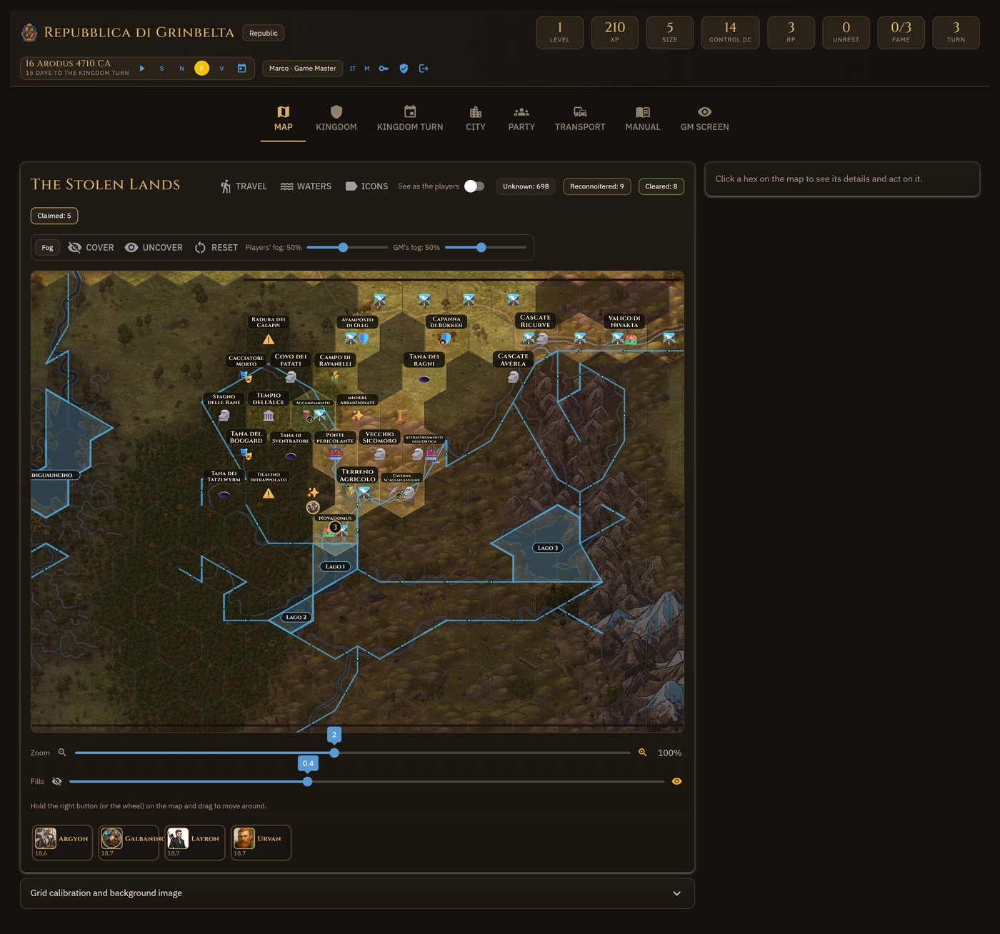

# Kingmaker Kingdom Manager

*Leggi questo documento in italiano: [README.it.md](README.it.md).*

A self-hosted web app for running the **kingdom-building part of Pathfinder 2e's Kingmaker
Adventure Path** at the table: the kingdom sheet, the Kingdom Turn with all its activities, the
settlements built lot by lot, and a **hex map** on which the party explores, claims, and travels
— on foot and by boat — while the Game Master prepares and reveals. Everyone plays the same game
from their own browser; the GM can publish it on the internet in one command.

It exists because the kingdom subsystem is a lot of bookkeeping: Resource Dice, Consumption,
Unrest thresholds, Ruin, forty-nine activities with four outcomes each, seventy-six structures,
travel costs across terrain and rivers. The app does the arithmetic, shows what a roll would
change, and **waits for a click**: nothing is applied in silence.



The interface is in **English and Italian**, and every player picks their own language from the
header. The rules texts come from the official English source, [Archives of Nethys](https://2e.aonprd.com/),
and from the Italian wiki [pf2.altervista.org](https://pf2.altervista.org/wiki/Regni).

## What it does

- **Kingdom sheet** — abilities and Ruins, the sixteen Kingdom skills with their modifiers and
  one-click rolls, Leadership Roles held by real characters, feats, Commodities, RP and Resource
  Dice, Consumption.
- **Kingdom Turn** — the four phases with their steps, dedicated buttons for the automatic ones
  (roll the Resource Dice, collect from Work Sites, pay Consumption, check for random events,
  convert RP into XP, level up), and every activity as a dialog: requirements, cost, DC, the four
  outcomes, the roll, and the effects proposed for confirmation.
- **City** — the Urban Grid as a city-builder: nine blocks of four lots, the catalogue of
  structures filtered by what you can afford, overcrowding, rubble, borders, and the growth from
  Village to Metropolis.
- **Map** — a hex grid aligned over your own map image. Hex status, terrain, features, roads,
  farmland, work sites; the Region activities rolled straight from the hex; fog of war; the GM's
  secrets revealed one hex or one feature at a time.
- **Travel** — drag an arrow as in a strategy game and see activities and days; the road follows
  your hand hex by hex, rivers block or cost according to bridges and fords, boats follow the
  drawn water, scattered parties meet at the best rendezvous. Everyone at the table sees the
  arrow you are drawing.
- **Water** — rivers, lakes, bridges, fords and currents drawn on the map, or proposed by reading
  the map image; exchangeable as a JSON chart.
- **Party and Transport** — characters with portraits and tokens, vehicles from the rules
  catalogue placed on the map, boarding and disembarking.
- **Time** — the Absalom Reckoning calendar; the GM lets the days pass and journeys advance on
  their own until the month closes the Kingdom Turn.
- **Accounts** — administrator, Game Master, player and spectator roles; players never receive
  what they do not know.

More screenshots and the full walkthrough are in the [user guide](docs/user-guide.md).

## Download

The easiest way, no Python and no terminal: the installed app, from the
[latest release](https://github.com/MarcoMungaiCoppolino/kingmaker-kingdom-manager/releases/latest).

- **Windows** — `Kingmaker-Kingdom-Manager-<version>-Setup.exe`. It installs for your user
  only (no administrator rights), under `%LOCALAPPDATA%\Programs` unless you choose another
  folder, and puts a *Kingmaker Kingdom Manager* entry in the Start menu. The file is not
  signed with a paid certificate, so Windows shows *Windows protected your PC* the first time:
  click **More info**, then **Run anyway**.
- **Linux** — `Kingmaker-Kingdom-Manager-<version>-linux-x86_64.tar.gz`: extract it anywhere
  you can write to and run `kingmaker-kingdom-manager`. Needs Ubuntu 22.04 or newer, Debian 12
  or newer, or any distribution with glibc 2.35+. On a desktop nothing else is needed; on a
  bare system — a server, a container, WSL — the launcher window wants the X screensaver
  library, which such a system usually does not carry: `sudo apt install libxss1` (Debian,
  Ubuntu) or `sudo dnf install libXScrnSaver` (Fedora, RHEL).

What opens is the **launcher**: choose where you play (this computer, the same network, online
with distant friends), press *Start*, and the game opens in your browser. The first time it
shows the administrator's password in a dialog; the links to give the players have a *Copy*
button; *Online* has a field for your On Air token and the steps to get one. Played before,
on another PC or from source? *Load a save file…* in the launcher, or the same box on the
kingdom creation page, takes the zip from its Save tab (or its `kingmaker.db`) and brings
everything back, images included. Your game lives in
`saves\` and `assets\` **inside the installed folder**: an update replaces the program and
leaves them, and the uninstaller asks whether to delete them too. The launcher tells you when a
new version is out and, on Windows, downloads it for you: that is one request to GitHub at
every start, and *Settings* can switch it off.

**Several PCs.** The launcher can also move the hosting between the administrator and the
GMs marked *Can host*, through a folder in the administrator's free Dropbox: whoever starts
first hosts, the others join, the game follows. The administrator sets it up once, guided by
pictures; the other hosts type their account once. See the [user guide](docs/user-guide.md).


macOS has no installer yet: install from source, below.

## Requirements (from source)

- **Python 3.11 or newer** ([python.org](https://www.python.org/downloads/); on Windows tick
  *Add python.exe to PATH* in the installer).
- A modern browser (Chrome, Edge, Firefox, Safari).
- **Your own map image.** No map is distributed with the app: it is Paizo's. Use the hex map from
  your copy of the Kingmaker Adventure Path, or any hex map, as a PNG or JPG.
- Optional: [Pillow](https://pypi.org/project/Pillow/), only for reading the water from the map
  image.

## Install from source

For whoever wants the code, or macOS. Open a terminal in the folder where you want the app.

**Windows (PowerShell)**

```powershell
git clone https://github.com/MarcoMungaiCoppolino/kingmaker-kingdom-manager.git
cd kingmaker-kingdom-manager
python -m venv .venv
.\.venv\Scripts\python.exe -m pip install -r requirements.txt
```

On Windows the commands below call the environment's own interpreter,
`.\.venv\Scripts\python.exe`, in place of `python`: nothing has to be activated, and no
PowerShell setting has to change (running `Activate.ps1` is refused by the default execution
policy).

**macOS / Linux**

```bash
git clone https://github.com/MarcoMungaiCoppolino/kingmaker-kingdom-manager.git
cd kingmaker-kingdom-manager
python3 -m venv .venv
source .venv/bin/activate
pip install -r requirements.txt
```

No Git? Download the ZIP from the green *Code* button on GitHub, unpack it, and run the same
commands from the `python -m venv` line on.

The launcher window of the installed app is available from source too, with
`python launch.py --launcher`; the commands below run the server directly.

## First run

```bash
python launch.py
```

(on Windows: `.\.venv\Scripts\python.exe launch.py`, and the same for every `python launch.py`
below.) The app opens at <http://127.0.0.1:8080>. On the very first start it creates the `admin` account
and **prints a random password in the terminal, once**: write it down. At the first login you
are asked to change it; from there you create the accounts of the players (the 👤⚙ icon next to
your name in the header, visible only to administrators).

Then:

1. **Add your map.** In the *Map* tab open *Grid calibration and background image* and upload
   your PNG/JPG (or copy it into `assets/` and pick it from the list). A 2000–4000 px wide image
   is plenty; a 20 MB scan has to be downloaded by every player.
2. **Calibrate the grid.** Press *Fit the grid to the image*, then adjust orientation, radius and
   origin with the sliders until the polygons match the printed hexes. It is done once.
3. **Found the kingdom.** The guided creation walks through the ten steps of the rules.

Your game lives in `saves/kingmaker.db` (a single SQLite file) and the images in `assets/`;
neither folder is versioned. The **Save** tab, for administrators, downloads both as one zip
and loads it back, on this PC or another.

## Language

The header has an **IT / EN** button: it switches the interface for you only, and the choice is
remembered on your account. The login page has the same button, and a new account adopts the
language it signed in with. Before anyone chooses, the browser's language is used, then the
server's default (`KINGMAKER_LANG`).

Rules texts follow the same choice: the English ones are transcribed from Archives of Nethys,
the Italian ones from pf2.altervista.org. The kingdom journal stays in the language each line
was written in.

## Playing with friends

**Same room, same network:**

```bash
python launch.py --lan
```

and give them `http://<your-ip>:8080`. The state is shared: everyone sees the same kingdom and
the updates reach every open browser. Run **one** copy of the app on the same data.

**Far away**, without opening ports or renting anything:

```bash
python launch.py --online
```

[NiceGUI On Air](https://nicegui.io/on_air) publishes the game through a relay run by
Zauberzeug GmbH (Germany), the makers of NiceGUI; the address to share appears in the
terminal. Your PC must stay on, because the kingdom lives there, and the relay sees every
player's address and carries the traffic in the clear (see [PRIVACY.md](PRIVACY.md)). Without a token the address changes at every start; with a free token from
the same page it stays yours (`https://europe.on-air.io/<your-name>/device-0/`):

```bash
python launch.py --online YOUR-TOKEN
```

To keep the token out of the shell history, put it in the `KINGMAKER_ON_AIR_TOKEN` environment
variable and start with `--online` alone. **Read the security notes below before publishing.**

## Settings

Everything is optional and read from the environment (see [`.env.example`](.env.example)):

| Variable | What it does | Default |
|---|---|---|
| `KINGMAKER_DATA_DIR` | where the game (database, sessions, backups) lives | `./saves` |
| `KINGMAKER_ASSETS_DIR` | where the map image, portraits and tokens live | `./assets` |
| `KINGMAKER_HOST` | address to listen on (`--lan` sets `0.0.0.0`) | `127.0.0.1` |
| `KINGMAKER_PORT` | port to listen on (`--port` too) | `8080` |
| `KINGMAKER_LANG` | default interface language, `en` or `it` | `en` |
| `KINGMAKER_STORAGE_SECRET` | the key that signs session cookies | random, kept in `saves/.storage_secret` |
| `KINGMAKER_ON_AIR_TOKEN` | your On Air token for `--online` | — |
| `KINGMAKER_HTTPS` | mark the session cookie *Secure* (behind an HTTPS proxy only) | off |
| `KINGMAKER_TRUST_PROXY` | trust the first `X-Forwarded-For` hop as the client address | off |
| `KINGMAKER_LOG` | `INFO` or `DEBUG` | `INFO` |

## Docker

A `Dockerfile` and a `docker-compose.yml` are included **untested**: the author runs the app on
Windows with `python launch.py` and has not built the image. They are a starting point for
whoever self-hosts, not a supported way to run the app. `docker compose up` should serve the app
on port 8080 with the game in `./saves` and the images in `./assets`.

## Hosting and security

- **On your PC, for your table** (`launch.py`, `--lan`): this is what the app was written and
  tested for.
- **On Air**: convenient, but the traffic goes through a third-party relay and reaches it in the
  clear; the relay operator could read it. Fine for a game of make-believe, not for anything
  you would call a secret.
- **A rented server**: possible, and untested by the author. Put a reverse proxy with HTTPS in
  front (Caddy, nginx), set `KINGMAKER_HTTPS=1` and `KINGMAKER_TRUST_PROXY=1`, keep the
  `saves/` folder out of the web root, and pass the storage secret through the environment
  rather than by copying the folder.

Passwords are never stored: only a salted PBKDF2-HMAC-SHA256 hash, in your own database. There
is no account with any external service. Uploads are checked to be real images and renamed;
the `/assets` folder is served only to signed-in users. Players receive only the hexes they
know: the filter is on the server, not in the page.

## Privacy and data

The author runs no service and receives nothing: no account, no statistics, no crash reports.
Everything lives in the host's `saves/` and `assets/`: the accounts (username, salted password
hash, role, language, last login), the game, the journal with the username of whoever acted,
the uploaded images, and the one cookie, the signed session that keeps you logged in. On this
PC or on the LAN nothing leaves the machine — pages, scripts and typefaces are all served by
the host. Online, the On Air relay sees the players' addresses and the traffic; with the cloud,
copies of the whole game (password hashes included) and a record with the host's username and
computer name go to the administrator's Dropbox; the launcher asks GitHub for a newer version
at start unless told not to. Whoever hosts holds the players' data and answers for it. The
whole notice is [PRIVACY.md](PRIVACY.md), and every player can read it in the app under
*Manual → Privacy & licences*. What the app protects and what it does not is in
[SECURITY.md](SECURITY.md).

## Tests

```bash
python tests/run_all.py
```

builds a test scene from scratch in `tests/scene/` (never touching `saves/`) and runs the whole
suite — some 1,360 assertions in 49 files. `python tools/check_i18n.py`, `check_texts.py`,
`check_data.py` and `check_names.py` are the four consistency checks (catalogs complete, no
label written outside the catalogs, both languages with the same data shape, no undefined
name); the suite runs the first three. Two browser benches in
`tests/benches/` compare the ruler's arithmetic in the browser with the server's.

## Project layout

```
launch.py              start the app (local, --lan, --online, --launcher)
launch_test.py         the app on a copy of the data, on port 8081
kingmaker/             the package, one folder per layer
  main.py              the pages, the header, the in-app Manual
  cli.py               the command line shared by launch.py and the installed app
  config.py            paths, port and network from the environment
  launcher/            the window that starts and stops the server
  state.py             the kingdom in memory and the derived statistics
  rules/               the game rules: the loader (rules/__init__.py), the calendar,
                       the mechanics in data/*.json and the texts in data/lang/{en,it}/
  locale/              what depends on the viewer: i18n.py and the catalogs lang/{en,it}.json,
                       units.py (metres or feet)
  geometry/            pure geometry: hexgrid, sections (faces), atoms, waterways (the network)
  water/               the water as the GM draws or imports it: reading.py, chart.py
  travel/              journeys: costs, paths, plans, rendezvous, routes (travel/__init__.py),
                       the day that passes (daily.py)
  storage/             SQLite: archive.py (schema and queries), migrations.py, legacy_names.py
  access/              who you are and what you see: auth.py, permissions.py, view.py
  media/               uploaded images and thumbnails: images.py, imgsize.py
  ui/                  the interface
    theme.py login.py badges.py icons.py   the shell: CSS, windows, refresh bus, header, login
    tabs/              one module per tab: sheet, turn, city, creation, party, transport,
                       clock, gm_screen
    hexmap/            the map, nine modules behind a facade (hexmap/__init__.py)
    static/            the four browser scripts (travel ruler, water eraser, current, scroll)
packaging/             the installed app: PyInstaller spec, Inno Setup script, build.py, icon
.github/workflows/     the tests on every push; the installers on every version tag
tests/                 the suite, the scene built from scratch, the benches, the fixtures
tools/                 the four checkers and the one-off tools of the 1.0.0 release
docs/                  the user guide, the code manual, the water model, the devlog
```

The **code manual** — how the app is built, module by module — is in
[`docs/manual/README.md`](docs/manual/README.md); the story of the water and travel model, with
its measurements, in [chapter 9 of the manual](docs/manual/09-water-travel.md); what changed and
why in [`CHANGELOG.md`](CHANGELOG.md) and [`docs/devlog.md`](docs/devlog.md).

## Licence and credits

The program is released under the [MIT licence](LICENSE). The game rules are Open Game Content
used under the [Open Game License v1.0a](OPEN_GAME_LICENSE.md), and the Pathfinder and Kingmaker
names and setting appear under Paizo's Community Use Policy: see [NOTICE.md](NOTICE.md) for
what falls under which. This project is not published, endorsed, or specifically approved by
Paizo Inc., and it is free of charge.

The English rules texts are transcribed from [Archives of Nethys](https://2e.aonprd.com/), the
Italian ones from [pf2.altervista.org](https://pf2.altervista.org/wiki/Regni). Built with
[NiceGUI](https://nicegui.io/). The typefaces — Cinzel, IBM Plex Sans, Press Start 2P — are
shipped under the SIL Open Font License. The installed app carries the licences of everything
it bundles in `THIRD_PARTY_LICENSES.txt`, next to the program; from source,
`python packaging/third_party.py` writes the same file for your environment.
