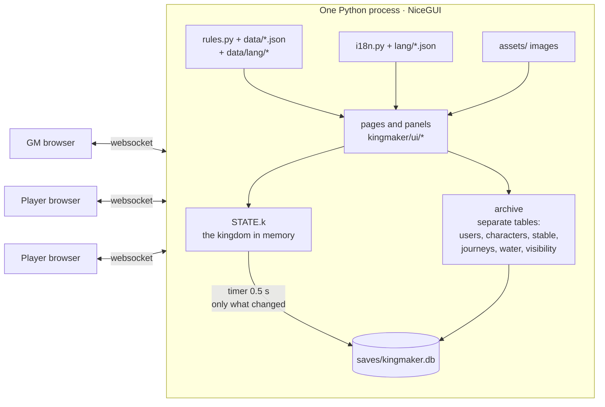
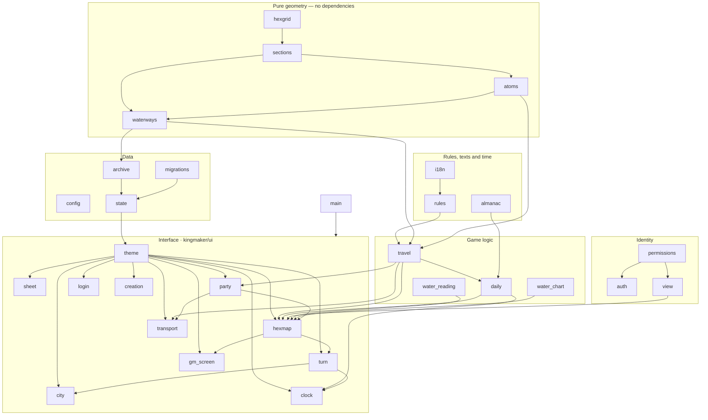

# 1. Overview

## What it is

A table manager for the **Kingmaker** campaign of Pathfinder 2e: the kingdom sheet, the Kingdom
Turn with its activities, the settlements built lot by lot, and a **hex map** on which the party
explores, claims, travels — on foot and by boat — while the GM prepares and reveals. Everyone
plays the same game from different browsers, each in their own language; the GM can publish it
on the internet with NiceGUI On Air.

## How it runs

One Python process, one kingdom. **NiceGUI** (3.16, the only required dependency) serves the
pages and keeps a websocket open per window; the kingdom lives in memory in `STATE.k` and is
written to **SQLite** by a timer. There is no separate frontend: the interface is Python, and in
the browser run only four scripts for the gestures that must follow the mouse without a round
trip to the server (dragging the travel arrow, passing the eraser, following a river with the
finger, panning the map).



Three data sources, with three different life cycles:

| Source | What it holds | Who writes it |
|---|---|---|
| `kingmaker/rules/data/*.json`, `rules/data/lang/<code>/*.json` | The rules: activities, structures, feats, vehicles, calendar, terrains, travel — mechanics in one file, texts per language in the other | Nobody at runtime: game data, versioned |
| `saves/kingmaker.db` | The game: kingdom, hexes, users, characters, vehicles, journeys, water, who sees what | `archive.py`, and only it |
| `assets/` | The map image, uploaded portraits and tokens, with their thumbnails | `media/images.py` |

## The modules and who imports whom

The graph is **layered** and reads from the bottom: the geometry knows nothing about the
database, the database knows nothing about the interface. The `ui/hexmap/` package (facade
`hexmap/__init__.py`) imports everything — it is also the largest (≈9,800 lines).



One line per module, in the order it pays to meet them:

| Module | Lines | What it does |
|---|---|---|
| `config.py` | ≈100 | Paths (`DATA_DIR`, `ASSETS_DIR`, `DB_FILE`), port, default language, the cookie key |
| `locale/i18n.py` `units.py` | ≈150 | `t()`, `tn()`, `t_in()`: the interface texts from `locale/lang/<code>.json`, the language of the window being drawn |
| `rules/__init__.py` | ≈450 | Loads the mechanics and the texts per language, indexes by id (`BY_ID`), rolls dice, degrees of success, effect labels; every table is a `View` that answers in the viewer's language |
| `rules/almanac.py` | ≈150 | The Absalom Reckoning calendar: dates, months of different lengths, leap years |
| `geometry/hexgrid.py` | ≈340 | The grid: centers, corners, neighbours, pixel→hex, the ring of vertices |
| `geometry/sections.py` | ≈820 | The **faces** water divides a hex into, computed from the drawn segments |
| `geometry/atoms.py` | ≈580 | The hex as **24 fixed pieces**, 36 sides, 19 junctions; the graph the water closes |
| `geometry/waterways.py` | ≈710 | The **network** a boat sails: junctions and atom sides over the drawn water |
| `storage/archive.py` | ≈1,600 | The SQLite schema and every query; rewrites only the rows that changed |
| `storage/migrations.py` `legacy_names.py` | ≈900 | Brings old data to today's model (bank indices → points, crossings → points, JSON → DB, the Italian → English rename of schema 27) |
| `state.py` | ≈730 | `State`: the kingdom document, the derived statistics (DC, consumption, size), the effects |
| `access/auth.py` `permissions.py` `view.py` | ≈550 | Who you are, what you may do, what you see |
| `travel/__init__.py` | ≈2,700 | Costs, categories, Dijkstra on cut hexes, the atom count, the plan, the rendezvous, river routes |
| `travel/daily.py` | ≈280 | A day passes: journeys advance leg by leg, the month ends |
| `water/reading.py` `chart.py` | ≈840 | Reading the water from the image (a proposal, never applied by itself); exchanging it as a JSON file |
| `media/images.py` `imgsize.py` | ≈260 | Safe uploads, thumbnails, sizes from the header bytes alone |
| `ui/theme.py` | ≈650 | CSS, injected scripts, `esc`, dialogs, per-window identity and language, **the refresh bus** and the deferred save |
| `main.py` | ≈340 | The `/` route, the header, the tabs, the in-app Manual, startup |
| `ui/hexmap/` | ≈9,800 | The map, in nine modules (chapter 6) and a facade that re-exports everything |
| `ui/tabs/sheet.py` `turn.py` `city.py` `creation.py` | ≈2,550 | Kingdom sheet, Kingdom Turn, Urban Grid, guided creation |
| `ui/tabs/party.py` `transport.py` | ≈1,050 | Characters and vehicles |
| `ui/tabs/clock.py` `gm_screen.py` `login.py` | ≈750 | Time passing, the GM screen, login, accounts and the language toggle |
| `ui/static/*.js` | ≈1,850 | The travel ruler, the water eraser, the current guide, the map scroll |

## The concepts in one table

When a name appears in the code it always means the same thing:

| Word | Meaning | Where it lives |
|---|---|---|
| hex, `(col, row)` | a cell of the grid; key `"col,row"` in `STATE.k["hexes"]` | `state.hex`, table `hexes` |
| border | the water **between** two hexes (`water`, `ford`, `bridge`) | table `borders` |
| banks / `points` | the water segments drawn **inside** a hex, and the sides grouped by bank | table `banks` |
| section, face, shore | a piece of hex the water separates; numbered by recomputing it, never saved | `sections.faces_of`, `archive.campaign_sections` |
| atom | one of the 24 fixed pieces of the hex | `atoms.atoms` |
| junction, node | a point where water lines meet; where a boat sits | `waterways` (`("v"…)`, `("c"…)`, `("x"…)`) |
| spot, `pos_x/pos_y` | the point **inside** the hex where a marker or a vehicle sits, in radii from the center | `characters`, `stable`, `journeys` |
| cell (ruler) | one entry of the field sent to the browser: a hex+shore on foot, a junction by boat | `hexmap.travel_field`, `route_field` |
| waypoint, leg, journey | a hex one enters; a piece of journey with its people; the saved journey | `travel.Waypoint`, `journeys.legs` |
| window | a connected browser: its own panels, choices and language, not the kingdom's | `theme.window_state`, `hexmap._mine` |

## Starting, in short

```bash
python launch.py                # http://127.0.0.1:8080, opens the browser
python launch.py --lan          # reachable from the local network
python launch.py --online       # NiceGUI On Air, token from KINGMAKER_ON_AIR_TOKEN
python launch.py --launcher     # the launcher window of the installed app, from source
```

On the first start `main._first_start` creates the `admin` account and prints the password in
the console, once (the launcher shows it in a dialog). To try things without touching the
game: chapter 11. The installed app, its launcher and how it is built: chapter 12.
