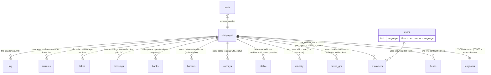

# 2. Data and saving

## Two ways of being on disk

The kingdom is **one document** (`STATE.k`, a dictionary) plus **real tables** for the things
that are queried one by one. The split is deliberate (`storage/archive.py`, module docstring): the forty
odd keys of the kingdom sheet need no query, the hexes do — the fog, the travel and the GM
screen ask «this hex» dozens of times per redraw.



`SCHEMA` in `storage/archive.py` creates everything with `CREATE TABLE IF NOT EXISTS`; every table
carries a comment saying **why** it exists in that shape. They are worth reading: they are the
design decisions written next to the data.

### The document: `STATE.k`

`state.new_kingdom()` is the schema of the document — the full list of keys with their starting
values. The most important:

| Key | Content |
|---|---|
| `created`, `name`, `level`, `xp`, `turn`, `rp`, `unrest`, `fame_points` | the sheet |
| `abilities`, `proficiencies`, `roles`, `feats`, `ruins`, `commodities` | the tables of the sheet |
| `roles[rid]` = `{name, character_id, pc, invested, absent}` | a role may point at a character (table) or a written name (NPC) |
| `modifiers`, `turn_activities`, `milestones` | the state of the turn |
| `hexes` | `{"col,row": {...}}` — in memory, but on disk it is the `hexes` table |
| `settlements` | the Urban Grid of every city: `grids[g][block][lot]`, structures by id |
| `map` | image, orientation, `size`, `origin_x/y`, `columns/rows`, `image_width/image_height`, zoom, veil, fog |
| `clock` | start date, days passed, clock running, seconds per day |
| `waters` | whether the table uses the water model (`hexmap.waters_active`) |

The journal is not in the document: it is the `log` table (`STATE.record`, `STATE.journal`);
the `journal_into_table` migration moved the old rows once.

A hex (`state.hex(col, row)` creates it at the first touch) has `status` (unknown |
reconnoitered | cleared | claimed), `terrains`, `features`, `roads`, `fortified`, `farmland`,
`work_site`, `settlement`, `name`, `note`. The table columns are `HEX_COLUMNS`; a new key ends
up in `extra` (JSON) without touching the schema.

## The life cycle

```mermaid
sequenceDiagram
    participant Start
    participant STATE
    participant migrations
    participant archive
    participant UI
    participant timer as theme._maintenance (0.5 s)

    Start->>archive: Archive(): schema, upgrade_storage_v27 if the save is older (backup first)
    Start->>STATE: State() → load()
    STATE->>migrations: import_json (only if the DB is empty and regno.json exists)
    STATE->>archive: read(campaign) → document + hexes
    STATE->>migrations: normalize, unify_fields, ensure_characters, ensure_visibility, water_on_edge, renumber_sections, marker_spots, crossings_on_point
    Note over STATE: from here STATE.k is the kingdom
    UI->>STATE: edits STATE.k
    UI->>timer: theme.mark_dirty() / save_and_refresh()
    timer->>archive: write(campaign, k) at most every 2 s
    archive->>archive: serialise; rewrites ONLY the changed document/hexes
```

The points that are not seen but count:

- **`archive.write` is differential**: it keeps the last written version of document and hexes
  (`_remember_written`) and rewrites only what differs. Serialising the document at every
  `write` still costs, but happens outside the lock.
- **The separate tables are written at once**: `update_character`, `set_border`,
  `create_journey`… commit right there. Only the document and the hexes go through the timer.
  Hence a practical rule: after an `update_character` whoever reads `STATE.characters()` sees
  the new value (it is a query), but a panel keeping a copy in hand does not.
- **`_rev`**: `theme.mark_dirty` (so every `save_*`) increments `STATE.k["_rev"]` at every
  change; together with `archive.rev` (which rises at every `_commit`) it is the key of the
  copies the map keeps (view, sections, network, SVG layers, the ruler field); it ends up in
  the `kingdoms.rev` column.
- **A single lock** (`threading.RLock`) protects the connection: the timer writes from one
  callback, the pages from another.
- **WAL**: `PRAGMA journal_mode=WAL`, so a copy of the file for the tests is made by copying
  `.db` and `.db-wal` together.

## The migrations: three levels

1. **Added columns** — `Archive.ADDED_COLUMNS`: `(version, table, definition)`.
   `_add_missing_columns` runs on every database and adds only what is missing, so a fresh
   database and a migrated one end up with the same columns.
2. **Rebuilt tables** — `TABLES_REBUILT`: when a table changes shape it is renamed into a stash
   (`_stash_tables`) and `migrations.py` translates it once the kingdom is in memory (it needs
   the map geometry, which the archive does not have). Example: `crossings_on_point`.
3. **Kingdom data** — the functions of `migrations.py` called by `State.load`: idempotent, run
   at every start, do something only if they find the old format.

**Schema 27 — the English rename.** Release 1.0.0 renamed every table, column, document key
and stored enum value from Italian to English. `migrations.upgrade_storage_v27` does it on a
save older than 27, after `Archive.__init__` has checkpointed the WAL and copied the file to
`kingmaker.db.pre-v27.bak`: tables via `RENAMED_TABLES`, columns via `RENAMED_COLUMNS`,
document keys and values via `translate_document` with the maps in `legacy_names.py`
(`DOCUMENT_KEYS`, `HEX_STATUS`, `TERRAINS`, `FEATURE_KINDS`, the ids of abilities, skills,
activities, …). `is_legacy_document` recognises an old JSON export and the same translation is
applied on import. `rename_asset_folders` renames `assets/personaggi` → `characters`,
`veicoli` → `vehicles`, `miniature` → `thumbnails` at the first start. `tests/test_migration_v27.py`
drives it on `tests/fixtures/v26.db`.

`SCHEMA_VERSION` (30: schema 27, plus `users.units` in 28, `users.can_host` in 29, and
`users.totp_secret` with `users.recovery_codes` in 30, the second factor) is
written in `meta`. Adding a column: one row in `ADDED_COLUMNS` with the new version **and** the
same column in the `CREATE TABLE` (a test compares the two), then raise `SCHEMA_VERSION`. Adding
a table: the `CREATE TABLE IF NOT EXISTS` in the `SCHEMA` is enough.

**The save format and the app version.** The schema number belongs to the *file format*, not
to a release: it goes up only when the tables or the way rows are written change, and many
releases share one number (1.1.0 to 1.2.0 all write 29). The rules:

- **Older files are upgraded one step at a time.** Each schema step has its migration, and
  `_open` runs them in order, so a save of any age goes through every step after it. A step,
  once released, is never edited. A large change of the database is one more step: it reads
  the old layout and writes the new one, as `upgrade_storage_v27` did for the English rename.
- **The number is trusted, the content is guessed only without it.** Recognising a format from
  its tables or keys (`is_legacy_document`, the Italian table names) is the fallback for files
  that carry no number.
- **A copy is kept before a conversion.** See `kingmaker.db.pre-v27.bak`.
- **A newer file is refused, untouched.** A schema higher than `SCHEMA_VERSION` makes `_open`
  raise `NewerSaveError` before any write, the journal mode included. The server started on it
  prints why and exits with `cli.NEWER_SAVE_EXIT` (3), and the launcher shows its log;
  `Archive.inspect` refuses it with `main.newer_schema` for *Load a save* and the cloud.
- **The file remembers who opened it.** `meta.app_history` lists, oldest first, each app
  version that opened the file: `{"app", "schema", "at"}`, where `schema` is the number the
  file had at that moment (0: that version created it). `Archive.app_history()` reads it,
  `inspect` returns the last as `app`. It does not decide anything the schema decides. It is
  there for bug reports, for comparing hosts in the cloud, and for a converter that one day
  must tell apart two files of one schema. Releases before 1.2.1 kept no list, so a file they
  wrote starts its list at the first newer version that opens it.
- **One sample per format.** `tests/fixtures/v<schema>.db` holds a save of every format the
  app has shipped (`v26.db`, `v29.db`), and `tests/test_save_formats.py` opens each one. When
  the schema goes up, add the save of the outgoing format there before changing anything.

## Export, reset, copies

- **The kingdom as JSON**: `STATE.export()` — the whole `STATE.k`, hexes included, plus the
  last 400 rows of the journal; it does not contain the other tables (users, characters,
  water). Since 1.1.0 it has no button of its own: it travels inside the zip below as
  `kingdom.json`, for a human to read.
- **Start over** (the Save tab): `STATE.reset()` → `archive.reset` empties **every** table of the campaign
  (`CAMPAIGN_TABLES`: kingdom, hexes, secrets, fog, characters, vehicles, journeys, water,
  journal). The accounts stay.
- **Download / load the save** (the Save tab, admin only; the load also on the creation page
  and in the launcher): `storage/bundle.py` writes one zip — `manifest.json`, `kingmaker.db`
  from `Archive.backup_to` (a consistent copy with the SQLite backup API after a WAL
  checkpoint), `kingdom.json` from `STATE.export`, and `assets/…` — sent as
  `kingmaker-<date>.zip` from `saves/backups/`. `bundle.inspect` takes a zip or a bare
  database and says what it holds (`Archive.inspect`: SQLite header, the game tables, schema
  version not newer than ours, kingdom name, number of accounts; plus the number of images) or
  raises a `ValueError` carrying a catalog key; `bundle.restore` goes through
  `Archive.restore_from` — the connection closed, the current file copied to
  `kingmaker.db.before-restore-<date>.bak`, the file swapped in and reopened through `_open`,
  so an old save is migrated exactly as at start — then unpacks the images over `assets/`,
  refusing any member that climbs out of it; `STATE.restore` reloads the kingdom.
  `tests/test_backup.py` covers both round trips.
- **Copies**: `saves/backup-*` are copies made by hand before the big migrations, and
  `kingmaker.db.pre-v27.bak` is the automatic one. `KINGMAKER_DATA_DIR` moves the whole data
  folder (DB, sessions, cookie key).
