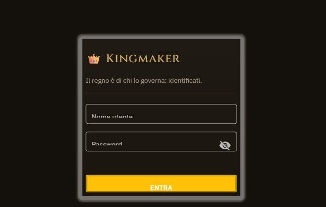
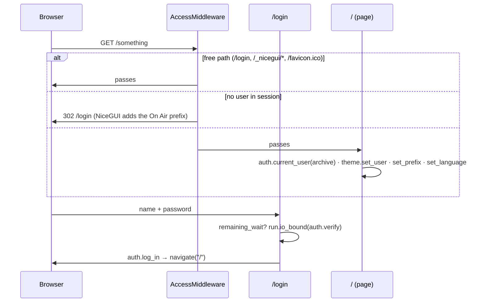
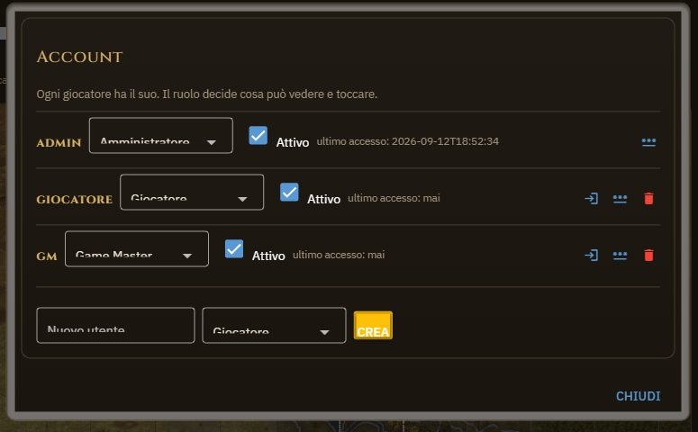

# 3. Access and permissions

## Accounts and sessions — `access/auth.py`

*The login screen: username and password, a single message for every error.*

- Passwords are **PBKDF2-HMAC-SHA256**, 600,000 iterations, a 16-byte salt per user, all with
  the standard library. The number of iterations is saved per row: raising it invalidates
  nobody, the account is upgraded at the first successful login.
- `verify` costs half a second of processor **on purpose**; the login page calls it with
  `run.io_bound` so as not to stop the others. A non-existent name computes a digest anyway, so
  the response times do not reveal which names exist; the error message is one.
- Brake on attempts: 5 failed → 30 seconds of waiting for that name, and 20 failed from the same
  address → 30 seconds for that address with any name (`_attempts`, in memory; old entries clean
  themselves up). The address comes from `login.py` via `auth.client_ip`, which honours
  `X-Forwarded-For` only with `KINGMAKER_TRUST_PROXY` and switches the per-address brake off
  under On Air, where everyone arrives from the relay.
- The session is `app.storage.user["user_id"]`, signed with `config.storage_secret()`: the
  `KINGMAKER_STORAGE_SECRET` environment variable or a `saves/.storage_secret` file generated at
  the first start. Whoever knows the key forges an administrator cookie: that is why it is not
  in the code. The session is rotated on login and logout.
- **Wearing somebody else's clothes**: the administrator may look at the app as another
  account (`auth.wear`). The permission is checked on the **real** user (`REAL_KEY`), and while it
  lasts it shows in the header; a password change is refused while impersonating. It is not an
  extra power: whoever has the database file can already do everything.
- The username is an identifier, `VALID_USERNAME` = `[A-Za-z0-9._-]{2,32}`: it goes into HTML
  and SVG, and a name with markup in it was the first thing the security review found.

The middleware (`ui/login.py`) serves above all for `/assets`: it is a static mount, not a page,
and without the filter whoever guesses a file name downloads it from the public address.

## Roles and actions — `access/permissions.py`

*The Accounts panel: role, active, last login, entering another account, new password, new user.*

Four roles in a hierarchy (`admin` ⊃ `gm` ⊃ `player` ⊃ `spectator`) and **one list of
actions** with the minimum role:

| Action | Minimum role | Where it is checked |
|---|---|---|
| `EDIT_KINGDOM` | player | sheet, turn, city, hex panel |
| `PLAN_TRAVEL`, `MANAGE_STABLE`, `OWN_CHARACTER` | player | map, transport, party |
| `UPLOAD_IMAGE`, `SEE_SECRETS`, `MANAGE_CHARACTERS`, `CONTROL_CLOCK` | gm | map, GM screen, clock, water brushes |
| `MANAGE_USERS`, `EXPORT_SAVE`, `RESET_KINGDOM` | admin | login, manual |

`permissions.can(user, action)` **raises `KeyError` for an action never declared**: better to
notice than to grant by distraction. `can_on_character` adds the rule «your character or
nothing»: a character without an account remains the GM's. A spectator is read-only by
construction: no mutating action reaches their role.

The rule of use, repeated in the docstrings of half the app: **hiding a button is not a
defence**. Every function that writes checks again — `theme.requires(action)` as a decorator,
`theme.protected(action, fn)` for the lambdas written inline — because an event can be fired
from the browser console too. `permissions.role_name` and `role_description` give the labels in
the viewer's language.

## What is seen by whom — `access/view.py`

`MapView(user, state)` is built **at every redraw** (visibility changes while playing) and
answers three questions:

- `can_see(col, row)`: always yes for the GM; for a player if the pair is in `visibility` (for
  them or for `*`).
- `hex_for(col, row)`: the hex **cleaned up** — only `PUBLIC_FIELDS`, and with the fields the GM
  keeps hidden (`HIDEABLE_FIELDS`: roads, fortification, farmland, work site) reset to «not
  there». A field added in the future does not leak by distraction.
- `markers()`: the characters on visible hexes, **plus one's own** wherever they are.

Everything that goes to the browser passes through here: `_svg_grid(sel, view)`, the counts,
the hex panels, the ruler field (`travel_field` skips the cells the view does not see). The GM
screen and the «GM Screen» box of the hex read `hexes_gm` only through `view.gm_data`, which
answers empty for a player.

**Preview**: the «See as the players» switch builds the view of a fake user
(`hexmap._PREVIEW_USER`) in the GM's window: same code, other eyes.

## On Air and the prefix

Publishing with On Air the app does not sit at the root of the domain but under
`/<name>/device-0/`. NiceGUI adds the prefix to *its* elements; to the addresses we write
ourselves inside the SVG (`/assets/...`) `theme.with_prefix` adds it, reading
`X-Forwarded-Prefix` once per window (`set_prefix`). `request_prefix` takes into account that
under On Air the header and the `root_path` say the same thing (adding them wrote the prefix
twice). The On Air token **is never written** in the code or in the files: `launch.py` reads it
from the environment or from the Windows registry.
