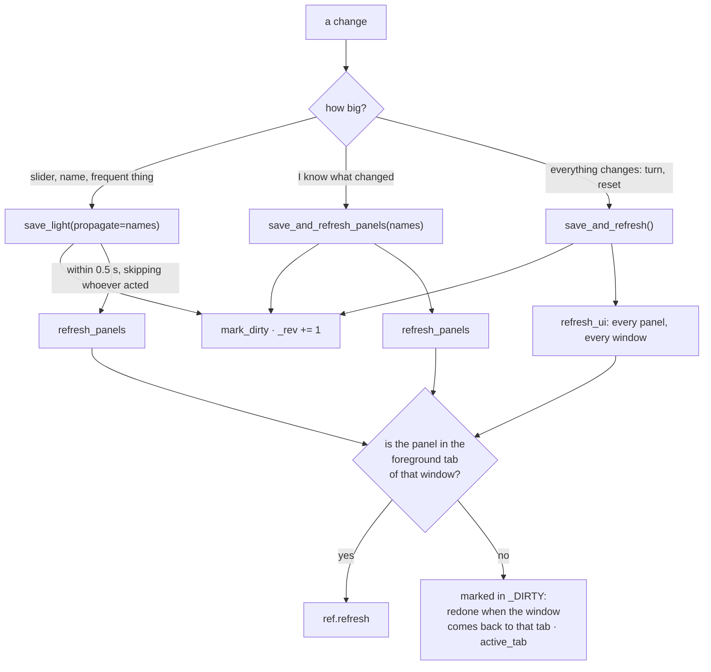

# 4. Interface

## The page

*The in-app Manual tab: structures, activities, feats and the rules tables, at the table.*

`main.page_` (`/`) does five things in a row: checks the user, applies the theme, sets the
window's language, draws the header, and opens the **tabs**: Map, Kingdom, Kingdom Turn, City,
Party, Transport, Manual, GM Screen (only with `SEE_SECRETS`: if the panel is never created
there is nothing to discover) and Save (only with `EXPORT_SAVE`, the same way). Every tab is a `*_panel` function of its module. The tabs are
`ui.tab("map", label=t("tabs.map"))`: the value is a language-neutral id (`theme._TABS`, the
ruler and the refresh bus compare against it), only the label is translated.

`theme.apply_theme` injects the CSS (variables `--km-*`, classes `km-panel`, `km-chip`,
`km-stat`…) and the four scripts, all files in `ui/`: `map_scroll.js` (panning the map with the
right button, remembering where one was looking), `travel_drag.js`, `water_eraser.js`,
`water_current.js`.

## Windows: what is the kingdom's and what is yours

The kingdom is one; every connected browser is a **window** with its own panels, choices and
language. `theme._window()` derives the client identifier from NiceGUI's slot stack (or from
the event context), and on it rest:

- `theme.window_state()` → a private dictionary per window. `hexmap._mine()` puts the whole
  state of the map in it: selected hex, zoom, click mode, who leaves, the travel plan in
  preparation (the full list is in the body of `_mine`).
- `theme.user()` → who looks at **that** window. `app.storage.user` cannot be asked during a
  redraw, because NiceGUI re-runs the panels of all windows in the context of whoever acted.
  The snapshot carries `archive.rev`: when it changes the row is re-read, and a deactivated
  account is sent to `/logout`.
- `theme.language()` → the language of that window (chapter 4, *Languages*).
- `theme.with_prefix()` → the On Air prefix of that window.

## Languages — `locale/i18n.py`

Every text of the interface is `t("area.key")`, looked up in `kingmaker/locale/lang/<code>.json`
(flat dotted keys, ≈1,200 of them, English the reference: a key missing from a language falls
back to the English text, a key missing everywhere shows itself). `tn(key, n)` picks
`key.one` / `key.other`. The language is a property of the window, like the identity:
`theme.set_language` stores it in the window state, `i18n.language_resolver` reads it from
there, so a panel redrawn for another window speaks that window's language.

Resolution, in `login.language_for`: the user's choice (`users.language`, set by the IT/EN
button in the header and adopted at the first login from the login page's choice), then the
browser's `Accept-Language`, then `KINGMAKER_LANG`, then English.

What goes to **other** windows is rendered for each of them: `_send_traces` renders the
titles and labels of the travel arrows with `i18n.t_in(lang, …)` and `drawing.plan_text(plan,
lang=…)` per recipient, and the ruler receives its label patterns in the field payload
(`ruler._label_texts`). The rules tables follow the same rule: `rules.STRUCTURES`,
`rules.BY_ID` and the others are `rules.View` objects that answer with the table of the current
language (`rules.data(lang)` merges the mechanics with `rules/data/lang/<code>/`), so the panels keep
writing `entry["name"]`. The kingdom journal stays in the language each line was written in.

**Units** follow the same pattern (`kingmaker/locale/units.py`): every Speed is stored in metres,
`units.current()` answers «m» or «ft» for the window being drawn (`theme.set_units`, from
`users.units` or the language: feet for English), and the fields convert on the way in and out
(`to_shown`, `from_shown`, `fmt`, `step`; 5 ft = 1.5 m). The m/ft button sits next to the
language one.

`t()` must never be called at module level (it would be evaluated once, in one language) and a
function that calls `t()` must not bind a local named `t`: `tools/check_i18n.py` checks both,
together with the catalogs (every key used exists, no orphans, same placeholders in both
languages). `tools/extract_strings.py` is the tool that moved the ≈1,100 literals of release
0.9 into the catalogs; it is kept for the record.

## The refresh bus

Every panel that must redraw when the kingdom changes is a `@ui.refreshable` registered with a
name: `theme.register_refresh("hexmap.map", map_)`. The name has a prefix that says **which tab
it belongs to** (`_TABS`), and this is the heart of the mechanism: redrawing the map in the
window of someone looking at the Kingdom tab is wasted work, and in play it shows.

Two details that explain otherwise mysterious behaviours:

- **The `_GLOBAL` heap.** The panels registered **at import** (`turn.py` at the bottom, the
  blocks of `sheet.py`) belong to no window: they are a single shared copy, and are redrawn if
  *somebody* is looking at that tab. They are the most expensive (the kingdom journal: eighty
  rows) and `save_and_refresh()` always redoes them. When you know what changed, list the panels.
- **Dead targets.** A refreshable keeps a target for every window it was drawn in and does not
  clean them up by itself; `_drop_dead_targets` does it before every refresh, or with the clock
  running every closed window left a NiceGUI warning per day.

Whoever wants to **add a panel**: `@ui.refreshable`, `theme.register_refresh("tab.name", fn)`
inside the body of the page (not at import), and then `save_and_refresh_panels(("tab.name",))`
from whoever modifies it.

## The deferred save

`theme._maintenance` runs twice a second: it propagates the names accumulated by `save_light`
to the *other* windows, and writes to disk if more than 2 seconds passed since the last time.
`app.on_shutdown(_switch_off)` makes the last save and closes the database. No change is lost
in normal conditions; with a crash at most two seconds of the document are lost (the separate
tables are already written).

## Dialogs, notifications, escaping

- `theme.dialog()` creates the dialog **anchored to the root of the client**: one created inside
  a refreshable would vanish at the next refresh.
- `theme.notify(text, kind)`: top right; `kind` is `positive`, `warning`, `negative`, `info`. It
  is the only way the app explains why something did not happen.
- `theme.esc(text)`: **everything a user can type** that ends up in a `ui.html` passes through
  here (names of the kingdom, hexes, characters). `ui.label` escapes by itself, `ui.html` does
  not. The browser side has its own `esc` in `travel_drag.js` for the labels of the arrows.

## The «propose and confirm» rule

It is the invariant of the whole interface, and it pays to recognise its shape because it comes
back identical in different places:

| Where | Proposal | Confirmation |
|---|---|---|
| Kingdom activity | `turn._outcome_dialog`: tickable, editable rows (`_effect_rows`) | «Apply the effects» → `_apply_rows` → `STATE.apply_effect` |
| Built structure | `city._effects_dialog` (from the structured `kingdom_effects`) | every entry with its own button |
| Journey | the plan drawn on the map, with the days | «Depart» → `_apply_journey` |
| Water reading | `water.reading.Proposal`, drawn in orange | «Accept» / «Discard» |
| Water chart | `water.chart.Chart` in proposal | «Replace» / «Add» |
| Revealing hexes | selection with ctrl | confirmation dialog |

An effect that applies itself is a design error, not a convenience.

## The in-app Manual

`main.manual_panel`: structures, activities (with the button to attempt them), feats, tables
(size, settlements, levels, XP, terrains, features, borders). It is where a player checks
whether something is a rule or a choice of the table: the entries with `source: "table"` are
marked.
