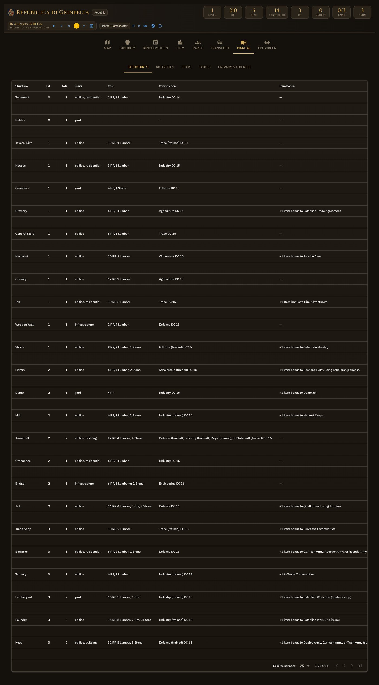
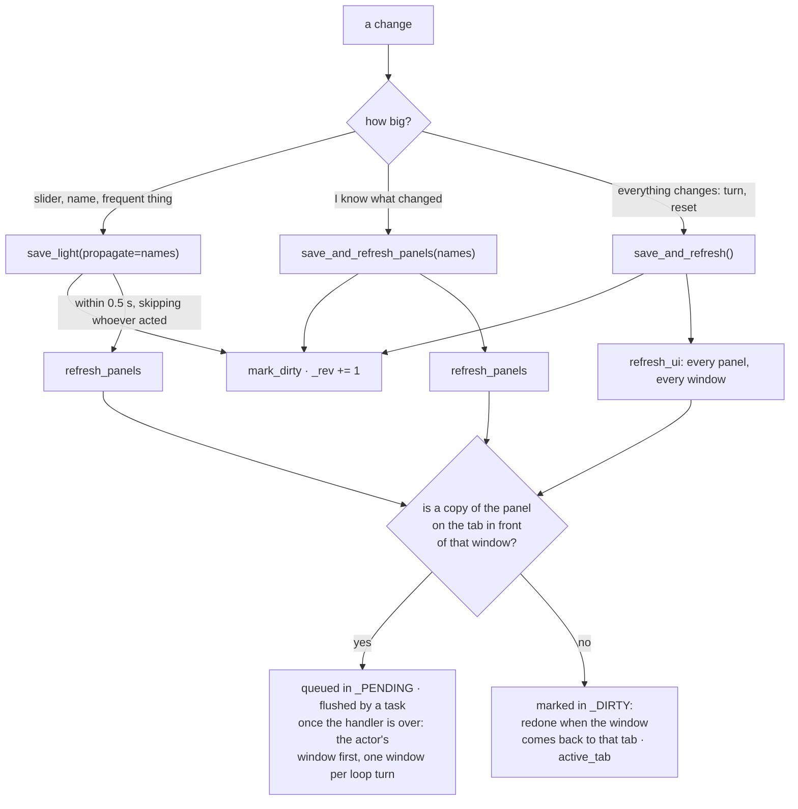

# 4. Interface

## The page

*The in-app Manual tab: structures, activities, feats and the rules tables, at the table.*

`main.page_` (`/`) does five things in a row: checks the user, applies the theme, sets the
window's language, draws the header, and opens the **tabs**: Map, Kingdom, Kingdom Turn, City,
Party, Transport, Manual, GM Screen (only with `SEE_SECRETS`: if the panel is never created
there is nothing to discover) and Save (only with `EXPORT_SAVE`, the same way). Every tab is a `*_panel` function of its module. The tabs are
`ui.tab("map", label=t("tabs.map"))`: the value is a language-neutral id (`theme._TABS`, the
ruler and the refresh bus compare against it), only the label is translated.

`theme.apply_theme` injects the CSS (variables `--km-*`, classes `km-panel`, `km-chip`,
`km-stat`…) and the four scripts, all files in `ui/`: `map_scroll.js` (panning the map with the
right button, remembering where one was looking), `travel_drag.js`, `water_eraser.js`,
`water_current.js`. The CSS opens with the `@font-face` rules of the three typefaces (Cinzel,
IBM Plex Sans, Press Start 2P), served by the app itself from `ui/static/fonts/` under
`/_km/fonts` (`theme.FONTS_ROUTE`, mounted at import; `login.OPEN_PREFIXES` lets the login page
have them too). Their addresses are relative (`_km/fonts/…`) on purpose: every page lives at
the root of its prefix, so they resolve under On Air's `/name/device-0/` without
`with_prefix`, which does not exist yet when the stylesheet is built. They used to come from
Google Fonts, which handed every player's address to Google on every page;
`test_security.py` now checks that the stylesheet names no outside host.

## Windows: what is the kingdom's and what is yours

The kingdom is one; every connected browser is a **window** with its own panels, choices and
language. `theme._window()` derives the client identifier from NiceGUI's slot stack (or from
the event context), and on it rest:

- `theme.window_state()` → a private dictionary per window. `hexmap._mine()` puts the whole
  state of the map in it: selected hex, zoom, click mode, who leaves, the travel plan in
  preparation (the full list is in the body of `_mine`).
- `theme.user()` → who looks at **that** window. `app.storage.user` cannot be asked during a
  redraw, because NiceGUI re-runs the panels of all windows in the context of whoever acted.
  The snapshot carries `archive.rev`: when it changes the row is re-read, and a deactivated
  account is sent to `/logout`.
- `theme.language()` → the language of that window (chapter 4, *Languages*).
- `theme.with_prefix()` → the On Air prefix of that window.

## Languages — `locale/i18n.py`

Every text of the interface is `t("area.key")`, looked up in `kingmaker/locale/lang/<code>.json`
(flat dotted keys, ≈1,200 of them, English the reference: a key missing from a language falls
back to the English text, a key missing everywhere shows itself). `tn(key, n)` picks
`key.one` / `key.other`. The language is a property of the window, like the identity:
`theme.set_language` stores it in the window state, `i18n.language_resolver` reads it from
there, so a panel redrawn for another window speaks that window's language.

Resolution, in `login.language_for`: the user's choice (`users.language`, set by the IT/EN
button in the header and adopted at the first login from the login page's choice), then the
browser's `Accept-Language`, then `KINGMAKER_LANG`, then English.

What goes to **other** windows is rendered for each of them: `_send_traces` renders the
titles and labels of the travel arrows with `i18n.t_in(lang, …)` and `drawing.plan_text(plan,
lang=…)` per recipient, and the ruler receives its label patterns in the field payload
(`ruler._label_texts`). The rules tables follow the same rule: `rules.STRUCTURES`,
`rules.BY_ID` and the others are `rules.View` objects that answer with the table of the current
language (`rules.data(lang)` merges the mechanics with `rules/data/lang/<code>/`), so the panels keep
writing `entry["name"]`. The kingdom journal stays in the language each line was written in.

**Units** follow the same pattern (`kingmaker/locale/units.py`): every Speed is stored in metres,
`units.current()` answers «m» or «ft» for the window being drawn (`theme.set_units`, from
`users.units` or the language: feet for English), and the fields convert on the way in and out
(`to_shown`, `from_shown`, `fmt`, `step`; 5 ft = 1.5 m). The m/ft button sits next to the
language one.

`t()` must never be called at module level (it would be evaluated once, in one language) and a
function that calls `t()` must not bind a local named `t`: `tools/check_i18n.py` checks both,
together with the catalogs (every key used exists, no orphans, same placeholders in both
languages). The ≈1,100 literals of release 0.9 were moved into the catalogs once, by a one-off
tool that is no longer in the repository.

## The refresh bus

Every panel that must redraw when the kingdom changes is a `@ui.refreshable` registered with a
name: `theme.register_refresh("hexmap.map", map_)`. The name has a prefix that says **which tab
it belongs to** (`_TABS`), and this is the heart of the mechanism: redrawing the map in the
window of someone looking at the Kingdom tab is wasted work, and in play it shows.

Five details that explain otherwise mysterious behaviours:

- **The `_GLOBAL` heap, copy by copy.** The panels registered **at import** (`turn.py` at the
  bottom, the blocks of `sheet.py`) belong to no window: one refreshable, drawn once per
  window, a *target* per copy. NiceGUI's `refresh()` redoes every target at once, and that is
  what made an evening with eight windows cost four seconds per dice roll: every copy was
  rebuilt whatever tab its window had in front. The bus now rebuilds the targets one by one
  (`_rebuild`, what NiceGUI does for each of them) and only where somebody is looking. Whether
  somebody is looking is decided **per copy**, from the `ui.tab_panel` above it
  (`_tab_of_target`), not from the panel's name: the quick adjustments are drawn in the Turn
  tab, in the City tab and in the outcome dialog, and the copy in the City tab is in front of
  whoever is on City. A window with no copy in front owes the panel (`_DIRTY[window]`) and gets
  it, alone, when it switches to a tab that has one. `refresh_locals`, the actor's instant
  redraw after a hex edit, treats the actor's copies of these shared panels the same way. It used
  to look only at the window's own panels, and `save_light` sends to every window but
  the actor's. So whoever ticked a Farmland read the old Consumption in the Turn tab, and the
  old kingdom size in the header, until a reload.
- **The queue and its task.** One action asks for the same panel several times — the actor's
  own window, the round over every window, a panel that calls another's `refresh()` — and each
  request used to be a rebuild. Requests land in `_PENDING`; when the handler is over a task
  (`_flush_async`) takes the batch and rebuilds **one window per turn of the event loop**: the
  actor's window first, then the windows on the map (the cheapest, and where the shared things
  are watched), then the rest. The actor sees the result at once, everybody's clicks are served
  in between, and a request that arrives mid-flush goes to the next batch — a window not yet
  redone in the current one is left to that batch, so it is rebuilt once, with the newest
  state. A panel drawn inside another that is being rebuilt (the journeys inside the Turn
  column) is skipped, because its container redoes it anyway. Without an event loop (the
  tests) the flush is immediate, at the end of the bus call. `register_refresh` also routes the
  panel's own `refresh()` through the bus.
- **What a figure reaches.** A quick adjustment and the costs and effects of an activity change
  numbers, and `theme.PANELS_BY_STAT` says which panels show each of them; `stat_panels(...)`
  turns the fields into the list to redraw, the header and the adjustments always included. A
  kind of effect not in `turn._EFFECT_FIELDS` (a modifier) still redraws everything. The list
  is not trusted on its own: `tests/test_windows.py` builds eight real windows with NiceGUI's
  user simulation, plays random changes from random windows, and after each compares every
  panel in front of somebody with a fresh render of itself. A panel missing from the list is a
  failed test, not a stale screen.
- **A copy whose inputs have not moved is not rebuilt.** `register_refresh(name, fn,
  depends=...)` takes a function returning what the panel reads — figures, lists, nothing that
  is not state — and the bus keeps, on every copy, the fingerprint of its last rebuild (the
  window's language, units and account are always part of it). A full refresh after a roll
  then costs the Kingdom sheet nothing: six blocks say what they read, the quick adjustments
  too. The fingerprints are computed once per panel per batch, at planning time, so a panel
  drawn inside a skipped one is still redone on its own. A dependency left out is a stale
  panel that no unit test sees, which is why `test_windows.py` plays the sheet's setters and
  the keys its blocks send from the browser, and compares every copy with a fresh render.
- **What a panel weighs.** Time and bytes go with the number of elements, not with the text.
  The Turn column went from 1,860 elements per window to 300: an activity card is a single
  `ui.html` with the click on it, the journal one block, the quick adjustments one block whose
  `data-km` attributes say which control was clicked (`_adjust` reads the key as untrusted
  input), a stat box one element, and the adjustments, the journal and the live part of the
  upkeep and event steps (`turn.steps`) sit outside the column's refreshable. On the sheet the
  skills, the roles and the feats are one element each as well, with native selects and inputs
  in the theme's clothes and the ticks drawn as icons; `theme.PICK` and `theme.PICK_VALUE` are
  the two browser-side handlers every such block uses, and `_skill_click`, `_role_change` and
  company read the key and the value as input from outside.

Whoever wants to **add a panel**: `@ui.refreshable`, `theme.register_refresh("tab.name", fn)`
inside the body of the page (not at import), and then `save_and_refresh_panels(("tab.name",))`
from whoever modifies it. A panel that shows a kingdom figure goes in `PANELS_BY_STAT` too,
and `test_windows.py` will say if it was forgotten.

## The deferred save

`theme._maintenance` runs twice a second: it propagates the names accumulated by `save_light`
to the *other* windows, and writes to disk if more than 2 seconds passed since the last time.
`app.on_shutdown(_switch_off)` makes the last save and closes the database. No change is lost
in normal conditions; with a crash at most two seconds of the document are lost (the separate
tables are already written).

## Small screens

The layout adapts in the stylesheet only (`theme.CSS`), so a narrow screen costs nothing: no
element is added, nothing runs on a resize, and no second layout is drawn or sent.
- `.km-split` marks a tab's row of side-by-side columns (the sheet, the turn, the city, the
  map). Below 900 px its columns stack at full width. A new tab with columns side by side
  takes this class, or its side column runs off a smaller screen.
- Below 600 px the dialogs fit the window (`max-width: calc(100vw - 24px)`) instead of
  keeping their fixed minimum.
- Grids size themselves to their panel, not to the screen. `.km-skills` uses
  `repeat(auto-fill, minmax(260px, 1fr))`, and the ability rows may wrap. A column narrowed by
  its neighbour gets one column of skills even on a wide screen.
- The tab bars carry `mobile-arrows outside-arrows`: when the tabs do not fit they scroll,
  and the arrows say there are more (on touch screens too, which is what `mobile-arrows` is
  for).
- Wide content that is read across stays wide and scrolls in its own frame: the manual's
  tables and the strip of character tokens under the map.

- A card (`ui.card`) lays its children out at their own width, not at the card's. A row
  that wraps (the activity cards of a turn step) must say `width:100%`, or it takes the width
  of its texts, wider than the panel in Italian. `.km-panel > * { max-width: 100% }` keeps
  anything from coming out wider than its panel.

They were checked by measuring the elements sticking out of the screen or of their panel, on
every tab, in Italian (the longer texts), with every collapsible section opened, at 1775,
1280, 1024, 768 and 390 px. A section left collapsed is not measured at all, which is how the
activity cards slipped through the first check.

## Dialogs, notifications, escaping

- `theme.dialog()` creates the dialog **anchored to the root of the client**: one created inside
  a refreshable would vanish at the next refresh.
- `theme.notify(text, kind)`: top right; `kind` is `positive`, `warning`, `negative`, `info`. It
  is the only way the app explains why something did not happen.
- `theme.show_result(res, title, outcome, where=None)`: the result screen of a check, here and,
  through `share_roll`, read-only in every other open window (`other_windows()`), with
  "<account> rolled" above it. `title` and `outcome` may be functions. A function is called
  again inside each window (`with client:`), so `t()` and the rules tables answer in that
  window's language. A string is shown as the roller wrote it. `where`, the hex the roll is
  about, skips the windows whose account cannot see it (`MapView.can_see`). The kingdom-turn
  activities call `share_roll` themselves: their own screen carries the effects to apply,
  which stay with whoever rolled.
- `theme.show_check(res, title, outcome, apply=, reroll=, where=)`: a Kingdom skill check with
  the reroll for 1 Fame/Infamy point. `outcome(res)` takes the result; `apply(res)` does what the
  result does, once, with the result kept. While `can_reroll` allows it (a point in hand, not
  rerolled yet, not a critical success) the result waits on a persistent screen: *Keep this
  result*, or the reroll, whose result stands and goes to `show_result`. Otherwise it applies at
  once. The map's checks (`hex_panel._check`), Build a Structure and the sheet's rolls use it.
- After `save_and_refresh` and `save_and_refresh_panels`, `_offer_fame` asks the window that made
  the change whether to spend all the points against the Anarchy or Ruin penalty just reached
  (`State.take_fame_offers`). From a background timer there is no window: the offer waits for
  the next change made from one.
- `theme.show_dice(title, rolls, faces, outcome, dc=None, verdict=None, where=None)`: the same
  for plain dice (Resource Dice, the event d20, the 1d4 of Unrest, a flat check). `dc` adds
  "vs DC" and Success/Failure on the total, and `verdict` replaces that line with its own text.
  Both screens reach the other windows through `_broadcast(draw, where)`. Activity effects
  that roll Resource Dice hand them back through `apply_effect(..., dice=[])`, and
  `turn._apply_rows` shows them.
- `theme.esc(text)`: **everything a user can type** that ends up in a `ui.html` passes through
  here (names of the kingdom, hexes, characters). `ui.label` escapes by itself, `ui.html` does
  not. The browser side has its own `esc` in `travel_drag.js` for the labels of the arrows.

## The «propose and confirm» rule

It is the invariant of the whole interface, and it pays to recognise its shape because it comes
back identical in different places:

| Where | Proposal | Confirmation |
|---|---|---|
| Kingdom activity | `turn._outcome_dialog`: tickable, editable rows (`_effect_rows`) | «Apply the effects» → `_apply_rows` → `STATE.apply_effect` |
| Built structure | `city._effects_dialog` (from the structured `kingdom_effects`) | every entry with its own button |
| Journey | the plan drawn on the map, with the days | «Depart» → `_apply_journey` |
| Water reading | `water.reading.Proposal`, drawn in orange | «Accept» / «Discard» |
| Water chart | `water.chart.Chart` in proposal | «Replace» / «Add» |
| Revealing hexes | selection with ctrl | confirmation dialog |

An effect that applies itself is a design error, not a convenience.

## The in-app Manual

`main.manual_panel`: structures, activities (with the button to attempt them), feats, tables
(size, settlements, levels, XP, terrains, features, borders). It is where a player checks
whether something is a rule or a choice of the table: the entries with `source: "table"` are
marked.
