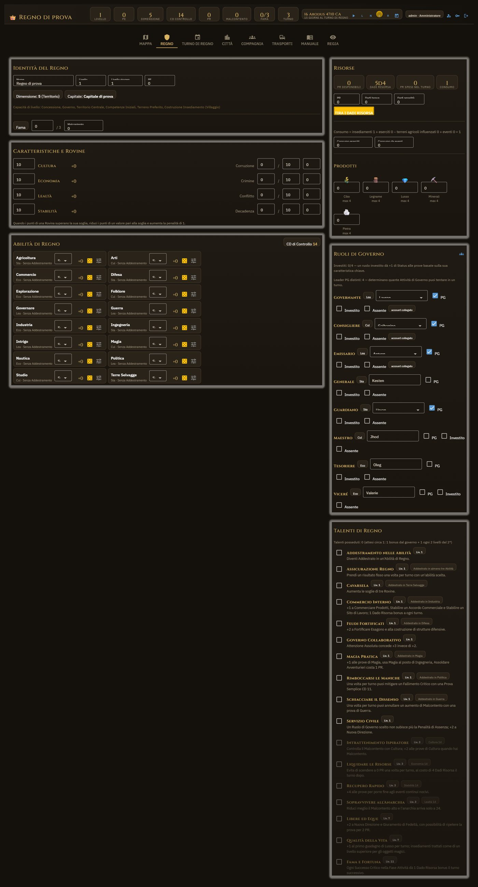
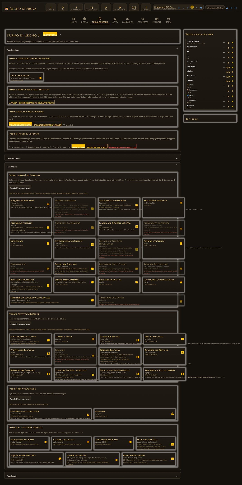
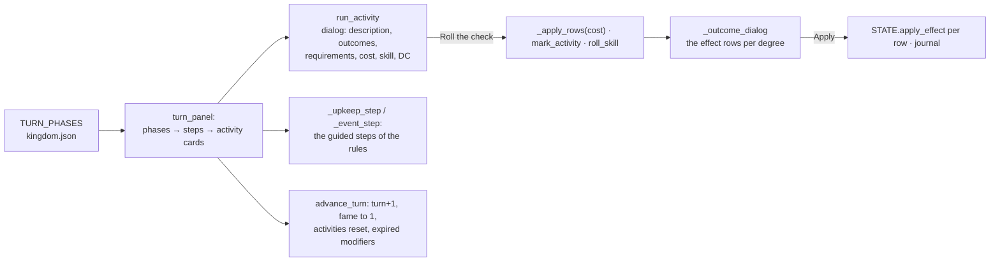
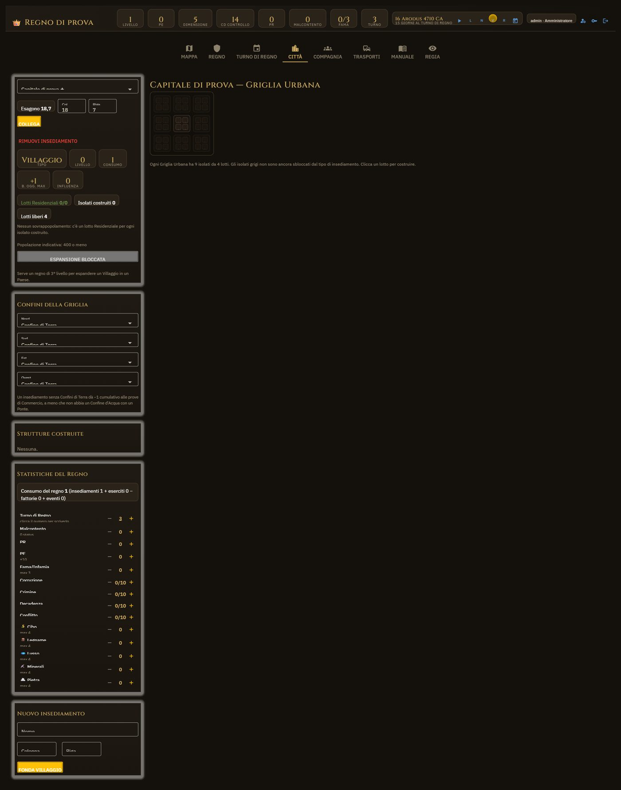

# 5. Kingdom, Kingdom Turn, City

## The rules: `rules/__init__.py` and `rules/data/`

`rules/__init__.py` **contains no rules**: it loads the JSON and offers the computation. Every mechanics
file has its `_source`; the texts live apart, one folder per language.

| File | Content | Entries |
|---|---|---|
| `kingdom.json` | abilities, ruins, skills, charters, heartlands, governments, roles, proficiencies, size and level tables, settlement types, commodities, terrains, terrain features, `travel` (categories, costs, borders, current), milestone XP, unrest thresholds, turn phases | — |
| `activities.json` | the Kingdom Turn activities, with `phase`, `step`, `skills`, `dc`, and `effects` already translated into applicable entries per degree | 49 |
| `structures.json` | the Urban Grid structures: lots, cost, construction check, `kingdom_effects` (structured: kind, sign, quantity) | 76 |
| `feats.json` | the kingdom feats | 17 |
| `vehicles.json` | the vehicle catalogue with speeds, seats, kind | 45 |
| `calendar.json` | months, leap year, the leaders' downtime (read by `rules/almanac.py`) | — |
| `lang/en/*.json`, `lang/it/*.json` | the texts of every entry above, keyed by id: names, descriptions, outcomes, requirements, notes | — |

`tools/split_texts.py` made the split once; `rules.merge_texts` puts the halves back together
at load, English first so a hole in a language shows the English text. `rules.data(lang)`
builds the tables once per language and `rules.View` hands the panels the table of the current
window (chapter 4). `tools/check_data.py` verifies that the two languages have the same shape
and that every id referenced by the mechanics exists.

`BY_ID[kind][id]` is the index for everything. The functions that count: `roll_check` (d20,
degree of success with natural 1 and 20), `success_grade`, `grade_label` (in the viewer's
language), `signed_value` («-1d6» → number and description), `entry_label` (how an effect
reads), `structure_effects` (the structured effects of a structure, which release 0.9 used to
parse from the Italian prose).

## The derived state: `state.State`

`STATE` is the single instance. Besides holding `k`, it computes what the sheet shows:

| Property/method | Rule |
|---|---|
| `size_` | `claimed` hexes |
| `control_dc` | level table + size modifier + 2 if the Ruler is absent |
| `skill_detail(sid)` | ability, proficiency, the status bonus of the invested role (the best), Unrest penalty, Ruin penalty, temporary modifiers (the best per type) |
| `consumption()` | settlements + armies − influenced farmlands + events |
| `influenced_hexes()` | within the influence of a placed settlement (`hexgrid.distance`) |
| `step_limit(phase, step)` | Leadership: `max_leadership_activities × pc_leaders`; Region: 3; Civic: number of settlements |
| `activity_block(act)` | why an activity cannot be attempted: proficiency, per-turn limit, anarchy, step used up |
| `apply_effect(entry, value)` | the single point that modifies the kingdom by effect of an activity |

`pc_leaders()` counts **distinct characters** (`character_id`), not names: two roles of the
same PC count as one.

## The Kingdom sheet — `ui/tabs/sheet.py`

*The Kingdom sheet: identity, abilities, skills, resources, leadership roles, feats.*

Refreshable blocks registered at the bottom of the module (`_name`, `_ref` in a loop):
identity, abilities, skills (rollable with `roll_skill` → `theme.show_result`), roles,
resources, feats. **Roles are assigned to a character** (`ui.select` on the characters of the
campaign) when `pc` is ticked; otherwise to a free name for the NPCs. `characters_dialog` is the
character management seen from here (create, link to an account, delete).

## The Kingdom Turn — `ui/tabs/turn.py`

*The Kingdom Turn: the phases, the activities per step, the journeys under way, the journal.*

- `_activity_dc`: the Control DC, or the one written on the activity.
- `_effect_rows(entries)` draws every entry as a tickable row with an editable value; dice are
  rolled on the spot (`rules.signed_value`). `entry_target` asks whom to apply it to («ruin of
  your choice», «commodity of your choice»).
- `quick_adjustments`: the manual sliders for when the rules leave the table to decide.
- **`advance_turn` does not touch the interface**: the clock calls it too at the end of the
  month (chapter 10), from a timer where there is no window to notify.
- `journeys_in_progress` / `_resolve_journey`: the journeys departed from the map are resolved
  by hand from here (chapter 8).

## The Cities — `ui/tabs/city.py`

*The Cities: the settlement's urban grid, the structures, the consumption.*

A settlement is `city.new_settlement`: `grids` (one or more, each 9 blocks × 4 lots, holding
structure **ids**), `active_blocks`, `borders` (north/south/east/west: land or water, for the
Bridge), `capital`, `hex`. The Urban Grid is drawn by `_draw_grid`; clicking a free lot opens
`_construction_dialog`, which lists the affordable and contiguous structures
(`_free_contiguous_lots`).

`_build` is the complete sequence of the rule: pay the cost, roll Build a Structure with the
best of the allowed skills, place (or Rubble on a critical failure), then `_effects_dialog`
proposes Unrest and Ruins from the structured effects. `_can_expand` / `_expand` follow the table
of the settlement types (village → town → city → metropolis).

The city↔hex link is two-way: `STATE.link_settlement(sid, col, row)` writes `ins["hex"]` **and**
`h["settlement"]` and the terrain feature; `unlink_settlement` undoes everything. From the map
(`hexmap._settlement`, `_link_existing`) and from the city (`_position_block`) one goes through
the same two functions.

## The guided creation — `ui/tabs/creation.py`

The ten steps of the rules in a single page with a `draft`; `compute_scores` adds boosts and
flaws, `_found` writes the kingdom and the capital, and the page reloads. It appears only as
long as `STATE.k["created"]` is false.
