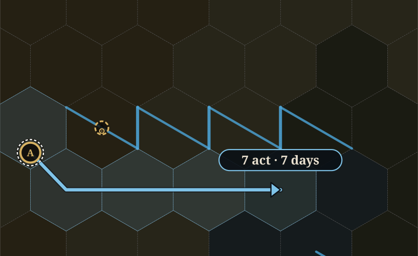
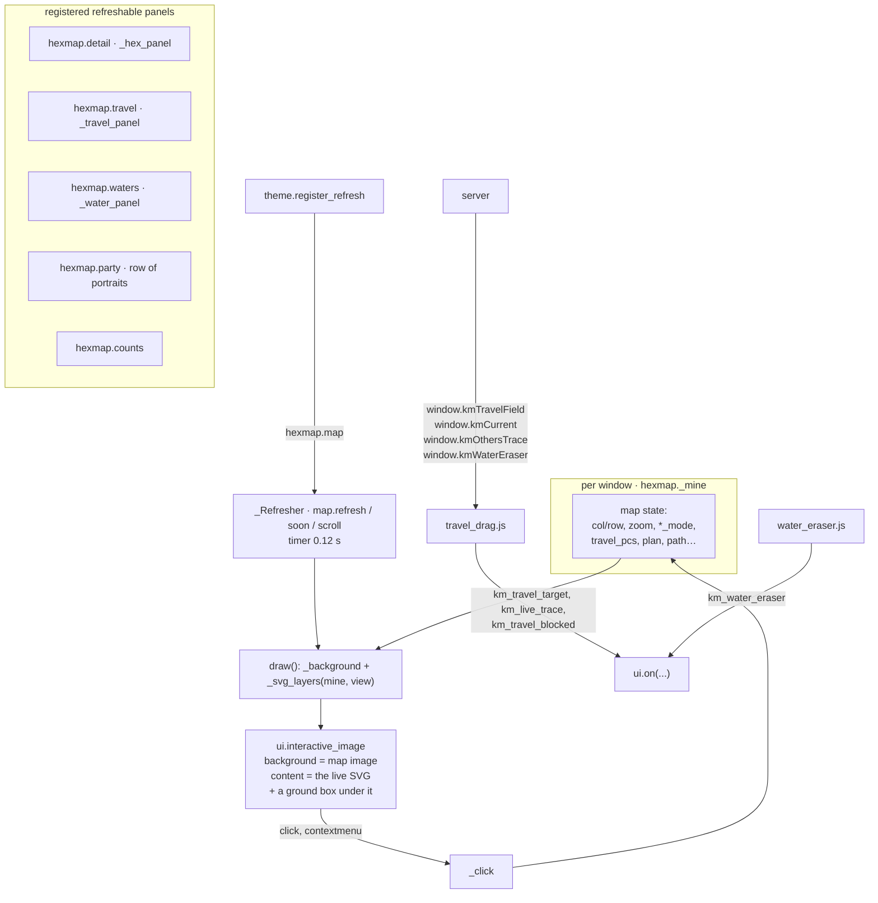
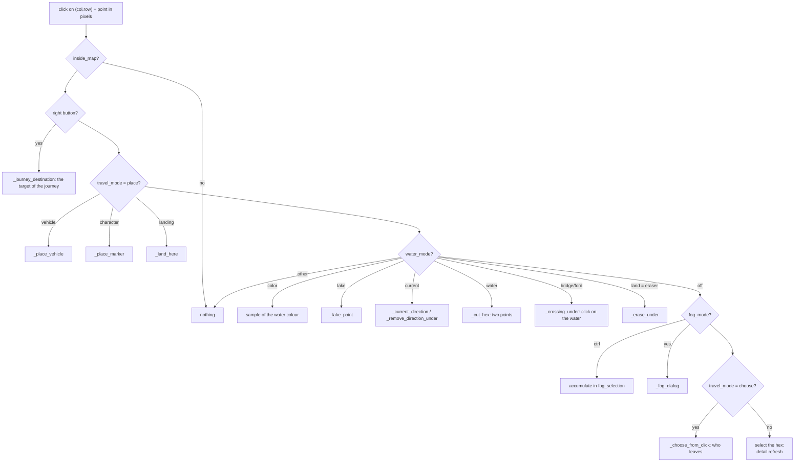
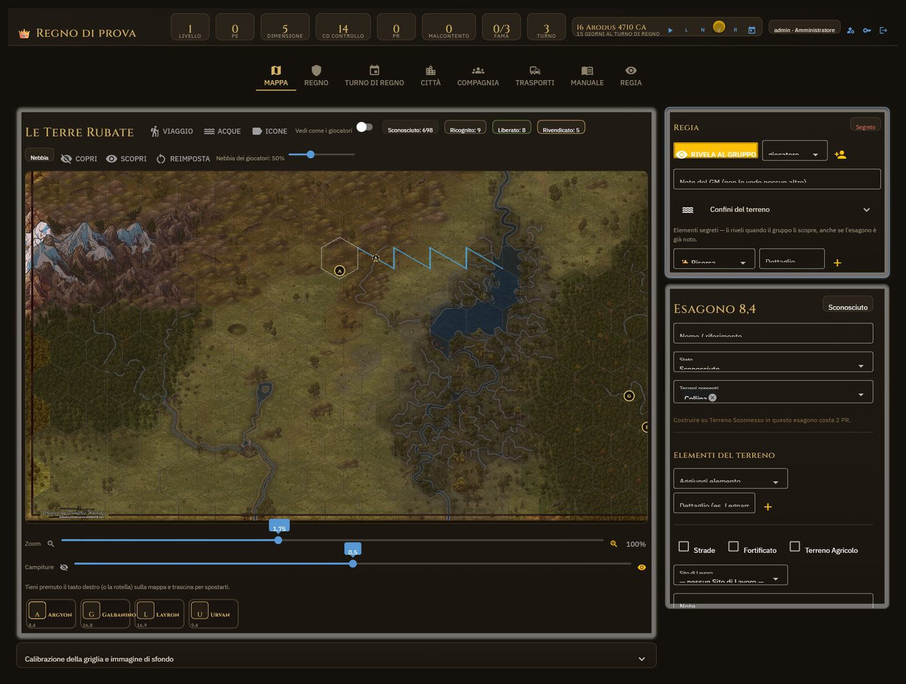
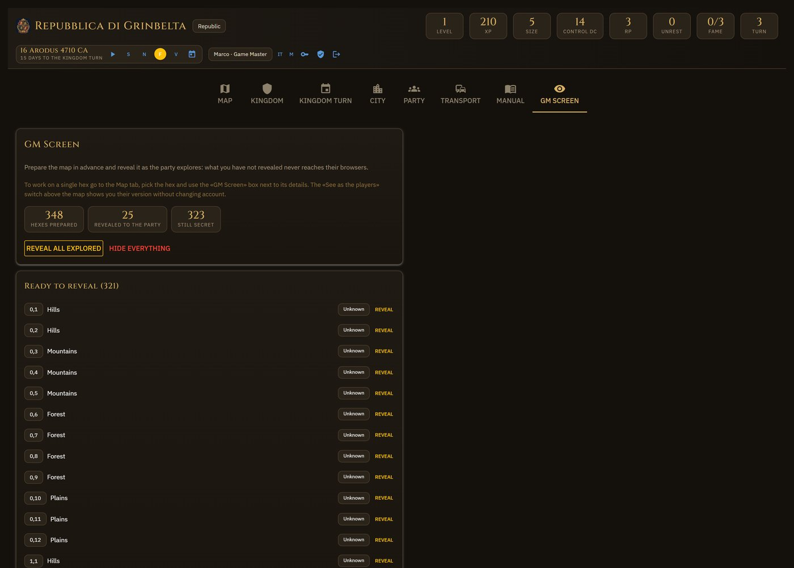

# 6. The map — the `ui/hexmap/` package

It is the largest part of the app, and holds four trades together: drawing the grid, answering
clicks in its modes, managing the water (brushes), and travel (chapter 8). Here the first three
and the common frame are explained.

The code sits in nine modules; `ui/hexmap/__init__.py` is the **facade** that imports them all and
re-exports every name, so from the rest of the app and from the tests one still writes
`hexmap.something`.

| Module | What it holds |
|---|---|
| `common.py` | constants, the window state (`_mine`), the sliders, `_current_view`, `inside_map`, `_background`, `waters_active`, the water caches (`sections_map`, `waters_network`) |
| `drawing.py` | the SVG: `_svg_grid` and `_ground_layers`, the water (`bank_stretches`, `_svg_banks_and_crossings`, `_svg_borders`, `_svg_currents`, lakes, proposal), the arrows (`_svg_path`, `_svg_journeys_in_progress`, `plan_text`), icons and labels |
| `markers.py` | who sits where: `_members_per_hex`, `marker_positions`, the badges, `marker_under`, `_choose_from_click`, `_open_group`, sections and shores (`section_of`, `bank_point`, `anchor_markers`) |
| `water.py` | the Waters box and the brushes (`_BRUSHES`), stretches, bridges and fords, currents, lakes, eraser, image reading, charts |
| `hex_panel.py` | the hex box: GM screen block, borders, crossings, the kingdom actions, the calibration |
| `travel/__init__.py` | travel on foot: `_compute_journey`, `_apply_journey`, rendezvous, separate journeys, who is on the road, the row of portraits |
| `boats.py` | the route, placing a vehicle, boarding and landing |
| `ruler.py` | the field for the browser (`travel_field`, `route_field`), the others' traces, `_dragged_target`, `_journey_blocked` |
| `page.py` | `map_panel`, `_click`, switches, fog, zoom and veil |

Inside the package a module calls another by qualified name (`_journey.name`, `_drawing.name`):
sibling imports are resolved at call time, so no cycle. In the tests a function is replaced
**in every module** (`tests/helpers.silence`).

## The frame: `map_panel`

*The Map tab on the test scene: fog, counts per status, the drawn river, the markers, the row of portraits.*

- The map is **an interactive image with two SVGs on top**: `_background()` gives the image (or
  a dark rectangle if missing), `_svg_layers` the rest as two strings. The **ground** (grid,
  fog, chosen ones, water, icons and names) goes to a `ui.html` box placed inside the image
  under its own SVG (`.km-ground-box`, z-index 1); the **live layer** (journeys, the decided
  route, the markers, the chosen hex, a proposal) is the image's `content` (z-index 2). Each is
  sent only when it changed: a moved marker costs a window a couple of KB, not the 93 KB of
  the whole map. The browser scripts (the ruler, the others' arrows, the water tools) append
  their groups to the image's SVG, which is still the first `<svg>` in the box, so they draw
  above the markers as they always did. The ground layers stay cached in `mine` until
  `archive.rev` and `STATE.k["_rev"]` change. `_svg_grid` is the two strings joined, for the
  tests. One consequence of the split: a journey's arrow passes over a hex's icons and name.
- `_Refresher` exposes `.refresh()` like a refreshable but redraws in place: at once when
  asked from the window's own handler (the click that boarded), at the next tick of the timer
  (0.12 s) when asked from elsewhere (the bus); `soon()` always waits for the tick, so a slider
  does not draw ten times a second.
- The **calibration** (`_calibration_panel`, `_fit_grid`): `size` (radius in pixels),
  `origin_x/y`, `columns/rows`, orientation; «Fit the grid» spreads the columns over the width
  of the image. `image_width/image_height` come from `imgsize.dimensions` at upload.
- **The edge of the map is the image**: `inside_map(m)` → a hex belongs to the map if its center
  falls on the image. The grid, the click and every travel count use it.

## The SVG layers (`_svg_layers`), from the bottom

The ground box holds 1 to 5, the image's SVG 6 to 8.

1. **ground**: one `<path>` per combination (fill, stroke, width): the cells with the same look
   go together, or 720 separate polygons weigh. The colour comes from the first terrain
   (`rules.BY_ID["terrain"][...]["color"]`) attenuated by `terrain_veil`; the status decides
   stroke and opacity (`HEX_STATUSES`).
2. **veil** (fog): light for the GM (`FOG_GM`), dense for the players as much as `fog_opacity`
   says. A covered hex without data does not even have the base polygon.
3. **chosen**: the hexes taken with ctrl in fog mode.
4. **borders** (only if `waters_active()`): lakes → banks and inner crossings → borders on the
   edge → currents → seams (only with the Bridge/Ford in hand) → the lake names
   (`_svg_lake_names`; drawn right after the lakes instead, under the lines, while the Waters
   mode is on). Chapter 7.
5. **icons and names** of the hexes (`_hex_icons`, `_hex_label`).
6. **journeys in progress** (dashed amber) and under them the **proposal** (blue).
7. **markers**, and the ring of the chosen hex.
8. **proposal**: the water reading in orange, the lake in progress, the current's vertex, the
   outlines of the candidates of the Water brush.

## The click modes (`_click`, in `page.py`)

One click, and a chain of `if` in the order below; the water brushes are a table
(`water._BRUSHES`: `border_mode` → function), with a single permission check. The rule:
**one mode at a time** (`_single_mode`), or two would fight over the same gesture.

The **right button** has two trades: dragging the map (all in the browser, `map_scroll.js`) and
pointing at a target; the script lets the `contextmenu` through only if the mouse did not move.
`ui.keyboard` intercepts the release of ctrl to close the fog selection.

## The hex box (`_hex_panel`)

*A chosen hex: above the GM Screen block (GM only), below the hex sheet with status, terrains, features and actions.*

Status, terrains, terrain features, roads/fortification/farmland/work site (`_hex_actions`),
the settlement; for the GM the **GM Screen block** (`_gm_block`): notes, hidden features to
reveal one by one, forced travel difficulty, hidden fields (`_mark_field`), the six borders
(`_borders_block`) and the inner crossings (`_crossings_block`). Claim and Clear go through the
corresponding activity (`_claim`, `_free` → `turn.run_activity`); «Reconnoiter»
(`_reconnoiter`) costs what `travel.reconnaissance_cost` says and brings the hex to
Reconnoitered, the requirement to claim it.

## The fog

*The GM Screen tab: the GM's commands on the whole map, the queue of hexes ready to reveal.*

`_fog_controls`: Cover / Uncover / Reset, the density slider, and the click mode `fog_mode`.
Revealing writes in `visibility` (`archive.reveal` with recipient `*` or a user); `_fog_dialog`
asks whom. The GM Screen (`ui/tabs/gm_screen.py`) has the commands on the whole map. The refresh
towards the players goes through `_after_fog` → `save_light(propagate=...)`.

## The markers

The model is **a single list** for drawing and click (computed once per redraw):
`_members_per_hex(view)` → per hex, the people on the ground **and the placed vehicles**;
whoever is aboard a vehicle placed there is not a member of their own but sits in the vehicle's
`passengers`. `marker_positions` decides **where** every badge sits:

- whole hex: one badge below the center (`cy + 0.60·size`);
- cut hex: one badge per shore, on the shore's anchor (`anchor_markers` → `bank_point`, the
  centroid of the piece), with the radius the piece grants (`badge_radius`: a tenth of the area,
  ceiling `BADGE_RADIUS`, floor `MIN_RADIUS`, never beyond the `breath`);
- a boat: on its **junction** (`_boat_node`), radius `BOAT_RADIUS`.

Several members in the same place are **one badge with the number** (`_group_badge` + `_stack`);
clicking it opens `_open_group` with the big portraits and «All N»; **ctrl+click** adds people
and one vehicle at a time (the gesture is read by `.on("click", …, ["ctrlKey"])`) and «Take the
chosen» applies with `_apply_choice`. A vehicle shows inside the faces of whoever travels on it
(`_passengers_in_badge`). `marker_under` answers the click looking at the hex and the six
neighbours (a badge may overflow) with a minimum grip (`MIN_GRIP`). The white dashed ring
(`_chosen_ring`) marks who is in hand; `_taken` lights it on the vehicle of whoever is aboard too.

## Icons, names, images

`_hex_icons` draws a row of symbols with dots («×2» of the Resource hex, a padlock for the hidden
fields); `_hex_label` puts the name on a tag, splitting it over two lines if it does not fit in
the hex (`_text_width` estimates the width in Cinzel, because on the server text cannot be
measured). The images: the map in `assets/`, portraits and tokens in `assets/characters` and
`assets/vehicles`, served as thumbnails (`images.address` → `images.thumbnail`, side
`MARKER_SIDE`). The addresses in the SVG go through `theme.with_prefix`; those given to
`ui.image` do **not**: NiceGUI adds the prefix in the browser, and adding it twice broke the
faces in the badges under On Air. The HTML badges (sheet, party, transport, opened group) are
in `ui/badges.py`.

## The other windows see your arrow

While you drag, the browser sends `km_live_trace` (pixels of the polyline); the server passes
it on to the windows entitled to see it (`_trace_audience`: whoever sees at least one traveller)
with `window.kmOthersTrace`, title and labels rendered in each recipient's language. With the
plan made, `_trace_from_plan` sends it, in pixels computed by the server. The red flash of a
block reaches them too.
