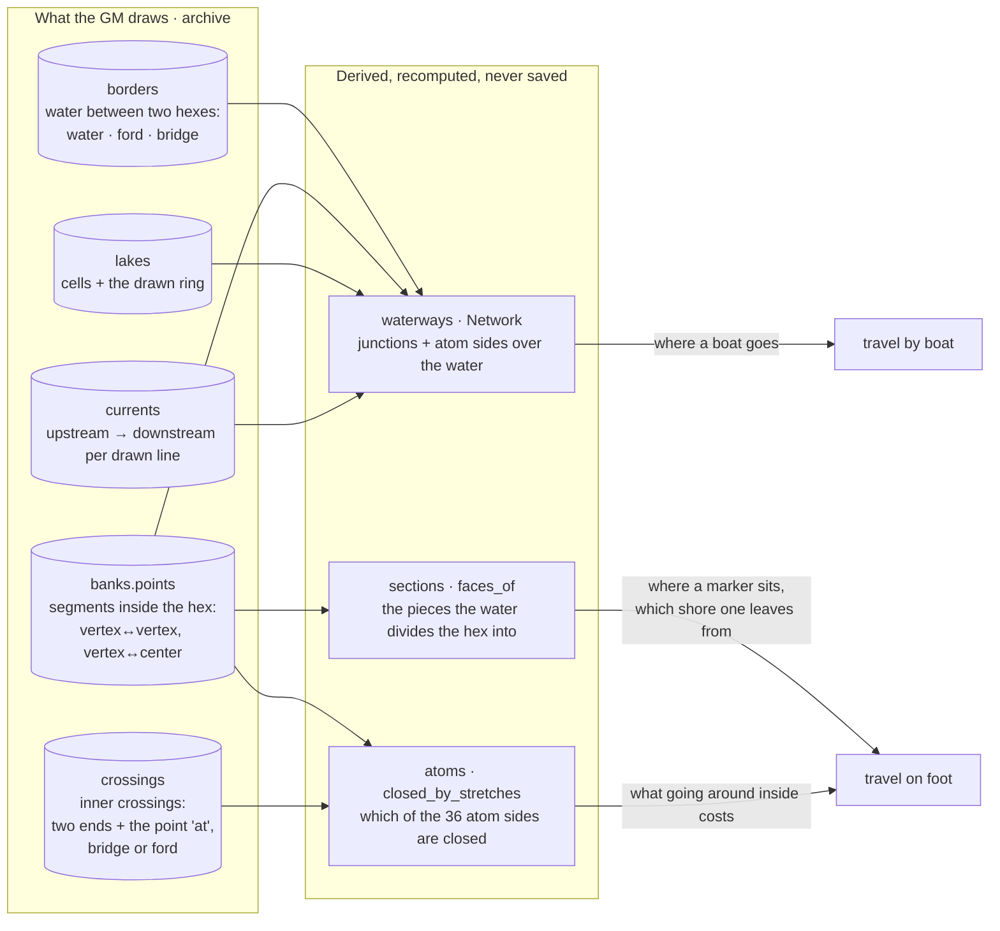
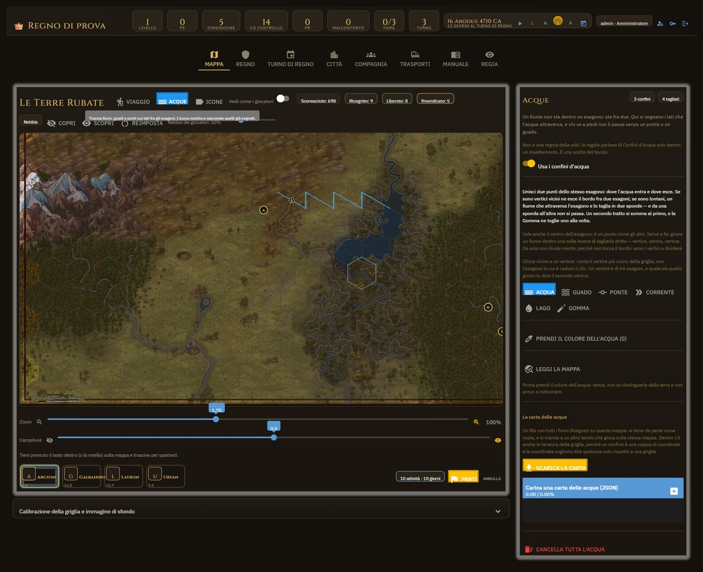

# 7. The water — the model on one page

The complete story, with the measurements and the whys, is in
[chapter 9](09-water-travel.md). Here is the map of the concepts and the
modules, to find one's way.

## Three things drawn, one truth

**`banks.groups`** (the sides grouped by bank) still exists and is written together with
`points`, but it is a derivative: it serves the drawing and the water charts. The truth is the
segments.

## The four models, in order of fineness

| Model | What it is | Where | What it answers |
|---|---|---|---|
| **Border** | the water on the side between two hexes; kind `water`/`ford`/`bridge` | `archive.campaign_borders`, `travel.border_cost` | «from A to B does one pass? does it cost more?» |
| **Section (face, shore)** | a piece of hex cut out by the segments (planar arrangement: `sections._faces`) | `archive.campaign_sections` → `{hex: (Face…)}` | «in which piece does this point sit?» (`face_of_point`), «which sides does it have?» |
| **Atom** | one of the 24 fixed pieces; 36 inner sides; 19 points | `geometry/atoms.py` | «what does crossing cost?» (`costs_inside`, `course_by_waypoints`), «where does the water close?» (`closed_by_stretches`, `mask`) |
| **Network** | junctions (`("v",col,row,k)` corners, `("c",col,row)` center, `("x",col,row,i)` inner) and arcs (`piece` = atom side ¼, `edge` = hex side ½) | `waterways.build`, `hexmap.waters_network()` | «where does a boat sail, at what price?» |

The properties everything rests on are measured, not assumed (`tests/test_atoms.py`): every
drawable line is **exactly** a set of atom sides; a chord between non-adjacent vertices is
**4** atom sides, a spoke **2**; a clean crossing passes through **4** atoms in all 15
directions, so ¼ per atom gives the cost of the rules without calibrating anything.

An **inner** bridge/ford opens an atom side (`travel.openings_of`); a ford costs as much as the
terrain; a bridge nothing. A ford **on the edge** costs one more activity (`kingdom.json →
travel.borders`, `source: "table"`).

## The current

`currents` is `{drawn line: (upstream, downstream)}` — on the line, not on the piece. The brush
(`_current_direction`) takes two junctions, `waterways.course` finds the road on the network,
and `course_stretches` translates it into the lines travelled. Every piece inherits the
direction from its parent in the sense it is travelled (`Arc`, `step_direction`). Downstream
open terrain, upstream difficult (twice); in lakes still water. One arrow per line
(`_svg_currents`).

## The brushes — `_water_panel`

*The Waters box: the brushes, the borders switch, the map reading, the water chart.*

| Brush (`border_mode`) | Gesture | Function |
|---|---|---|
| Water | two points of the same hex (vertices or center): neighbouring → border, far apart → segment | `_cut_hex` → `_drawn_stretch` |
| Bridge / Ford | **one click on the water line** to hop over (inside or on the edge) | `_crossing_under` |
| Current | upstream vertex, then follow the river; ctrl removes | `_current_direction`, `_remove_direction_under`, guide in `water_current.js` |
| Lake | the vertices of the outline, then the first to close; inside, the cells with the center in the shape **or on the outline** | `_lake_point`, `_close_lake`, `waterways.cells_in_polygon` |
| Eraser (`land`) | hold down and pass over: removes one stretch, border or crossing at a time | `water_eraser.js` → `km_water_eraser` → `_erase_under` |
| Colour | samples for the image reading | `map.water_samples` |

The **drawing** of the water: lakes (glaze) → `bank_stretches` (the segments as drawn) →
`_svg_inner_crossings` (bridge: full span + 🌉; ford: light dots along the water) →
`_svg_borders` (full, dashed, gap) → `_svg_currents` (arrows) → `_svg_seams` (only with the
Bridge in hand: where a stretch ends and the next begins).

## Assisted reading and charts

- **`water.reading.trace`**: opens the image with Pillow (optional), learns the water colour
  from the clicked samples, and for every pair of neighbouring hexes asks «does the segment
  between the two centers cross water?». Out comes a `Proposal` (borders, banks), drawn
  in orange, and applied only with «Accept» (`_accept_borders`; `source: "traced"` distinct from
  `"gm"`).
- **`water_chart`**: the whole drawing in a readable JSON (`compose`/`read`), to carry it to
  another map with the same grid; the directions are checked against the existing lines
  (`Network.has_stretch`). Here too: in proposal, then «Replace» or «Add».

## Switching everything off

The «Use the water borders» switch (`STATE.k["waters"]`, `hexmap.waters_active`) switches the
model off without erasing anything: travel goes back to whole hexes. Lake and River are no
longer terrains (the two entries stay in `kingdom.json` as `legacy` for the heartland table and
for old saves, which `migrations.drop_water_terrains` cleans at load): water exists only as
drawn lines and lakes.
