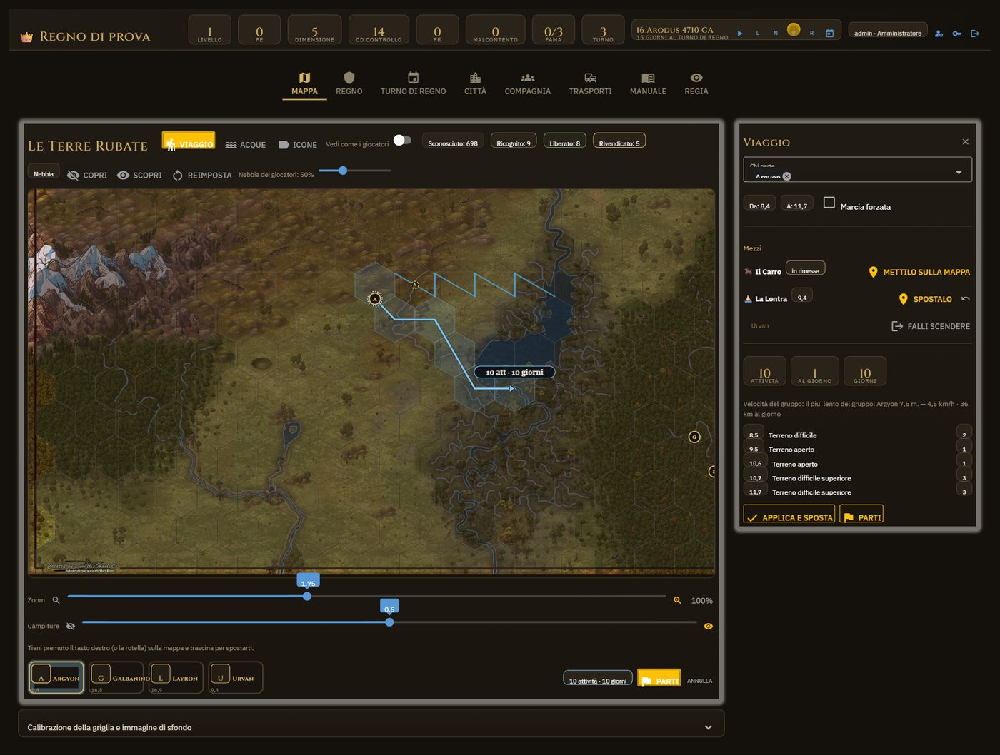
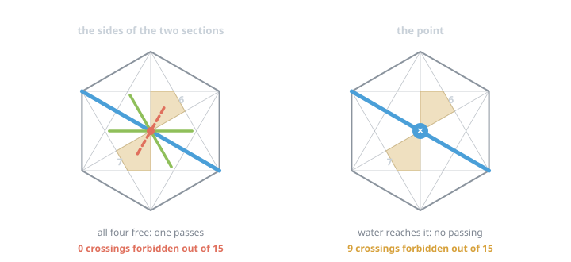
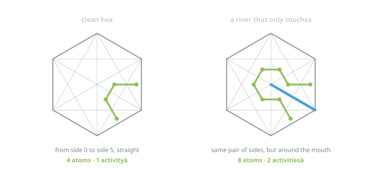
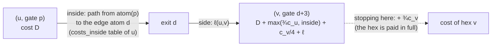
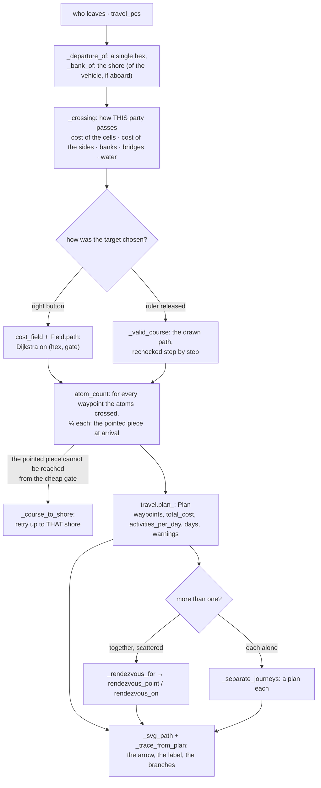
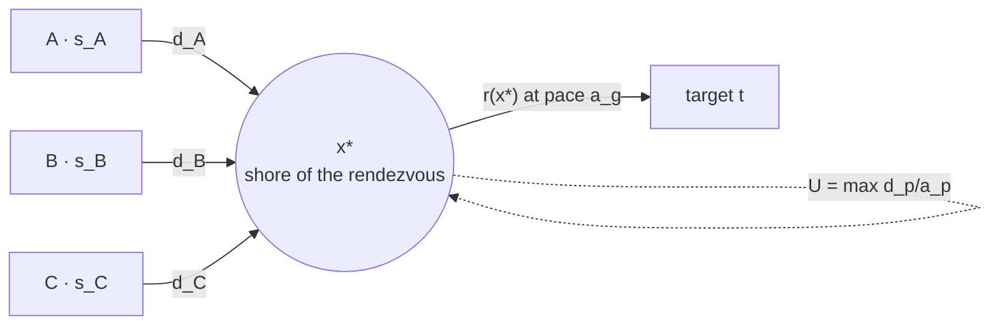

# 8. Land travel

A journey has three moments — **it is proposed** (a drawn plan), **it departs** (a row in
`journeys`), **it advances** (one day at a time, or by hand from the Turn) — and two means, on
foot and by boat, sharing the frame but not the graph. This chapter explains first the
**units** one counts with, then the **model of the hex** one walks on, then the **algorithms**:
the path of one traveller (Dijkstra), the count by atoms, the plan, the rendezvous of a
scattered party, separate journeys, the water route. At the end the ruler, the departure,
swimming. The story of how this model was reached, with the measurements, is in
[chapter 9](09-water-travel.md).



*A journey proposed with the right button: the arrow with the days label, the Travel box with the detail per hex, «Depart».*

## 1. The units: activities and days

The rules measure travel in **exploration activities**, not in miles. What the app applies
(all in `kingdom.json → travel`, with the source):

| Quantity | Rule | Function |
|---|---|---|
| cost of a hex $c$ | open **1**, difficult **2**, greater difficult **3**; roads improve by one grade; the GM's `difficulty` wins; a terrain without a category → the GM decides; a hex never explored counts as the worst («at most» estimate) | `terrain_category`, `travel_cost` |
| side between two hexes $\ell$ | 0 normally; **+1** for a ford on the edge; $\infty$ (no passing) for water without a bridge, unless by boat or swimming | `border_cost` |
| activities per day $a$ | from the Speed of the slowest: ≤10 ft → ½ · 15–25 → 1 · 30–40 → 2 · 45–55 → 3 · ≥60 → 4; forced march **+1** | `activities_per_day`, `available_activities` |
| days | $\text{days} = \lceil C / a \rceil$, with $C$ the total cost of the plan | `Plan.days` |
| sustainable forced march | $\max(1, \min_p \text{Con}_p)$ days; beyond → Fatigued (a warning, not applied) | `sustainable_march_days` |

One pays **the hex one enters**: the one one leaves from is free. Everything that follows
answers a single question: *what is $C$ for this road, with this water*.

## 2. The hex as 24 atoms

The water lines that can be drawn inside a hex are always the same: from one vertex to another
(the 9 diagonals), or from a vertex to the center (the 6 spokes). Drawing them all cuts the hex
into **24 fixed pieces**, the *atoms* (`geometry/atoms.py`). The count is closed: the diagonals alone
already make 24, and the spokes add none because they are halves of the long diagonals.



Numbers measured on the real geometry (`test_atoms.py`), not estimated:

| What | How many |
|---|---|
| atoms | **24**: 18 triangles and 6 quadrilaterals |
| borders between atoms (`sides`) | **36**, and all 36 lie on a drawable line |
| edge atoms (one per side of the hex) | **6** (`edge_atoms`) |
| inner points (junctions): center + 12 | **13** |
| atoms crossed by a clean crossing, for each of the 15 pairs of sides | **4** |

The fact that the 36 borders lie *exactly* on the drawable lines is what makes the model exact:
a water line **is** a set of borders between atoms (`closed_by_stretches`), in both directions,
and the water state of a hex is a mask of 36 bits (`mask`).

### The graph inside the hex

Given the closed borders $K \subseteq \{0,\dots,35\}$ and the openings $A$ (the borders a
bridge or a ford reopens), the graph $G(K, A)$ (`atoms.graph`) has the 24 atoms as vertices and
two kinds of edge:

- **by side**: $u \sim v$ if the border between $u$ and $v$ is not in $K$, or is in $A$;
- **by point**: $u \sim v$ if $u$ and $v$ touch the same junction **and no water reaches that
  junction** (no incident border in $K$; a bridge does not count: it reopens its stretch, not
  the point).

The point rule is the choice that decides everything. Read as «the sides of the two sections
being free is enough», the straight river **no longer divides** the hex (left panel of the
figure); read as «no water reaches the point» it forbids 9 crossings out of 15 (right). And the
jumps by point **are needed**: without them a clean hex would cost 4, 7 or 8 atoms depending on
the direction.

### The cost inside the hex

One pays **entering an atom**: a quarter of the cost of the hex, $q = c/4$. An extra ford costs
its toll $\pi$ (the cost of that terrain), a bridge nothing. On $G(K, A)$:

$$
\mathrm{inside}_{K,A}(u, v) \;=\; \min_{\gamma:\, u \to v} \;\sum_{(x,y) \in \gamma} \bigl( q + \pi(x, y) \bigr)
$$

computed with a Dijkstra from every atom (`_costs_inside`, memoised per $(K, A, q)$). Out of it
comes the property that keeps the numbers of the rules standing: a clean crossing passes
through 4 atoms, so $4q = c$, in every direction, without calibrating anything.



Where the water forces a detour, the detour pays for itself: in the figure a river entering
from a vertex and stopping at the center divides nothing, but the crossing of 4 atoms becomes
one of 8, that is double. Over all 1,561 configurations of up to three lines a crossing costs
4, 5, 6, 7 or 8 atoms or is impossible: **never less than 4**, never less than the rules.

## 3. The path of one: Dijkstra on (hex, gate)

`travel.cost_field` (the «field») is a Dijkstra on the map that answers *what it costs to get
anywhere and from where*. The graph:

- **node** = `(col, row, gate)`, where the gate is **the side one entered from** (0–5), or
  `DEPARTURE = -1` for the starting hex. The gate and not the shore, because what it costs to
  pass through a hex depends on where you enter **and** where you leave: entering and leaving
  by the two ends of the same shore means walking along the river, and `(col, row, shore)`
  could not say so;
- **edge** = leaving hex $u$ by side $d$ and entering the neighbour $v$, if `cost_of(v)` is not
  `None`, $v$ is inside the map and `passage(u, v)` is not `None`.



The weight of an edge is the sum of three pieces (`exit` inside `cost_field`); with $p$ the
entry gate into $u$ and $d$ the exit side towards $v$:

$$
D(v, d{+}3) \;=\; D(u, p) \;+\; \max\!\Bigl( \tfrac{3}{4} c_u,\; \mathrm{inside}_u\bigl(\mathrm{atom}(p) \to \mathrm{edge}(d)\bigr) \Bigr) \;+\; \frac{c_v}{4} \;+\; \ell(u, v)
$$

- $c_v / 4$ is paid entering: the first atom of the new hex.
- $\max(\tfrac{3}{4} c_u, \mathrm{inside}_u)$ is paid leaving: the other three quarters if the
  hex is clean, more if the water forces a walk along it. The maximum guarantees that a hex
  **never** costs less than the rules.
- **Stopping** in $v$ still pays the full price: $\mathrm{costs}[v] = D(v, \cdot) + \tfrac{3}{4}
  c_v$ (`_refresh`, parameter `full`), because the rules price the hex you enter, not the yards
  you walk inside it.
- The **starting** hex is not paid: `pay=False`, and one starts from the atom the marker sits
  in (`start_atom`, from the saved shore).
- **Inner bridges and fords** are not edges of the graph: they sit inside $\mathrm{inside}_u$
  (the openings). After a bridge you are not on a side but in the middle of the hex, and from
  there you still have to leave.

The field keeps three views of the same result: `node_costs` (per gate, the truth), `costs`
(per hex: the minimum over the gates, plus the full price) and `shore_costs` (per section: the
minimum over the gates that face it, with `best_shore` to retrace the path up to **that** shore,
`_course_to_shore`). The path is read backwards from `previous_ones` and delivered as a list of
hexes (`path`, which squashes the two nodes of the same hex when a bridge sits between them).

Two design choices: **Dijkstra and not A\***, because the grid has a few hundred cells (≈700
hexes, ≈2,400 nodes with 76 cut hexes) and a heuristic would only add a way to be wrong; and **a
whole field** even for a single path, because it costs as much as finding one path and the
ruler needs it, having to redraw the arrow without asking the server anything. With `arrival`
the loop stops as soon as it pops it from the queue.

## 4. The count by atoms: `atom_count`

The field says *which* road; `atom_count` **prices it waypoint by waypoint**, and it is the same
count the browser does while you drag (`legCost`, `stepCost`), line by line. For every cut hex of the
path:

1. entry atom = the edge of the side one arrives from; target = the edge of the side towards
   the next hex, or the atom of the **pointed piece** if it is the last waypoint (`final_spot`);
2. the **stops** = the shores the hand touched, in order (the ruler's `nodes`), each a set of
   atoms (`shore_atoms`); with the right button none;
3. `course_by_waypoints(K, A, entry, stops, target)`: a **layered Dijkstra** with state
   $(\text{atom}, k)$, $k$ being the stops already made; entering an atom of stop $k$ leads to
   $k{+}1$; a step costs $q + \pi$; with `constrained` between one stop and the next one does
   not enter a third shore (the drawn road stays its own, the count only asks it to be the
   shortest *among those that make that detour*). Ties are deterministic — by cost, then by
   atom number and layer, neighbours in increasing order — and the browser does the same, or
   the arrow would change shape on release (the `bench10` bench verifies it on 1,725 courses);
4. the **detour** of the waypoint: $\text{detour} = \max\bigl(0,\; \text{walk} - \tfrac{3}{4}
   c\bigr)$ — what is paid beyond the three quarters a clean hex costs to leave. `None` if
   there is no way to reach the pointed piece: the caller says so out loud.

A case apart, the journey **inside** the starting hex (a single waypoint and a pointed spot):
no hex is entered, one pays only the road from where one stands to the pointed piece.

## 5. The plan: `plan_`

With the waypoints, the sides and the detours, the total cost is

$$
C \;=\; C_0 \;+\; \sum_{i=1}^{n} \bigl( c_i + \ell_i + \text{detour}_i \bigr), \qquad \text{days} = \left\lceil \frac{C}{a} \right\rceil
$$

where $C_0$ (`departure_cost`) is what is paid before moving (fording the river of the hex one
leaves from, or changing shore at home). `Plan` carries every addend per waypoint
(`Waypoint.cost`, `border_cost`, `ring` for the detour, `inner_cost`), the warnings (unknown hexes counted as
the worst, fords, detours, forced march beyond the sustainable days) and the blockers (a side
that cannot be passed, a terrain to decide). `possible` if there are waypoints or a cost or
forced days and nothing blocking. At departure the plan is **frozen**: `waypoint_costs(plan)`
is the list the passing day consumes (section 9).



## 6. The rendezvous of a scattered party: `rendezvous_point`

If those leaving are not all on the same hex and «Travel together» is on, the journey is made
in two stages: each reaches a **meeting point** at their own speed, and from there they go on
together at the pace of the slowest. The meeting point is chosen by the algorithm, and the
choice is a minimisation over all the **shores** of the map (in a cut hex the two banks are two
different places).

Given the travellers $p$ with start $s_p$, activities per day $a_p$, the target $t$ and the
pace of the joined party $a_g = \min_p a_p$ (or the one imposed by the vehicle):

1. for every $p$ a **forward** field $d_p(\cdot)$ = `cost_field(s_p)` (section 3);
2. a **backward** field $r(\cdot)$ = `inverse_cost_field(t)`: what remains from there to the
   target. It is a reversed Dijkstra — entering a hex one pays that hex, so going backwards one
   pays the hex one comes from — on the graph **by shores**, not by gates: it does not count
   the detour inside the hex, and is slightly optimistic. It serves to *choose*; the plan shown
   at the table redoes it forward with the exact count;
3. for every shore $x$ reachable by **everyone**:

$$
U(x) = \max_p \frac{d_p(x)}{a_p}, \qquad T(x) = U(x) + \frac{r(x)}{a_g}, \qquad x^* = \operatorname*{arg\,min}_x \bigl( T(x),\, U(x) \bigr)
$$

   $U$ is the days for everyone to be there (whoever arrives first waits), $T$ the days to the
   party's arrival; the minimum is **lexicographic**: first make nobody late, then meet earlier,
   that is, make more of the road together;

4. from $x^*$: the **approaches** `_course_to_shore(s_p, x*)` of each, the **wait** $U(x^*) -
   d_p(x^*)/a_p$, how long they would take **alone** ($d_p(t)/a_p$, to tell the table what
   waiting costs), and the **common road** read from the inverse field climbing the
   `previous_ones` from $x^*$ to $t$. The result is a `Rendezvous`; `None` if even one cannot
   get there.



The cost: $k+1$ Dijkstras (one per traveller plus the inverse) and a scan of the shores; on
the real map a fraction of a second. In terms of the model, the rendezvous that comes out is
**free** for the arrival (nobody arrives later than the slowest would alone) and maximises the
road made together for the same arrival.

**`rendezvous_on`**, when the common road is **drawn by the hand** with the ruler: the meeting
point is not searched, it is read (the first hex of the drawn road); among its shores the one
where everyone meets first is taken, if the hand did not say; the rest of the road is priced
adding hexes and sides; the drawn approaches (`branches`) are kept if they end at the meeting
point, on its shore, otherwise recomputed. A meeting point that moved by itself while the hand
pulls the road would make the line dance under the fingers: the choice is deliberate.

At departure `_legs_from_rendezvous` writes **one leg per branch** (whoever arrives first
waits: `progress` still) and a common leg with `waits=True`, which starts when everyone has
arrived.

## 7. Separate journeys

With «Travel together» off (`_separate_journeys`) there is not one journey, there are $k$: a
field per traveller, a path and a plan each, everyone at their own speed; the box shows the plan
of whoever takes longest. It holds also when leaving from the same hex: the road is the same
but the faster arrive first.

## 8. The ruler in the browser — `travel_drag.js`

The server sends the field **once** (`travel_field` → `window.kmTravelField`) and from there
the drawing is all in the browser: at every mouse movement zero requests.

| Field key | Content |
|---|---|
| `cells` | one per **(hex, shore)**: `[col, row, px, py, unknown, entry cost, anchor_x, anchor_y, shore, atom]` |
| `neighbours`, `sides` | adjacencies and extra costs of the sides (fords, borders) |
| `atoms`, `masks`, `compass` | the geometry of the 24 atoms (once), for every cut hex the mask of the 36 closed borders + openings + shore per atom, and how one passes from a hex to the neighbour |
| `travellers[]` | `id`, `name`, `color`, `origin` (cell), `activities`, `from` (the distances of the backward Dijkstra, for the rendezvous) |
| `pace`, `together`, `water`, `scale` | the pitch of the grid, whether one travels united, whether the field is a water one, the scale of the costs |
| `texts` | the label patterns in the viewer's language (`_label_texts`: one day, N days, «act · days», the «at most» prefix) |

The browser redoes the same count as the server (`courseByWaypoints` is the copy of
`atoms.course_by_waypoints`, with the same tie-break; the `bench10` bench verifies it on 575
configurations; the rendezvous formula is the same as `rendezvous_point`, on the `from`
distances). The gesture:

1. **pressing** gives at once the shortest way to the pressed cell (`climbBack` on the distances);
2. **dragging** guides by hand from one cell to the next (`manualStep`): going back shortens,
   jumping ahead fills **only in a straight line** and at most `MAX_FILL` cells; against the
   water or a long detour, red flash, vibration and `km_travel_blocked`;
3. **releasing** sends `km_travel_target` with the path, the **nodes** (the shores touched),
   the arrival point, and for the party the common road and the branches: the server redoes
   the count **on that** (`_dragged_target` → `_compute_journey(traced=…, traced_nodes=…,
   traced_branches=…)`, after `_valid_course`: nothing of the browser's count is kept).

With «Travel together» off it guides $k$ arrows in parallel (`refreshSeparate`). The field is
sent only with the ruler in hand and only if it changed (key: travellers, vehicle, march,
revisions).

## 9. Departing and advancing

```mermaid
sequenceDiagram
    participant U as Depart
    participant H as hexmap._apply_journey
    participant DB as journeys (archive)
    participant G as daily.advance_one_day
    participant T as turn._resolve_journey
    U->>H: plan possible, nobody already travelling
    H->>H: _road_drawing: nodes, stretches (atoms), where (arrival spot); _journey_vehicle
    H->>H: legs: a single one, or _legs_from_rendezvous (branches + common with waits=True), or _parts_each_alone
    H->>DB: create_journey {characters, stable_id, path, costs (frozen), legs, days, …}
    H->>H: _reset_journey, travel_pcs/vehicle cleared
    loop every day (clock)
        G->>DB: journeys(in_progress)
        G->>G: _active_legs: first the branches, then the common one when everyone has arrived
        G->>G: _advance_leg: progress += activities_per_day; waypoint_reached → hex and spot
        G->>DB: update_character (hex + where), move_vehicles_with, legs rewritten; finished when all are done
    end
    T->>H: move_characters(ids, arrival, coming_from, stable_id, where) — by hand from the Turn
```

- The plan is **frozen** at departure: `costs` per waypoint (`travel.waypoint_costs`: hex +
  side + detour, and the departure cost on the first) and activities per day stay those of that
  moment, even if the GM retouches the terrain. The context everything is computed with is an
  object, `_Crossing` (costs, sides, banks, bridges, water, view, difficulty, vehicles).
- The passing day: `waypoint_reached(costs, progress)` counts how many waypoints are paid in
  full; $\text{days missing} = \lceil (\sum_i \text{costs}_i - \text{progress}) / a \rceil$.
- The leg carries what is needed to redraw it as it was seen: `nodes`, `stretches`, `where`;
  for a boat `route` (junctions) and `waypoint_states`. `_svg_journeys_in_progress` →
  `_leg_points` draws the amber route from the marker to the pointed piece, shortening it
  every day.
- The arrival spot (`where_x/where_y` of the journey, and per leg `where`) is the pointed
  piece; for the branches the shore of the rendezvous (`daily._leg_spot`).

## 10. By boat: the route on the water

Same frame, other graph: `_compute_route` (a boat in hand) or `_route_by_river` (an assigned
boat: «⛵ By river» appears next to the land journey). The graph is the **network**
(`waterways.Network`, chapter 7): junctions and arcs over the drawn water, where an arc is a
**piece** (an atom side, ¼ of a hex) or an **edge** (a hex side, ½).

- The **state** is `(junction, hex)`: the junction alone is not enough, because two hexes
  attached along the river share the vertices and the target is *entering the hex*, not
  touching a node (`route_towards`). One starts from the boat's junction
  (`waterways.vehicle_node`) and stops when the second member is the target, or at the pointed
  junction (`arrival_node`).
- The **cost of a step** (`stretch_cost`, `_water_steps`):

$$
\text{cost}(\text{arc}, \text{direction}) = f(\text{arc}) \cdot c(\text{direction}), \qquad f = \begin{cases} \tfrac14 & \text{piece (atom side)} \\ \tfrac12 & \text{edge (hex side)} \\ 1 & \text{otherwise} \end{cases} \qquad c = \begin{cases} 1 & \text{downstream, or in a lake} \\ 2 & \text{upstream} \end{cases}
$$

- `route_field` is the Dijkstra on the states for the ruler; it counts in thousandths
  (`scale`) with +1 per step, so that even a path of zero-cost steps is retraced backwards
  without bouncing.
- `route_plan` adds the stretches travelled **per hex** (the waypoints stay one per hex,
  because that is how a journey is read and a marker moved) and rounds to the whole at the end
  of the journey; `route_along` prices the road drawn by hand on the same arcs.
- One boards and lands from the **shores touching the junction** (`waterways.touching_faces`,
  `travel.ascent_blocked` / `descent_blocked`); ashore, not in the middle of the lake
  (`_no_landing`). A boat never follows a land journey (chapter 10). The whole water side —
network, route, the ruler on the water — is chapter 9.

## 11. Swimming

`swim_speed_m` on the sheet: whoever swims crosses borders and shores without a boat
(`party_swims`, `swim_crossings`, `OpenWater`: for the pathfinder the water is where it is but
closes nothing, and every pair of shores touches), the party goes as the slowest, and it stays
a land journey (in the detail: 🏊). Whoever swims **but is on a boat** sails.

## 12. Where things are

| Question | Function | File |
|---|---|---|
| what entering a hex costs | `travel_cost`, `terrain_category` | `travel/__init__.py` |
| the graph of a hex, the cost inside | `graph`, `costs_inside`, `course_by_waypoints` | `geometry/atoms.py` |
| which road, what it costs to get anywhere | `cost_field`, `Field`, `path` | `travel/__init__.py` |
| the count waypoint by waypoint, the detour | `atom_count`, `inner_on_course`, `nodes_on_course` | `travel/__init__.py` |
| activities and days | `plan_`, `Plan`, `available_activities`, `waypoint_costs` | `travel/__init__.py` |
| the rendezvous | `inverse_cost_field`, `rendezvous_point`, `rendezvous_on`, `Rendezvous` | `travel/__init__.py` |
| the water route | `route_field`, `route_towards`, `route_along`, `route_plan` | `travel/__init__.py` |
| how the map puts everything together | `_compute_journey`, `_apply_journey`, `_rendezvous_for`, `_separate_journeys` | `ui/hexmap/travel.py` |
| the ruler | `travel_field`, `route_field`, `_dragged_target` | `ui/hexmap/ruler.py`, `ui/static/travel_drag.js` |
| the passing day | `advance_one_day`, `waypoint_reached` | `travel/daily.py` |
