# 9. Water travel — how the water works, really

This chapter tells **the whole model of the water and of travelling on it** as it is
implemented today: what the water is on the map, how it divides a hex, how a boat moves,
what a route costs, who does the count, who draws the arrow, and what the other windows see.
It is written to be read **from beginning to end, once**: every section uses only things
explained before it, and every concept appears with the name it has in the code.

Chapter 8 covers travel on foot — the 24 atoms, the Dijkstra on (hex, gate), the plan, the
rendezvous — and this chapter leans on it where a boat and a walker share a rule. The last
two sections are of a different kind: where the model comes from, and where it ends.

> **The figures are not drawn by hand.** `water_figures.py` generates them with the app's real
> geometry — the hexes from `hexgrid`, the sections from `sections.faces_of`, the same code the
> program decides with — so a figure cannot tell something other than what the program does.
> They are remade with `python docs/manual/water_figures.py`.

## 1. The hex: sides, vertices, center

A hex is two numbers: `(col, row)`. That is how the players call it («17,5») and that is how it
sits in the archive. Everything else stands *around* it or *inside* it.

**The six sides** are the six directions towards the neighbours, in the order of
`hexgrid.neighbours(col, row, orientation)`: side *d* looks onto neighbour *d*, and from the
other side that same side is `(d + 3) % 6`. **The six vertices** are numbered going around,
`hexgrid.SIDE_RING = (0, 5, 4, 3, 2, 1)`: vertex *k* is where sides `SIDE_RING[k]` and
`SIDE_RING[k+1]` meet. **The center** is not a vertex, but it is a snappable point like the
others: it serves the rivers that enter a hex and turn, and the confluences.

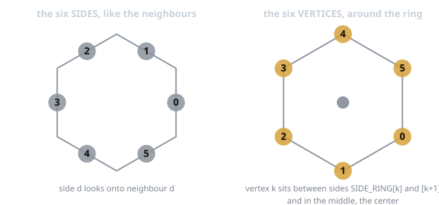

All the geometry in pixels sits in `geometry/hexgrid.py` and depends on `size` (radius
center→vertex), `origin` and `orientation` only. No other module computes positions by itself.

## 2. The water on the map: three ways of being there

The water is **drawn on top of the terrain**. Lake and River are not terrains (release 1.0.0
dropped them; a save that marked hexes so loses the mark at load,
`migrations.drop_water_terrains`): a hex under a lake keeps its own terrain, and only the drawn
water counts. It is written in three tables, because it is three different things.

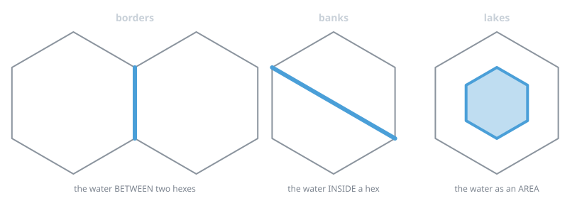

| Table | What it is | Key |
|---|---|---|
| `borders` | the water **between** two hexes: `water` (no passing on foot), `ford` (passing costs one activity more), `bridge` (passing costs nothing) | the ordered pair of hexes (`hexgrid.border_key`) |
| `banks` | the water **inside** a hex: `points`, the drawn segments (vertex↔vertex, vertex↔center), and `groups`, the sections derived from them | the hex |
| `lakes` | the water as an **area**: the drawn ring of vertices and centers (`points`) and the `cells` whose center falls inside it, plus a name | the lake id |

And two service tables: `crossings` (bridges and fords **inside** a hex, section 5) and
`currents` (the direction of a drawn line, section 6). An unmarked side is land and costs
zero. All three kinds of border are water for a boat: a ford and a bridge are ways of
*passing* a watercourse, not its absence.

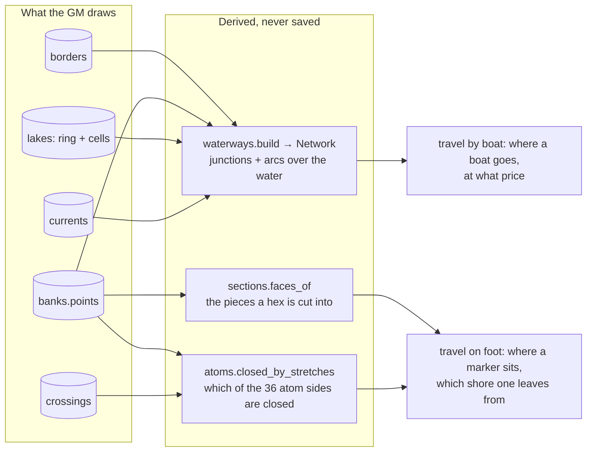

## 3. The sections of a hex: the «shores»

When the water crosses a hex, the hex stops being a single place. Whoever stands on this side
and whoever stands on that side are in two different places with the same coordinates. The
app calls those places **shores** (or sections), and numbers them 0, 1, 2…

The rule is `sections.faces_of`, and it is the geometric definition: the water lines drawn
inside the hex, plus its edge, form a **planar drawing**, and the sections are its **faces**.
The count is the standard way of reading a planar drawing: every line is broken where it
touches another, the lines leaving each node are sorted by angle, and the faces are walked
always taking the rightmost turn.

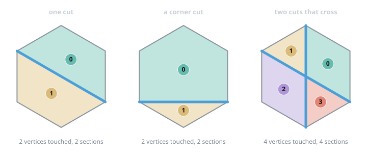

Four consequences worth having in mind:

1. A stretch that enters and stops in the middle divides nothing: the drawing stays, the
   section is one.
2. Passing through the center cuts like everything else: a stretch vertex→center and one
   center→vertex are two lines with a node between them.
3. A section has a shape and an area; the sides it faces are a property, not its definition.
   It may face none: an island, entered only with an inner crossing.
4. Every side of the edge lies on the outline of **exactly one** section, as long as the ends
   of the stretches are vertices or the center — the only two things the brush snaps to.
   `travel.bank_of_side(banks, coord, direction)` is the question everything else asks.

**The section number is not saved. The spot is.** A section is a question asked of a point, not
a name that is kept: as soon as the GM draws another line the sections are renumbered, and a
saved number would put a marker on the other bank without anybody touching it. So on disk
there are only points — `characters.pos_x/pos_y`, `stable.pos_x/pos_y` (in hex radii from the
center), `crossings.a_x/a_y, b_x/b_y, at_x/at_y` — and `sections.section_of(entry, faces)`
derives the number every time it is needed.

## 4. The drawing: where a section sits

Every section occupies a piece of hex, and that piece has a point: `Face.ring` is the real
outline, `Face.point` its centroid (pulled onto the widest triangle of the fan where the
centroid would fall outside, as in an L-shaped face). `hexmap.bank_point` only turns radii into
pixels.

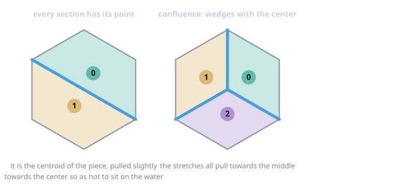

That point serves three trades that are the same trade: **seeing** (the markers of that shore
sit there, one badge per piece, sized by the piece: `badge_radius`, a tenth of the area,
between `MIN_RADIUS` and `BADGE_RADIUS`; several members are one badge with the count),
**pointing** (the ruler chooses the cell with the nearest point, so the other bank is a thing
one can aim at), and **drawing the road** (the arrow passes through the atoms the count
crossed and ends on the point of the pointed shore, where the marker settles). A journey
carries with it the point where it stops inside the arrival hex (`journeys.where_x/where_y`):
stopping in the shore one enters from and crossing the river to stop beyond are two different
journeys, and the second is longer.

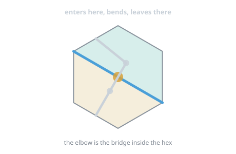

*The light line is the road, the blue one the water, the amber dot the bridge: the elbow is
the only place where the road has a point more than the hexes it crosses.*

## 5. Crossing: bridges and fords

**On the edge** a crossing is a `border` of kind `bridge` or `ford`. **Inside the hex** it is a
row in `crossings`: two points, one per shore, planted inside the two shores it joins, plus
`at`, where it sits on the water (two crossings on the same river join the same shores, and
without `at` they would be the same crossing).

A crossing is not a step of the graph: it is a stretch of river that **reopens**.
`travel.openings_of` translates it into the atom sides it sits on (chapter 8): a **bridge**
reopens its stretch and nothing more, at no cost; a **ford** reopens the whole line it belongs
to, at the cost of that terrain (the table's choice: the rules do not price it). A bridge opens
the stretch, not the point where it ends: going around a junction where water arrives stays
forbidden. If the GM redraws and the water no longer passes there, the crossing switches
itself off; so does a bridge whose two shores stop touching.

**The third way of crossing is swimming.** `swim_speed_m` on the sheet; the party goes as its
slowest member, and `travel.party_swims` says who is missing. Swimming is not sailing: the
swimmer walks on land like everybody, the shores stay, and for the pathfinder the water is
there but closes nothing (`travel.OPEN_WATER`), every pair of shores joined at zero cost
(`travel.swim_crossings`).

## 6. The current

A drawn line may have a direction: `currents` holds `{line: (upstream, downstream)}` — on the
line, not on the piece. The Current brush takes two junctions, `waterways.course` finds the road
on the network, `course_stretches` says which lines it travelled, and every piece of a line
inherits the direction in the sense it is travelled (`Arc.parent_`, `Arc.straight_on`,
`step_direction`). Downstream is open terrain, upstream is difficult (double); a line without a
direction is still water, open both ways — the case of every line of a lake.

## 7. The lakes

A lake is a **hand-drawn shape**: a ring of vertices and centers, and the cells whose center
falls inside the ring or on it (`waterways.cells_in_polygon`; a center on the outline counts,
or a sensible closed shape could contain no hex). It is not filled by flooding, because a
hand-drawn lake does not follow the hex edges. A named lake shows its name on the map, above
the water lines when reading the map and below them while the Waters mode is on
(`_svg_lake_names`); the *Lake names* button hides them per window.

**Inside, one really sails.** Every point of the grid inside the shape — vertices, centers and
the inner junctions of the atoms — is a water point, and the points next to each other are
joined: a triangular mesh over the lake, on which a boat goes from the shore to the middle and
across. The mesh is not drawn (a lake is seen by its glaze), and the Current brush does not
find it.

**But only inside the shape.** A cell belongs to the lake when its center does, and a cell on
the shore has vertices outside the ring. Until 1.0.0 the mesh covered the whole of every cell,
so a boat could sail to a vertex on dry land and the arrow left the water. Now
`waterways.build` keeps only the atom sides and hex sides whose two ends fall inside the ring
or on it (`_lake_membership`); a lake without a ring, from before the shapes, keeps its whole
cells.

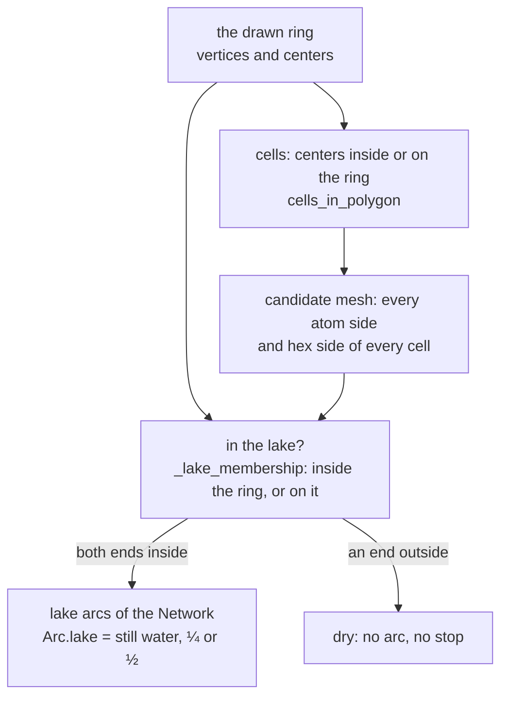

## 8. The network: the water as a boat sees it

A boat does not walk on hexes: it sails on the drawn lines, **one atom side at a time**.
Chapter 8 measures that every drawable line is exactly a set of atom sides — a chord between
non-adjacent vertices has **four**, a spoke from a vertex to the center **two** — and
`geometry/waterways.py` builds the network on those (`build`, cached per archive revision in
`hexmap.waters_network`):

| | What | Name |
|---|---|---|
| **Nodes** | the **junctions**: the six corners (`("v", col, row, k)`, canonical from all three hexes), the center (`("c", col, row)`), the twelve inner junctions (`("x", col, row, i)`). A junction is a node even where the line that would cut it is not drawn, as long as it is on water | `waterways.junction_key`, `node_point`, `node_hexes` |
| **Arcs** | the **pieces**, atom sides over a drawn line, kind `piece`, ¼ of an activity; the wet **hex sides**, kind `edge`, ½; each remembers its drawn line and the sense it travels it; lake arcs are `lake=True` | `Arc` |
| **Cost of a step** | `stretch_cost(arc, direction)`: the piece's share × 1 downstream or in a lake, × 2 upstream | `travel.stretch_cost`, `_water_steps` |

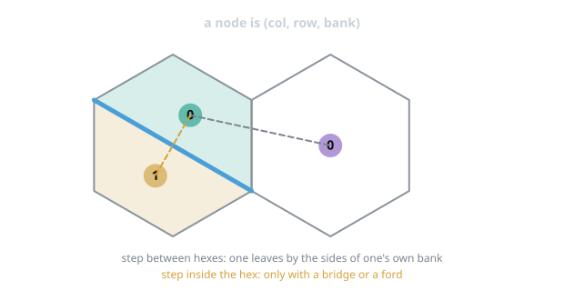

The **state** of a water journey is `(junction, hex)`, not the junction alone: two hexes
attached along a river share their vertices, and the target is *entering the hex*, not touching
a node. From a state, `_water_steps` offers the arcs leaving the junction, each booked in the
hex the arc belongs to when that hex is the current one or a neighbour: on an edge stretch one
may stay on this side or pass to the other, because it is the same water.

**The boat sits on a junction** (`stable.pos_x/pos_y` in radii; `waterways.vehicle_node` finds
it), placed by clicking near one (`_junction_under`). One boards and lands from the **shores
touching the junction** (`waterways.touching_faces`, `travel.ascent_blocked` /
`descent_blocked`), ashore and not in the middle of a lake (`_no_landing`). A boat never
follows a land journey (`archive.move_vehicles_with`).

## 9. The route: from a boat to a hex

Same frame as the land journey, another graph: `_compute_route` (a boat in hand, whoever is
aboard leaves with it) or `_route_by_river` (a boat assigned to the chosen characters: «⛵ By
river» appears next to the land plan, and *Take the river* is yours to press).

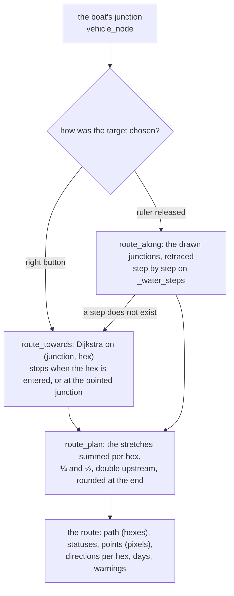

- `route_field` is the same Dijkstra kept whole, for the ruler; it counts in thousandths
  (`ROUTE_SCALE`) with +1 per step, so that a path of zero-cost steps is retraced backwards
  without bouncing.
- **The drawn route is kept.** The browser sends every junction it passed as `[x, y, col,
  row]`: the point says *which* water point, the hex *on which side* one was, and both are
  needed because a vertex belongs to three hexes. The server turns them into states
  (`statuses_from_points`) and walks them again with `route_along`, keeping nothing of the
  browser's count. Two things used to lose the drawn road silently and are fixed in 1.0.0: the
  payload check dropped the hex of every point, and a step onto a shared vertex counted in the
  *next* hex did not match the server's steps (the ruler's field has one cell per state and
  symmetric adjacencies; the server's steps are directed). Now the same junction booked in
  another hex is accepted, and the hand's booking is kept when that junction really touches
  the hex.
- **Where one arrives** is told by the route, not by the clicked hex: aiming at a river running
  on the edge one ends up in the cell beside, and the box writes that one.
- One pays what one sails, stretch by stretch, not the hex one enters: with a river running on
  the edge between two cells one could not even say which was entered. Half activities do not
  exist on the sheet: the plan rounds at the end, and the dragged arrow rounds the same way.

## 10. The ruler on the water

The server sends the field **once** (`route_field` → `window.kmTravelField`, `water: true`),
and from there every mouse move is the browser's alone. The cells are the **junctions** (each
with the hex it is counted in and, since 1.0.0, a flag saying whether it is a **line end** — a
vertex or a center — or an inner junction along a line), the adjacencies are the arcs, the costs
sit on the sides.

**Pressing** gives at once the shortest way to the pressed junction (`climbBack` on the
distances), as with the right button. From there the hand guides, and the rule is not the
land one. On land a cell is a hex, and «the nearest cell» is a sane question; on the water a
chord has five junctions and a lake hex nineteen, the nearest one flips several times per
centimetre, and at a confluence a line was picked by a few degrees of angle before the hand
had said anything. So on the water:

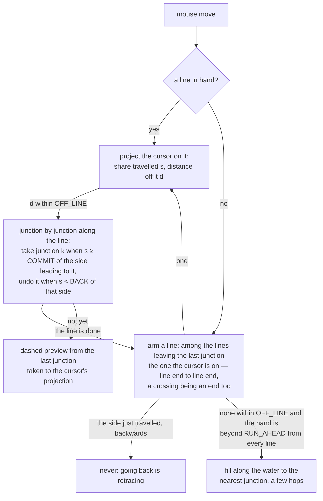

- **Direction from the line, steps from the junctions** (`waterGuide`). The candidates are the
  lines leaving the last junction (`waterEdges`: a breadth-first walk through inner junctions
  that stops at the first line end; an inner junction where more than two sides meet — a
  crossing — is an end too, because it is a place to turn). The line the cursor is closest to
  is armed; along it every junction is taken once the cursor has travelled `COMMIT` = 65% of
  the side leading to it, and undone once it comes back below `BACK` = 50%. At a confluence
  nothing happens while the hand hovers on the vertex: you go into a line, and the arrow
  follows you there, junction by junction.
- **Going back is retracing.** The side just travelled is never offered backwards as a new
  line: a hand coming back over it shortens the arrow, it does not double back. (An
  out-and-back on the same stretch cannot be drawn by hand; nobody asked for one.)
- **Screen pixels.** The thresholds are what a hand can do on the screen, converted with the
  image's current scale: a junction needs at least `PX_COMMIT` = 8 screen pixels of travel, a
  line is armed within at least `PX_OFF` = 10. Zoomed out, the same rule does not become a
  jitter test.
- **Coarse when tiny.** When a side is shorter than `PX_FINE` = 12 screen pixels it is no
  longer a step a hand can mean, and the line is one step, taken and undone as a whole. It
  switches by itself, per line.
- **The preview.** While a line is armed, a dashed thread runs from the last junction taken,
  along the line, to where the cursor projects: you see which line is about to be taken before
  it is, and the arrow does not look frozen while the hand earns the step.
- **No dwell.** The land rule «enter a cell only if the hand stays there 90 ms» is off on the
  water: commit by travel replaces it, and waiting would only delay a step already earned.
- **A hand that runs ahead** (farther than `RUN_AHEAD` from every line) is filled along the
  water to the nearest junction, a few hops at most (`alongWater`).

| Parameter | Value | Meaning |
|---|---|---|
| `COMMIT` | 0.65 | share of a side travelled before its junction is taken |
| `BACK` | 0.5 | share travelled back along a side before its junction is undone |
| `OFF_LINE` | 0.5 spacing | beyond it a line is not armed |
| `RUN_AHEAD` | 1.0 spacing | beyond it from every line the fill takes over |
| `PX_COMMIT` / `PX_OFF` / `PX_FINE` | 8 / 10 / 12 px | the same rules on screen, whatever the zoom |

**On release** the browser sends the whole drawn road, point by point with its hex, and the
server walks it again (section 9). Of the browser's count nothing is kept; of its drawing, the
junctions it passed are.

## 11. What the others see

While a boat is steered the browser publishes the arrow as **the polyline in pixels** it draws
(`km_live_trace`), and the server hands it to the windows entitled to see it with the labels
rendered in each recipient's language. Once the route is prepared — the right button, the
count redone on release — the server publishes the route's own points, the junctions it passes
(`_trace_from_plan`), with the route's activities and days. The audience is the one of every
arrow (`_trace_audience`): the GM always, a player when one of the travellers is a character
they know the whereabouts of — and, since a boat travels as a vehicle, when they can see the
hex the boat is in, exactly as they see the boat. The red flash of a blocked step reaches them
too. Until 1.0.0 a boat's arrow reached nobody: its traveller was a vehicle id the audience
rule did not know, and the prepared route was not published at all.

## 12. Switching it off, hiding it

The «Use the water borders» switch (`STATE.k["waters"]`, `hexmap.waters_active`) switches the
model off without erasing anything: travel goes back to whole hexes. The icon of the Waters
button hides the drawn water in your window only; the layer is cached per window, and the
switch is looked at before the cache (it was not, once, and hiding drew the lines back from the
copy).

## 13. Where the model comes from

For a long time a section was **a set of sides**: the vertices of the edge touched by the
water, and the edge arcs between two consecutive touches (`waterways.banks_from_cuts`). From
there descended something never written anywhere: the number of sections of a hex was the
number of vertices touched by the water, at most six. The geometry did not agree:

| cut | sides model | faces |
|---|---|---|
| a single chord | 2 | 2 |
| two chords that cross | 4 | 4 |
| **two separate chords** | **4** | **3** |
| confluence at the center | 6 | 6 |
| **a triangle inside** | **3** | **4** |
| **all the diagonals** | **6** | **24** |

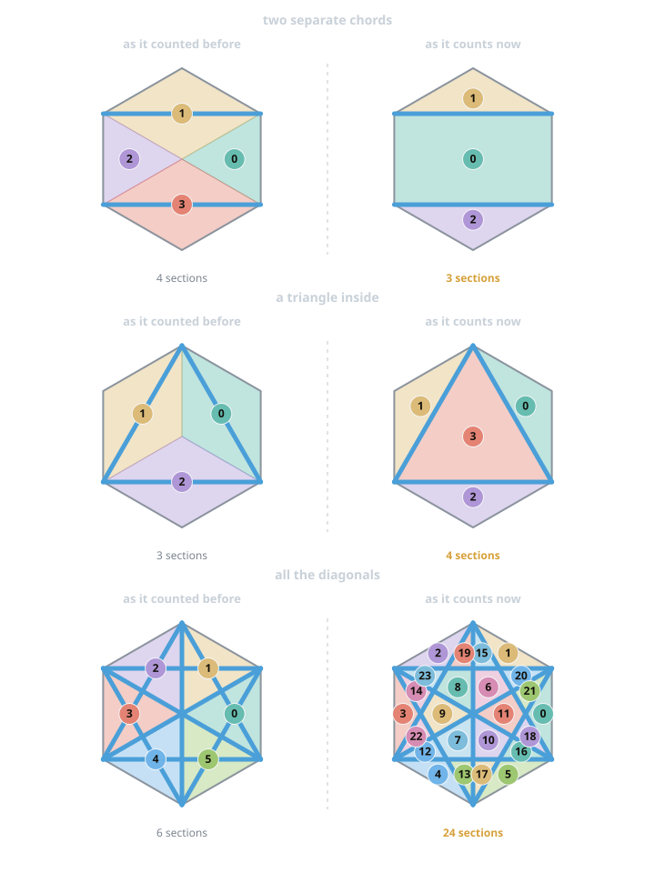

It counted more than there was (two separate chords: an invented wall between two arcs of the
same piece, the defect that cost most at the table), less (a triangle inside touches no side,
so it did not exist), and not even close (twenty-four faces, six names). It had not been seen
because there was no way to *see* a section: markers and arrows sat at the center of the hex.
As soon as every section had a shape and a point, the error had a place to show.

What did not change: the travel graph (node, steps, costs, Dijkstra work on any set of
sections), the ruler in the browser (a cell per (hex, section) with its point), the network for
the boats (built from the segments, not from the sections). `banks_from_cuts` still exists: the
groups of sides are the format the image reading proposes a cut hex in, and the water charts
are exchanged in (`sections.cuts_from_groups`).

Then the faces model met three things it could not do — a bridge could not be placed where
the hand naturally puts it, a river that only touches a hex counted for nothing, and «I am in
that piece there» could not be said — and the point of view was turned around: the hex is
**already divided into 24 fixed pieces**, and a water line closes passages between pieces that
were always there. That is the model of chapter 8; its numbers are measured, not assumed
(`test_atoms.py`): 24 atoms, 36 borders all lying on drawable lines, a clean crossing through
exactly 4 atoms in all 15 directions, so ¼ per atom is the cost of the rules without
calibrating anything.

## 14. Where it ends

- **The ends of the stretches are vertices or the center.** A line ending halfway along a side
  cannot be drawn: it would make a side divisible between two sections, and «which section does
  side 2 face» would stop having a single answer.
- **Twenty-four sections are representable, not playable.** The limit that remains is the
  eye's, and the water brush says so when it happens.
- **A lake's mesh is not drawn.** One sees where a boat went by the arrow, not by the lines it
  could take; the dashed preview while steering is what shows the next line.
- **An out-and-back by hand.** Going back over the side just travelled is read as retracing;
  a deliberate round trip on the same stretch is not a gesture the ruler knows.
- **The rules do not price everything.** A ford inside a hex costs the terrain, swimming across
  a hex costs nothing, a lake is open terrain: the table's choices, marked as such in the data,
  and the places where a table that decides otherwise should write its number.

## 15. Where things are

| Question | Function | File |
|---|---|---|
| the faces of a hex, the point of a face | `faces_of`, `face_of_point`, `section_of`, `breath` | `geometry/sections.py` |
| the 24 atoms, the closed borders, the openings | `sides`, `closed_by_stretches`, `mask`, `openings_of` | `geometry/atoms.py`, `travel/__init__.py` |
| the network: junctions, arcs, lakes inside the ring | `build`, `Network`, `Arc`, `cells_in_polygon`, `_lake_membership`, `vehicle_node`, `touching_faces` | `geometry/waterways.py` |
| the cost of a stretch, the steps from a state | `stretch_cost`, `_water_steps`, `current_category` | `travel/__init__.py` |
| the route, the field, the drawn road | `route_towards`, `route_field`, `route_along`, `route_plan` | `travel/__init__.py` |
| the route as the map builds it | `_compute_route`, `_route_by_river`, `_take_route`, boarding and landing | `ui/hexmap/boats.py` |
| the field for the browser, the drawn points, the traces | `route_field`, `statuses_from_points`, `_valid_points`, `_dragged_target`, `_live_trace`, `_trace_from_plan`, `_trace_audience` | `ui/hexmap/ruler.py` |
| guiding on the water | `waterGuide`, `waterEdges`, `projectOn`, `followLine`, `alongWater` | `ui/static/travel_drag.js` |
| the brushes, the lakes box, the lake names | `_lake_point`, `_close_lake`, `_lakes_box`, `_current_direction`, `_erase_under` | `ui/hexmap/water.py`, `drawing.py` |
| the day that passes on a boat | `advance_one_day`, `_waypoint_junction` | `travel/daily.py` |
