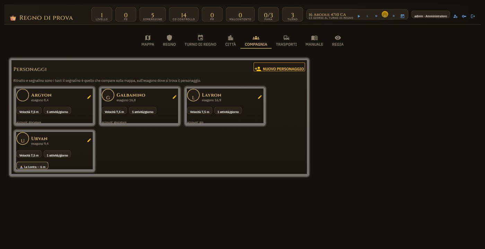
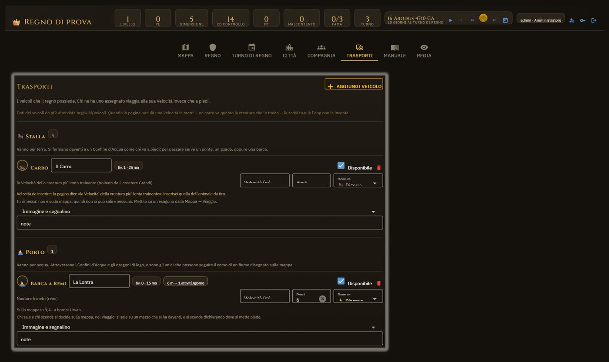
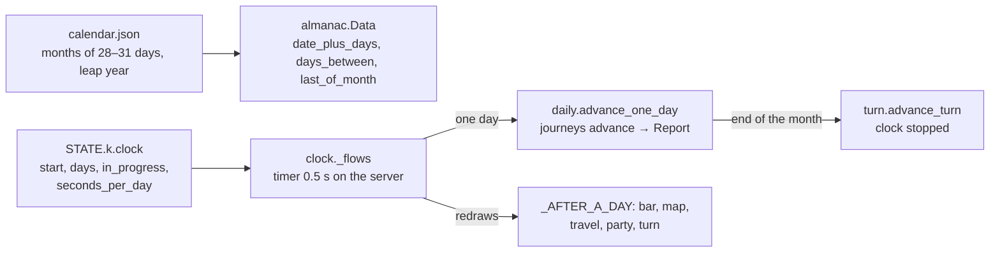

# 10. Party, Transport, Time

## Characters — `ui/tabs/party.py`, table `characters`

*The Party: the characters with account, speed, position and vehicle.*

A character is a row: `name`, `user_id` (who plays them), `speed_m` + `speed_bonus_m`,
`swim_speed_m`, `con_mod`, `color`, `portrait`, `token`, `note`, `hex_col/hex_row` +
`pos_x/pos_y` (where they are, and in which piece), `stable_id` (the vehicle they travel on).
`visible_characters(user)`: the GM sees them all, a player their own
(`permissions.can_on_character`).

The sheet (`character_dialog`, `_fields`) edits the fields; portrait and token go through
`_image_box` → `images.accept` (permission checked again, safe name, header bytes verified,
thumbnail). «Board / get off» (`_climb`) uses the same rule as the map
(`travel.ascent_blocked`) and **puts the character where the vehicle is** (hex and spot).

The leadership roles point at characters (`STATE.k["roles"][rid]["character_id"]`);
`migrations.ensure_characters` created the characters from the hand-written names once.

## Vehicles — `ui/tabs/transport.py`, table `stable`

*The Transport: the kingdom's stable, the rules catalogue, placing and taking back a vehicle.*

The **stable** belongs to the kingdom: `vehicle` (id in the `vehicles.json` catalogue), `name`,
`available`, `speed_m` and `seats` (when the rules do not give them as a number), `kind`
(`land`/`water`/`air`, `travel.vehicle_kind`; the catalogue suggests it from how the Speed is
written), `portrait`, `token`, `hex_col/hex_row` + `pos_x/pos_y`. `_catalogue_dialog` lists the
catalogue; `DEPOTS` names the three depots (stable, harbour, sky) through the catalogs.

A **placed** vehicle (`_place_vehicle` from the map) is a member of its piece of hex; a boat
sits on a water junction (`_junction_under`). «Put it on the map» / «Move it» / «Back in the
depot» (`_take_vehicle`, `_put_back_in_depot`). Whoever boards sits where the vehicle is;
whoever is aboard is seen inside its badge. The boarding and landing rules are in `travel/__init__.py`
(`ascent_blocked`: same atom for a land vehicle, a shore touching the junction for a boat;
`descent_blocked`: next to it for a wagon, a shore touching the junction and ashore for a boat).

`party_vehicles` / `_vehicles_in_play`: only the **placed** vehicles count; a `stable_id`
pointing at a vehicle in the depot is an old link and is worth nothing.

**A boat does not follow a land journey.** `archive.move_vehicles_with` moves water vehicles
only if they are the journey's vehicle (the leg's `stable_id`); `_journey_vehicle` never assigns
a boat to a journey on foot; whoever arrives on foot gets off the vehicle left behind
(`_leave_remaining_vehicles`, and the same in `daily`). The HTML badges of characters and
vehicles are in `ui/badges.py`.

## Images — `media/images.py`

- `safe_file_name`: allowed extension, no paths; `unique_name` so as not to overwrite.
- `accept(file, folder, name, max_bytes)`: byte limit, saving aside, check of the header bytes
  (`imgsize.dimensions`), then rename. An `.html` renamed `.jpg` never stays on disk with a
  servable name.
- `thumbnail(folder, name, side)` + `address(base, folder, name, side)`: the small copy in
  `assets/…/thumbnails`, made with Pillow if present, otherwise the original.
- The limits: map 40 MB, portraits 8 MB, charts 4 MB.

## Time — `rules/almanac.py`, `travel/daily.py`, `ui/tabs/clock.py`

- Time is counted in **absolute days** from the start date; the real date comes from the
  Absalom Reckoning calendar. The Kingdom Turn falls at the **end of the month**, so it lasts as
  long as the month.
- The timer runs on the server, one for everybody; the speeds are in `SPEED` (seconds per day);
  an absurd interval (a suspend) does not make months pass in one go. At restart the clock is
  always stopped (`_stopped_at_start`).
- An error while a day passes **stops the clock** and writes it in the journal, instead of
  killing the timer.
- Only the GM governs time (`CONTROL_CLOCK`); `_date_dialog` moves the date without losing the
  start of the campaign.
