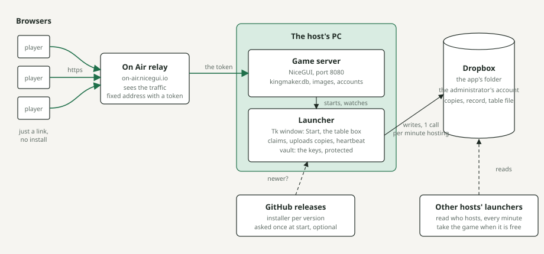
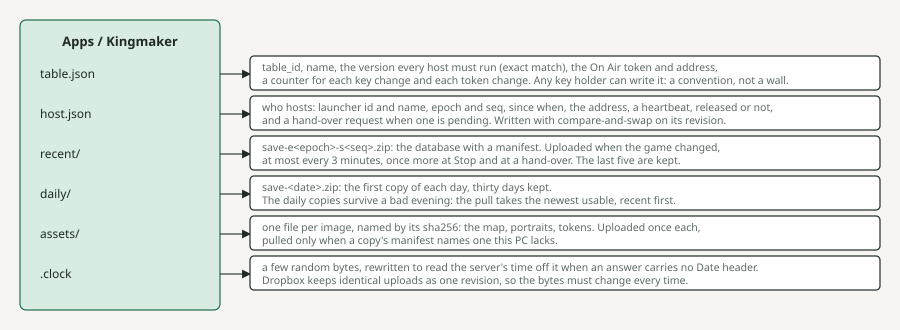
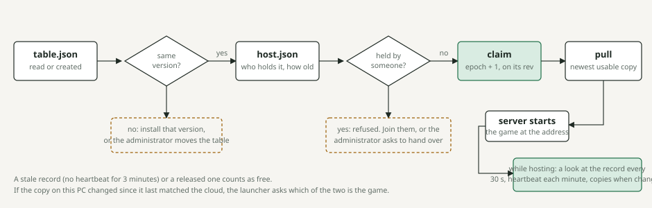
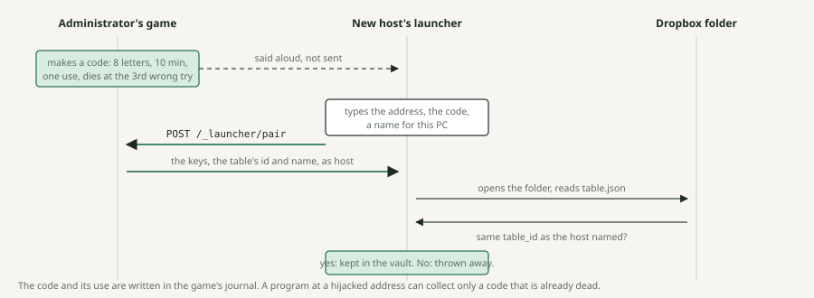
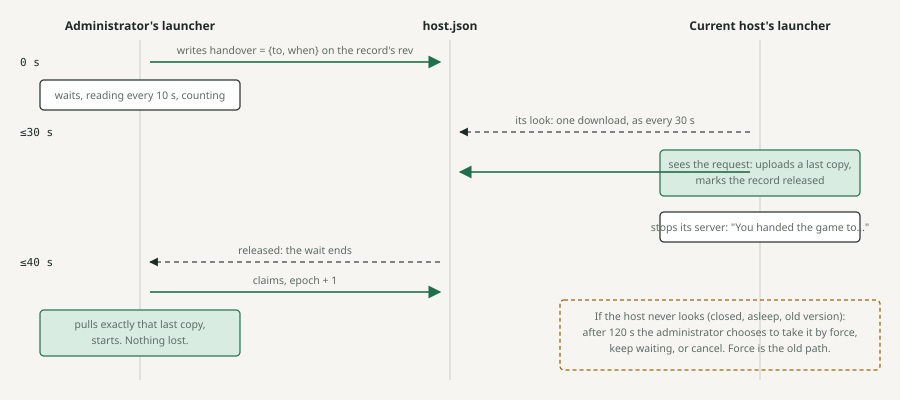
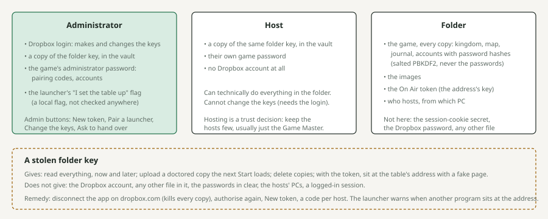
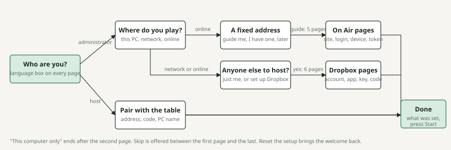

# 14. The architecture in pictures

Seven drawings of how a table of friends plays one kingdom from several computers: the
pieces, the Dropbox folder they share, what happens at Start, how a host is let in, how the
game changes hands, who holds which key, and the first run. Each picture carries one claim,
stated under it. The mechanisms themselves are explained in [chapter 12](12-launcher-and-packaging.md)
(the launcher) and [chapter 13](13-cloud-sync.md) (the cloud); this chapter is the map to read
them by. The drawings are plain SVG in `img/architecture-*.svg`, drawn by hand, not generated.

## The pieces

Everything runs on the computer that hosts. The players only open a web address. The folder in
Dropbox is how the next host picks the game up, and the relay is what makes the address
reachable from far away.

*Green: the game's traffic, from the players through the relay to the server. Black: the
launcher's own talk with Dropbox and GitHub; dashed, reads only. On the same network, or on
this computer only, the relay drops out and the players use the network link directly.*

## The folder

One folder per table, inside the app's own space in the administrator's Dropbox (`sync.py`:
`HOST_FILE`, `TABLE_FILE`, `RECENT`, `DAILY`, `ASSETS`). The app sees nothing else there. Every
host's launcher reads and writes it with the same key.

*The epoch rises each time the game changes hands, the seq at each upload: together they order
every copy. Dropbox opens the whole folder to any key, so what a launcher believes of a file
comes from its signature, never from the folder (`sync.TableRecord.verified`,
`sync.known_launchers`, `sync.snapshot_signer`). A copy from a newer save format stops the pull
(`NewerCopy`) rather than falling back to an older one.*

## Pressing Start with a table

Start never takes the game blindly (`window.claim_then_start`). It reads the table, checks the
version, asks who holds the record, and only then takes it, loads the newest copy and starts
the server.

*Dotted boxes are the two places Start stops and asks instead of deciding. The claim is a
compare-and-swap on the record's revision (`sync.claim`), so two launchers pressing Start
together cannot both win.*

## Letting a host in: the pairing code

No password travels. The administrator makes a short code in the game while hosting
(`access/pairing.py`), says it aloud, and the new launcher trades it for the keys
(`core.pair`), which it keeps only after checking that they open the right table
(`core.adopt_pairing`).

*The check against the folder is what stops a fake host: an address that answers with keys to
another table, or to nothing, hands out something the launcher refuses to keep. The admission
(`sync.make_admission`) is what makes the newcomer's later copies count: a chain of signatures
from the administrator's key down, kept in `launchers.json`.*

## The game changing hands: the hand-over

When the administrator wants the game back from a host who is still playing, nothing is taken
by force at first (`sync.request_handover`, `Hoster.look`, `sync.wait_for_release`). The host's
launcher is asked, uploads its last copy, and lets go.

*Measured on the two-machine bench (Windows administrator, WSL host, the fake Dropbox of the
tests): asked at 0 s, the host had uploaded and released one second later, and the
administrator was running with that copy at 12 s. The same look also notices a forced
take-over at once.*

## Who holds which key

Two Dropbox keys open the folder: the administrator's own (`cloud.refresh_token`) and the
hosts' key (`cloud.hosts_refresh_token`), of which every host holds a copy. On top of them
every launcher has a signing key of its own (`Settings.sign_seed`, `sign_key`), never typed by
anyone, and the table's file says which launchers it vouches for; *Trust in the folder* in
[chapter 13](13-cloud-sync.md) has the formats.

*Dropbox cannot tell one key holder from another, so the launchers do it themselves with
signatures. The one-key choice stands for what it was made for: friends never log in to
anything. [SECURITY.md](../../SECURITY.md) and [PRIVACY.md](../../PRIVACY.md) say the same in
full.*

## The first run

The welcome (`wizard.WelcomeWizard`) asks only what the answers call for. The administrator's
longest road is sixteen pages, two picture guides included; a host sees three.

*The host's road takes the mode from the table's address (`core.mode_for_address`), so a host
never chooses where the game is played. A table already in the settings skips the address and
the others pages.*
