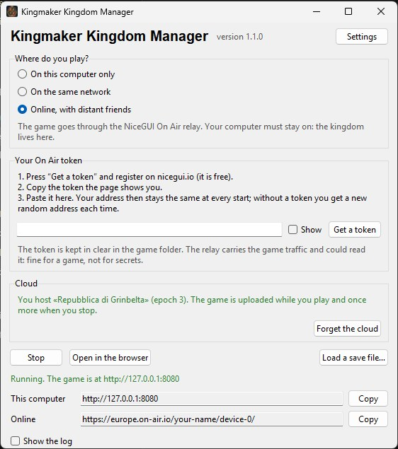
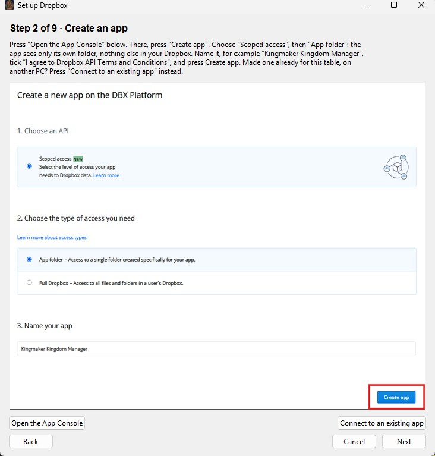

# Kingmaker Kingdom Manager — user guide

*In italiano: [it/guida-utente.md](it/guida-utente.md) (longer, with the history of every choice).*

This guide describes the app as it is in version 1.1.4, tab by tab, with the reason behind
each choice where it matters at the table. To install and start it see the
[README](../README.md); the window of the installed app is the first chapter below. The screenshots in [`manual/img/screenshots/`](manual/img/screenshots/)
were taken with the Italian interface; the English one is the same, label for label.

The rules quoted are those of the Kingmaker kingdom subsystem for Pathfinder 2e (Archives of
Nethys in English, pf2.altervista.org in Italian). Where the app follows a choice of the table
rather than a rule, the data carries `"source": "table"` and the in-app Manual marks it.

## The launcher

The installed app (the Windows setup or the Linux tarball from the releases page) opens this
window instead of a terminal; from source it is `python launch.py --launcher`. It starts and
stops the server, nothing else: the game is still played in the browser.

**Where do you play?** *On this computer only* is the default: the game opens in your browser
and nobody else can reach it. *On the same network* is for friends in the same house: they
open the network link in their browser. *Online, with distant friends* publishes the game
through the NiceGUI On Air relay; your computer must stay on, because the kingdom lives there.
The choice is remembered.

**The On Air token.** Choosing *Online* shows a field for it and, next to the steps, two
buttons. *Set it up step by step…* opens a wizard that walks you through it with a picture of
each screen: the On Air site, the login, GitHub — which is where you sign in, so that neither
On Air nor this app ever sees your password — the device to add on your On Air page, which
hands out its token as soon as you add it, and the token itself, which it saves for you. A
last step is there for the day the token is lost: On Air shows a token once and never again,
so you take a new one from the cog on the device's line, and it retires the one before. That
step has its own button, *Lost the token?*, next to the other two — you do not have to walk
the guide from the start to reach it, which would be cruel, since the step before it asks for
the token you no longer have. *Get a token* opens the same site
straight away, for when you know the road. With the
token your address stays the same at every start; without it you get a new random address
each time. The token is kept in clear in the game folder; the relay, run by Zauberzeug GmbH
(Germany), the makers of NiceGUI, sees every player's address and carries the game traffic
in the clear, so it could read it: fine for a game and not for secrets. On this computer or
on the same network nothing leaves your PC at all — see [PRIVACY.md](../PRIVACY.md).

**Start, Stop, the links.** *Start* runs the server; when it is ready the status line turns
green, the browser opens, and the links appear with a *Copy* button each: this computer, the
network (one line per address the machine has; try the one that looks like your home network),
online. *Stop* closes the server cleanly, with the last save written. Closing the window stops
it too, after a confirmation. If the port is busy the launcher takes the next one and says so.
On Windows, the first *On the same network* start is preceded by a notice: Windows will ask to
allow the app through the firewall, and you must click *Allow access*.

**The first start.** The administrator's password is shown in a dialog, with *Copy*; it is not
shown again. At the first login the app asks you to change it. If it is lost, *Settings →
Reset the administrator password* (server stopped) generates a new one and shows it once.

**A game from elsewhere.** *Load a save file…* (server stopped) takes the zip downloaded from
the Save tab of another PC, or its bare `kingmaker.db`: it shows the kingdom's name, the
accounts and the images, asks once, copies everything in and keeps the previous save next to
it. You
then sign in with the accounts of that file. The same box is on the kingdom creation page,
for whoever runs from source without the launcher.

**Settings.** The port, the language of the launcher (the app has its own toggle), whether the
browser opens on start, whether the launcher asks GitHub for a newer version at start (on by
default; the request carries only the app's version), *Open the game folder* (where `saves`
and `assets` are, for backups), and the administrator reset. *Show the log* at the bottom unfolds what the server prints, which
is where to look when it stops on its own.

**Updates.** When a newer release is on GitHub, a line at the top says so (unless the check is
off in *Settings*). On Windows *Download the update* fetches the installer from GitHub and
starts it, keeping your game; the installer is not signed with a paid certificate, so Windows
warns the first time. On Linux it opens the release page. *Settings → Versions on GitHub…* lists every release, newest first, with the
installed one marked, and installs the one you pick; going back to an older version is allowed,
with a warning, since a save written by a newer version can be refused by an older one. The game is in `saves` and `assets` inside the installed folder: an update
replaces the program and leaves them, and the uninstaller (in *Add or remove programs*) asks
whether to delete them too.

## Accounts and roles

At the first start the app creates the `admin` account and prints a random password in the
console, once: write it down. The first login asks you to change it, and from there you create
the other accounts: top right, next to your name, the 👤⚙ *Player accounts* icon (only the
administrator sees it). Every new account is born with a generated password to hand to its
owner; it cannot be recovered, but you can always generate another one.

| Role | What it can do |
|---|---|
| **Administrator** | Everything, plus the accounts, the save file and resetting the kingdom. |
| **Game Master** | Prepares the map and its image, knows the secrets, decides what has been revealed and governs every character. |
| **Player** | Plays: activities, turn, cities, map. |
| **Spectator** | Only watches. |

Passwords are not stored: only a PBKDF2-HMAC-SHA256 digest with a salt per user, in the `users`
table of `saves/kingmaker.db`, on your disk like everything else. No external service sees
them. The key that signs the session cookies is in `saves/.storage_secret`, generated at the
first start; `KINGMAKER_STORAGE_SECRET` overrides it. Deleting that file breaks nothing: it
only sends everyone back to the login page. Note that copying the `saves/` folder copies that
key too: fine on a home PC, but on a hosting service pass it as an environment variable.

**Entering another account.** From the Accounts panel the administrator can look at the app
through another account's eyes (the 🔓 icon on each row) without knowing or changing its
password. It is the honest way to see what a player sees: the header says **«as X»** in red
with a button to come back, the kingdom journal records who entered which account,
permissions are checked on who *really* logged in, and no password can be changed while
wearing someone else's clothes.

**Language.** The IT/EN button in the header switches the interface for your account and
remembers it. Before you choose, the browser's language decides; the login page has the same
button and the first login adopts what you chose there. Each connected window has its own
language, so the GM can play in English while a player reads Italian.

**Metres or feet.** The m/ft button next to it chooses the unit of every Speed you see and
type, per account: feet by default with the English interface, metres with the Italian one.
Speeds are stored in metres and converted exactly (5 ft = 1.5 m), so nothing changes in the
travel arithmetic; the Travel Speed line shows miles per hour and per day in feet mode.

**Shared and personal.** There is one kingdom: hexes, sheet, turn, cities and grid calibration
update by themselves in every connected window. The selected hex, the zoom, the veil and the
choices in dropdowns are yours, so two players can work on different hexes at the same time.
Run **one** copy of the app on the same data: each process keeps the kingdom in memory and
would overwrite the other's changes.

The game lives in `saves/kingmaker.db`, written at most every two seconds and at shutdown.
`KINGMAKER_DATA_DIR` moves the data folder, `KINGMAKER_ASSETS_DIR` the images. A save from
release 0.x is migrated at the first start, after an automatic copy named
`kingmaker.db.pre-v27.bak`; an old `saves/regno.json` is imported into an empty database and
left where it is. From the Save tab the administrator downloads the whole game as one zip, the
kingdom as JSON inside it.

### Characters

A **leadership role** is no longer a name typed by hand: with the *PC* box ticked you pick the
character from the campaign's list; roles without *PC* stay NPCs with a free name. Two roles
held by the same character count as one leader when the turn counts the available Leadership
activities.

The sheets are in the **Party** tab. The GM and the administrator see every character, create
and delete them and link them to accounts; a player sees and edits only the characters linked
to their account. It is not a hidden button: another player's sheet is not even read from the
database.

Every sheet has, as on Roll20, a **portrait** (the big image on the sheet) and a **token** (the
badge on the map). Upload them from the sheet (PNG, JPG, GIF or WebP up to 8 MB); they land in
`assets/characters`, behind the login like everything else. What the page receives is a
thumbnail kept next to the original (a 2.2 MB token became 60 KB; without Pillow installed the
originals are served). Without an image the badge shows the initials in the character's
colour, and the initials are always drawn under the image, so a missing file never leaves a
hole.

From the sheet you also set the **base Speed** and a **bonus** (kept apart so you see where the
total comes from), the **Swim Speed**, the **Constitution modifier** (how many days of forced
march they stand), the colour, the position on the map, the vehicle they are on (only among
those placed in their own hex) and notes. Under the numbers the app shows how many exploration
activities per day that Speed gives, from the Hexploration table.

### Transport

The **Transport** tab lists the vehicles the kingdom owns. It is its own tab and not a box at
the bottom of the Party because it answers another rule: a character is edited by whoever
plays them, a vehicle belongs to the kingdom and anyone who plays manages it. Vehicles come
from a catalogue of 45 entries transcribed from the rules: name, level, price, size, crew,
passengers and Speed as on the page.

Inside, vehicles are sorted by **where they go**: the **Stable** for land, the **Harbour** for
water, the **Sky** for those that fly (shown only if you own one). It is the only distinction
travel really looks at: a boat crosses a water border and follows a river; a wagon stops on
the bank like anyone on foot; whoever flies passes over both, because the rules put them
together («if you fly or travel on water, almost every hex is open terrain»), but a river is
not a road for a flyer. Where a vehicle goes is decided by the fastest movement on its page
(a Rowboat is born in the Harbour); when the page gives no Speed at all (a wagon goes as fast
as what pulls it) the app does not guess: it puts it in the Stable and the *Where it goes*
dropdown says why. The dropdown stays yours: a raft the catalogue does not know goes where
you say.

For each vehicle you can set the name you gave it, whether it is **available** (untick it when
broken, lent or far away), notes, and the number of **seats** (from the page: passengers plus
pilot, or the crew alone; correct it for your specimen). For many vehicles the rules give no
Speed in metres: the app asks you for it, saying why, and until you write it whoever is aboard
travels on foot. Every vehicle can have an **image** and a **token** like a character; they
land in `assets/vehicles`. Without an image the badge shows 🐎, ⛵ or 🎈, and an unavailable
vehicle looks faded.

Who is aboard **is not decided here**: boarding is a gesture made where one stands, and the
place where one stands is the map. This tab is the depot: you buy, name, count seats and
Speed; each row says where the vehicle is and who travels on it.

**Everybody boards.** In the *Travel* box, when those leaving bring a vehicle along, the switch
*Everybody boards* appears, **off**. On, the joined party moves at the vehicle's Speed instead
of its slowest member's, but only if the seats suffice and only if the vehicle really is faster
than the party is now. It is off on purpose: Hexploration says nothing about vehicles, and
putting the party in a carriage is a decision of the table. Turning it on a journey already
drawn does not choose another road: the road stays, only the days change. The same holds for
the forced march.

## Time passing

At the top, next to the kingdom's numbers, is the campaign date in the **Absalom Reckoning**
calendar and how long until the next Kingdom Turn. The GM has the controls: ▶ to let time
flow, ⏸ to stop it, four speeds (one game day every 12, 6, 3 or 1 real seconds) and 📅 to set
the date by hand.

Time flows **on the server**, not in the browsers: one clock for everyone. While days pass,
parties on the road advance by themselves: every day they spend their exploration activities,
and when those pay for the waypoint they enter the next hex. A swamp hex at one activity per
day takes three days, and for two of them the party is honestly still in the previous hex.
Every step goes into the journal.

**At the end of the month the Kingdom Turn advances by itself and the clock stops**, so the
table has time to play its Kingdom activities; the turn resumes when the GM starts time again.
The rules say Kingdom Turns «occur at the end of each month», and Golarion's months run from
28 to 31 days: a turn lasts as long as the current month, not a round number decided by us.
Calistril gets a day more in leap years, one every eight.

If the server restarts with the clock running, you find it stopped: making days pass while
nobody watched is not what whoever started it wanted.

## Kingdom creation

Under the ten steps, whoever can reset the kingdom sees **Already have a save file?**: the same
*Load a save* control as the Save tab, for a game played on another PC or before
the installer. Nothing to redo: the file is looked at, confirmed and copied in.

A guided procedure over the ten steps of the rules: Concept, Charter, Heartland, Government,
Finalize Ability Scores, Details, Leadership Roles (with the four invested roles and the skills
they train), First Village, Skill Modifiers, Fame or Infamy. The scores update as you choose.

## The map

A hex grid over the image of the map. For every hex you record the status (Unknown /
Reconnoitered / Cleared / Claimed), terrains, terrain features (Resource, Landmark, Refuge,
Ruins, Bridge, Structure…), roads, fortification, farmland and work site. From the side box you
attempt the Region activities on the selected hex — Claim, Clear, Establish Work Site,
Establish Farmland, Build Roads, Fortify, Establish Settlement — and **Reconnoiter**, which
costs what the rules say and brings the hex to Reconnoitered, the requirement to claim it.
Costs in RP, XP and milestone rewards are proposed and applied on confirmation.

**Background image.** Open *Grid calibration and background image* and upload the map of the
Stolen Lands (PNG or JPG), or copy the file into `assets/` and pick it from the dropdown. The
image size is detected; press *Fit the grid to the image* to spread the columns over the width,
then adjust orientation, radius and origin until the polygons match the printed hexes; each
slider has a box beside it to type the exact number, for a calibration copied from another
table. The
zoom under the map goes to 400% with scrolling; to pan, hold the right button (or the wheel)
and drag, as on Roll20. **The map ends where the image ends**: a hex belongs to the map if its
center falls on the image, for the grid, the click and every travel count.

**Icons** hides the icons and names of the hexes and leaves only the drawing; the character
badges stay, because they are *where you are*, not *what is there*. The **veil** slider decides
how much the terrain colours cover the image, with the two end positions as buttons; it is
personal, like the zoom, and the hex outlines never fade with it. The map remembers where you
were looking when you come back to the tab.

**Badges.** Whoever is on the map appears as a badge in their hex, with the token or the
initials in their colour. The fog rules apply: a player does not receive the badges standing on
hexes they do not know, but always sees their own characters. Where water divides a hex, every
piece has its own badge, sized by the piece; where several people (or a vehicle and people)
share a piece, the badge shows the **count**: click it to open the box with the portraits and
choose whom to move, or «All N». A placed vehicle is one unit with whoever is aboard, drawn
small inside its badge; you click the vehicle and they come with it.

### Travel

Under the map is the row of portraits: who is in the campaign, where, and a bar with the days
left if on the road. A character not yet on the map says «not on the map yet»: click them, then
click the hex where they are.

Turn on the **Travel** button above the map: the right column shows the *Travel* box and puts
away the GM block and the hex sheet. While it is on, a click on the map chooses who leaves:

- **click a hex** → takes every badge on it, usually the party travelling together;
- **click a badge** → takes only that one;
- **click a vehicle's badge** → takes that vehicle, and from there one travels with it;
- **ctrl + click** → adds to the choice instead of starting over, so you build a group one
  person at a time, even from different hexes; while ctrl is down the arrow does not start;
- **click where nobody is** → drops everything.

A white dashed ring marks who you have in hand. Taking someone on a wagon takes the wagon too;
taking someone on foot drops the vehicle you had. Among a face, a vehicle and the ground, the
face wins, then the vehicle.

Then, to say where to go:

- **drag with the left button**, like the Roll20 ruler. A plain click draws nothing (that is
  the gesture for choosing); it becomes a stroke as soon as you move, or if you **hold still**
  a quarter of a second, and from there the arrow goes there by the cheapest way. **If the
  arrow is visible, releasing confirms it.** If you keep dragging hex by hex **the path follows
  the hand**, even when longer: to pass through the forest instead of the road, bring the
  mouse there. Going back on your steps shortens it; jumping far fills **in a straight line
  only**. The label updates activities and days on the path you actually drew. The path may
  cross itself and pass the same hex twice, paying every time. Holding the right button pans
  the map, and you can do it **while still dragging**.
- or **right-click** the destination hex, which always takes the cheapest way in one go.
- or, in the *Travel* box, pick who leaves from a list, click the destination and press the
  compute button. The small arrow next to that list takes the chosen characters **off the
  map**: no hex, no vehicle, back to the Party tab to be placed again. It is the way out when
  a marker ends up somewhere no journey starts from; someone on a journey is not moved.

**When the arrow does not go on, it says so**: it flashes red for half a second, the phone
vibrates, and the reason appears top right — either *there is water between the two hexes*
(you need a bridge, a ford or a boat) or *the hand jumped too far* (the road exists but is a
long detour nobody asked for). Pressing where one cannot get says «No route». The red flash
is seen by everyone watching.

**Everybody sees the arrow while you pull it** — a boat's route too, for whoever can see the
boat — with the same activities and days you read and
under it **who is drawing it**, in a colour per connected person; when the plan is made the
label says *is preparing* instead of *is tracing*. It stays until its author changes it and
disappears when the journey departs, is cancelled, or the author leaves the Travel mode. It is
not shown to whoever is drawing water or laying fog, and a player sees only the arrows of
people whose position they know.

**Travelling towards the unknown.** Hexes the party has never seen do not stop the planner:
they count as the worst terrain (greater difficult, 3 activities), the plan says so, and the
label writes **at most** before the total. A player plans only through hexes they know; the GM
sees the true costs.

**Depart** puts the party on the road: from there it advances by itself while time flows.
**Apply and move** jumps to the result, for when the table does not need the days to pass. In
both cases the plan **freezes** at departure — cost per waypoint and activities per day stay
those of that moment — so a journey under way does not change under your feet if the GM
retouches the terrain.

The rules applied are those of Hexploration, transcribed in `rules/data/kingdom.json`:

| | |
|---|---|
| Cost of *Travel* | open terrain 1 activity, difficult 2, greater difficult 3 |
| A hex never explored | counted at the worst cost (3): an estimate at most, not a measure |
| Where one pays | on the hex one **enters** |
| Roads | improve the terrain by one grade |
| Activities per day | up to 3 m (10 ft) ½ · 4.5–7.5 m 1 · 9–12 m 2 · 13.5–16.5 m 3 · 18 m (60 ft) or more 4 |
| Party Speed | the slowest member's |
| Forced march | +1 *Travel* activity, for days equal to the Constitution modifier (minimum 1); beyond, Fatigued |
| Travel Speed table | 3 m → 1.8 km/h · 14.4 km per day, up to 18 m → 10.8 km/h · 86.4 km per day |

Activities and kilometres are two different tables: the journey between hexes is counted in
activities per day, and the Travel Speed table only answers «how fast are we», shown under
the plan. For the Speeds the table skips and for vehicles faster than 18 m the app continues
the table's own proportion (0.6 km/h per metre of Speed), marked as such in the data.

What the app does **not** guess:

- **Forest**, which the rules give as «difficult or greater difficult», counts as difficult
  with a warning. For any other terrain the rules do not classify, the plan stops, lists the
  hexes and says why; the GM decides the category hex by hex from the GM block.
- **Ruins** have no travel category in the rules: the table chose greater difficult, marked
  `"source": "table"`.
- **Water between hexes** (see below): the rules know Water Borders and Bridges inside a
  settlement, not between hexes of the map. Bringing them there is the table's choice.
- **Trap or Hazard, Dungeon, Event**: three terrain features the rules do not have, with no
  mechanics, used by the GM to keep the map in order and revealed when the party finds them.
- **Vehicles**: that a vehicle replaces the party's Speed is a reading of the table, and the
  app says so every time it uses one.

**Departing scattered.** If those leaving are not all on the same hex, the **Travel together**
box appears, on by default. On, the journey has two stages: each reaches a meeting point *at
their own Speed*, then from there they go on together at the pace of the slowest. The meeting
point is chosen by the app over every possible place — first so that nobody arrives later than
they would alone, then so that they meet as early as possible; it is exact, not a heuristic,
and the meeting point is a **shore**, not a hex, where water divides one. The box says when
someone slows the party («alone they would be there in 3 days instead of 10»): whether to wait
is the table's call. On the map you see the approach branches, the circle of the meeting point
and the common road with the total days; dragging guides the common road while the meeting
point stays put. Off, one journey per traveller departs, each at their own Speed by their own
road: the map draws **one arrow per traveller** with its own label, one gesture and one
**Depart** for all of them.

**Already travelling.** If someone chosen is already going somewhere, the box says so and does
not let you depart until you cancel their journey or remove them from the group.

**Journeys under way** stay drawn on the map in dashed amber, with a circle on the target,
shortening as the party walks; they are the same road as the proposal, frozen at departure.
Clicking the icon of the *Travel* button hides them. The list under the planner shows every
journey with who is on it, the days left and the state of each leg; *Show on the map* lights
it. Journeys are also listed in the **Kingdom Turn** tab, where they can be resolved by hand
without waiting for time to pass. The plan is a **proposal**, like the turn's activities: you
look, you discuss, then someone presses the button.

### Water borders, fords and bridges

A river between two hexes is a **border**: it sits on a side and holds from both directions.

| Border | What it does |
|---|---|
| *(unmarked)* | land: one passes at no cost. The normal case |
| 🌊 Water | no passing, unless aboard a water vehicle or swimming |
| 〰️ Ford | one passes, at one *Travel* activity more |
| 🌉 Bridge | one passes at no extra cost |

It is not a rule of the rules, which know Water Borders only on a settlement's Urban Grid; the
data marks it `"source": "table"`. Lakes and rivers are **not terrains**: they are drawn on
top of the terrain in the Waters mode below, and only the drawn water counts for travel. A hex
under a lake keeps its own terrain; a save that marked hexes as Lake or River loses those marks
at the first start.

### Banks: a river cuts the hex, it does not close it

A river that *crosses* a hex is different from one marking its border: one walks along the bank
from a hex to the next, but cannot **jump from one shore to the other** without a bridge, and
which side you are on depends on where you entered. The app divides the hex into **shores**;
each is the piece of hex on its side of the water, with its own point where badges sit and
where the arrow starts. Bring the pointer into the other half of the hex and the arrow enters
that shore. A **bridge** stitches the two shores: on the map it is the **elbow** of the arrow.
Every step inside a cut hex costs **a quarter** of that hex — four steps are one activity, like
crossing it — so going around costs what it is long, and you see the count rise while you drag.
You can travel from one shore to the other of the hex you stand in, and arrive in the exact
piece you pointed at; if that piece cannot be reached from where you enter, the app says so.

**Who crosses water.** A party crosses if it brings a vehicle that passes it (water or flying),
available, with seats for everyone, **and** *Everybody boards* on — boarding a boat is a
decision of the table — or by swimming, if everyone has a Swim Speed.

### The Waters mode (GM)

The **Waters** button next to *Travel* opens the mode with its own box: brushes, the water
colour, the reading of the image, the chart, the cleanup. Clicking the drop icon alone hides
the drawn borders without leaving the mode. One mode at a time: *Fog*, *Travel* and *Waters*
all take the click, so turning one on turns the others off, and an unconfirmed proposal is
dropped.

**Water.** Join **two points of the same hex** — vertices, or the center: if they are
neighbours on the ring the chord *is* a side and you get a water border; if they are far apart
the chord crosses the hex and you get a cut between two shores. Through the center a river
turns inside a hex: vertex, center, vertex. The first point shows as an orange dot and the hexes
still in play are outlined in orange; the second click takes the nearest compatible vertex
within a reasonable radius, or says why not. A second cut **adds** to the first: two
watercourses crossing the same hex make four shores. A stretch that enters and stops in the
middle leaves the hex whole, and the app tells you.

**Bridge / Ford.** **Click the water line to hop over** — a stretch inside the hex or a wet side
between two — and the crossing lands there. An inner bridge costs no activity (the hex is
already paid); an inner ford costs what that terrain costs (one activity in the plains, three
in the swamp), the table's choice for a number the rules do not give, and the GM can set
another on the single ford from the hex sheet. A bridge is drawn as a span with 🌉, a ford as
light dots along the water; in the plan they show as 🌉 and 〰️.

**Current.** The rules say going down a river is open terrain, going up is difficult or worse.
Click the upstream vertex, follow the river with the mouse (the guide shows the course stretch
by stretch) and click where the water arrives: every stretch in between takes the direction,
with a teal arrow each. A stretch without a direction is not an error: it is water without a
current, open terrain both ways — the case of every line of a lake. *Remove a direction* (or
ctrl+click) takes the direction off one stretch; passing a river the other way turns it.

**Lake.** Click the vertices of the outline one after the other and return to the first (drawn
bigger) to close. Inside go the hexes whose center falls in the shape or on its outline. Inside
a lake there is no current, one sails anywhere at the cost of open terrain, on a mesh of the
vertices and centers inside the shape (not drawn: a lake is seen by its blue glaze). The lakes
are listed in the box with their points and hexes; *Edit* puts the outline back in hand. A
named lake shows its name on the map, over the water lines; while the Waters mode is on the
tag goes under the lines, so they stay easy to grab, and the *Lake names* button above the
list hides them in your window altogether.

**Eraser.** Hold down and pass over the lines: the one under the pointer goes — a border, a
cut, or a crossing on the cut, one at a time. Over a bridge the bridge wins; erasing the river
also erases the bridges over it. *Erase all the water* resets everything, with a confirmation
saying how much of it was drawn by hand.

**Use the water borders**, off, turns the whole model off without erasing anything: no river
stops travel, no shore divides it, and the Lake and River terrains stop counting. Give those
hexes a normal terrain too, or they count as never explored.

### Vehicles on the map

**A vehicle sits in a hex, and one boards standing there.** In the *Travel* box the *Vehicles*
list has *Put it on the map*, then you click where: a boat wants a hex with drawn water or a
lake (on a meadow the app refuses), a wagon wants land, a flyer goes anywhere. *Move it* moves
it, the return icon puts it back in the depot, where nobody stays aboard. Under every placed
vehicle *Who boards* lists **only the characters standing in that hex** and, for a boat, on
the shores touching its junction; the check is made again when you press.

**Getting off a boat is declared**: press the landing button, then click the piece of hex where
they set foot — the boat's hex or one next to it, ashore, not in the middle of a lake. From a
wagon one gets off next to the wagon, on the same shore. Getting off cancels the proposal
drawn for that group, and if the journey had already departed the app asks before cancelling
it.

**A boat moves with whoever is aboard**: when a journey ends or a day advances it, the vehicles
already on the map carrying those characters go with them, and a boat's own journey moves it
even with nobody aboard. A boat never follows a land journey.

### Travelling by river

**Click the boat on the map** and the journey becomes another: it starts where the boat is,
the right button chooses where to arrive, and the summary speaks the right language — how
many hexes downstream, upstream, lake, without a direction. The boat moves **from junction to
junction, one atom side at a time**: every drawn line is made of atom sides (four for a chord,
two for a spoke), the points where lines meet are the **junctions** (six corners, the center,
twelve inner points), and a step costs **a quarter** of an activity, **double against the
current**; a hex side, longer, costs **half**. Four quarters are a whole chord, one activity,
the same as crossing the hex on foot — not chosen, it comes out of the geometry. The total is
summed along the route and rounded to the whole at the end. The terrain of the hex does not
count and water borders are not paid: you are sailing on them.

The arrow follows the lines, not the centers: pressing gives the shortest way to the pressed
junction; from there the direction comes from the **line** the cursor is on — among those
leaving the last junction — and the steps from its junctions: each is taken once the cursor
has travelled about two thirds of the side leading to it, and undone once it comes back
halfway; going back over the side you just travelled always shortens the arrow, it never
doubles back. A dashed thread shows the line being entered. So at a confluence nothing is chosen while the
hand hovers on the vertex, and once you are on a line the arrow follows you junction by
junction; zoomed far out, where a side is a few pixels, a line is taken as one step. On
release the road you pulled is retraced, not replaced by a cheaper one. The right button snaps to the nearest water within
a little more than a hex. One boards and lands from the **shores touching the junction**; two
boats stopped on the same junction are one badge with the count.

With a boat **assigned to those leaving** and *Everybody boards* on, **⛵ By river** appears next
to the land plan: the same days counted along the drawn water, with how many more or fewer
than by land. *Take the river* and *Go back by land* are yours to press.

### Swimming

The **Swim Speed** on a character's sheet, zero for those without one, is the second way of
passing water: whoever swims crosses a water border and enters a water hex without a boat.
The party goes together as its slowest member: if one does not swim, everyone stays on the
bank, and the app says **who**. Swimming is not sailing: the swimmer walks on land like
everyone and crosses where needed, the shores stay, and crossing costs no extra activity
(the rules do not price it, and inventing a number would be inventing it); in the plan that
hex shows 🏊.

### The water chart

**Download the chart** writes the whole drawing to a JSON file — borders, banks, crossings,
currents, plus the grid calibration — as a backup, or for another table playing on the same
map. On loading, the app compares: a different orientation is refused, a smaller grid loses
what falls outside and says how much, another image or calibration is a warning. Whatever is
malformed is discarded and counted. **Loading does not apply**: the chart appears in orange
over what is there, then *Replace everything* or *Add*. The file is named
`waters-<kingdom>-<date>.json`.

### Reading the water from the image

**Read the map** looks at the background image and **proposes** which sides are crossed by
water; nothing is written until *Accept*. First tell it the colour of the water *on this map*:
take the colour and click two or three points on the blue of the drawing. Two questions are
asked: does water run along this side (a quarter of it wet), and does water cut this hex
(chords between the midpoints of its sides). The proposal is drawn in orange; snowy peaks are
a known weak spot. Lakes are not read from the image: draw them with the Lake brush. A new reading replaces only
what it had found; borders drawn by hand stay. It needs **Pillow** (`pip install
"Pillow>=10,<12"`); without it the button says so.

### GM Screen (Game Master only)

Above the map, **See as the players** shows the map exactly as they receive it, without
changing account. The **fog** covers the hexes the party has never been to: light on your
side, dense on theirs, with two sliders: the players' fog sets its density **for them only**,
the GM's fog sets how much the veil covers the map on the GM screens. Revealing a hex
does not make it Reconnoitered: it removes the fog, that is, says the party knows something
about it.

The **Fog** bar: *Cover* and *Uncover* turn the pointer into an eye and you click the hexes; a
single click opens the dialog asking whom to apply it to (the whole party or some players);
with **ctrl** held you accumulate, highlighted in gold, and the dialog appears when you release
(or press *Confirm*). *Reset* puts the fog back on every hex still Unknown. Fog and counts
reason on the whole grid (Unknown + explored = columns × rows), up to 4,000 hexes.

The **GM block** next to the chosen hex has: reveal or hide to the party, reveal to a single
player, your private notes, the forced travel difficulty, and the **secret features**, which
stay invisible even on a known hex until you reveal them. Roads, fortification, farmland and
work site can be kept secret with the *secret* tick that appears once the box is active; on
your map a secret shows a 🔒 in the icon's corner. The **GM Screen** tab gathers the overview:
how many hexes you prepared, how many are revealed, the queue of those ready, and the commands
that apply to the whole map.

## Kingdom

The full sheet: abilities and Ruins (points / threshold / penalty), the 16 Kingdom skills with
the computed modifier and a one-click roll, leadership roles assigned to characters with the
vacancy penalty, kingdom feats, commodities with storage limits, RP and Resource Dice,
Consumption. Every roll shows the d20, the breakdown of the modifier and the degree of success.

## Kingdom Turn

The four phases (Upkeep, Commerce, Activity, Event) with their steps and the activities
available in each. Dedicated buttons for the automatic steps: roll Resource Dice, collect from
work sites, pay Consumption, check for random events, convert RP to XP, level up. Every
activity opens a sheet with requirements, cost, description, choice of skill, DC and the four
outcomes; after the roll the exact outcome to apply appears, with the **quick adjustments**
beside it (Unrest, RP, XP, Fame, Ruins, commodities). At the top the **journeys under way**
queued from the map can be resolved by hand.

*New turn* only goes forward. To correct the number use the ✏ pencil next to it or the
*Kingdom Turn* row of the quick adjustments: it is bookkeeping only, it undoes nothing and does
not move the campaign date (📅 in the clock does that).

## Cities

An Urban Grid in city-builder style: 9 blocks of 4 lots, with blocks locked until the
settlement grows. Clicking a lot opens the catalogue of the 76 structures filtered by kingdom
level and free contiguous lots, with cost, construction check, item bonus and effects. *Build*
pays the cost and rolls the check; *Place without a check* is for pre-existing structures
(those already in the Stag Lord's fort, for instance). Overcrowding, Rubble, grid borders and
the expansion Village → Town → City → Metropolis with their requirements are handled, and the
effects of a built structure are proposed, never applied in silence.

## Manual

Quick reference: the table of the 76 structures, every activity with its four outcomes, the
kingdom feats, and the tables of Size, Settlement Types, Levels, milestone rewards, terrain
costs and terrain features, each entry marked when it is a choice of the table. The rule texts
follow the language of the interface: in English they come from Archives of Nethys, in Italian
from pf2.altervista.org. The last sub-tab, *Privacy & licences*, tells every player what the
app stores, what leaves the host's computer and to whom, and under which licences the program,
the rules and the bundled software come: the full text is [PRIVACY.md](../PRIVACY.md).

## Playing from several PCs (the cloud)

Without it, the game lives on one PC and its owner must be online for anyone to play. With
it, the hosting can move between the trusted people of the table — the administrator and the
GMs the administrator marks *Can host* in the accounts dialog — through a folder in the
administrator's Dropbox. Players never host and never hold the save: they open the table's
address, which stays the same whoever hosts, because the hosts share one On Air token.

**The administrator, once.** In the launcher's *Cloud* box press *Set up Dropbox…*: seven
steps with a picture each. A free Dropbox account; *Create app* in Dropbox's App Console
with *Scoped access* and *App folder* (the app sees only its own folder); the five
permissions; the *App key* pasted into the launcher, with the table's name; the
authorisation page (Continue, then Allow); the code it shows, pasted back; done. Only the administrator needs a
Dropbox account.

**The other hosts.** While the administrator is hosting, the DM opens *Connect to a table…*
in their launcher: the table's address, their username and password. The host checks that
the account may host and hands over what the launcher needs; the password is used once and
not kept. From then on that launcher can host too.

**Playing.** *Start* first asks the cloud who hosts. Nobody: the launcher takes the game,
loads the newest copy from the cloud if it is newer than its own, brings the images it lacks,
and starts. Somebody: the box says "hosted by X since…", with *Join* to open the game there.
While you host, the cloud receives a copy of the game every few minutes when something
changed, the images once, and a last copy when you press *Stop*. Five recent copies and one
per day for thirty days are kept in the folder; the total stays under a hundred megabytes for
years.

**The administrator's *Force take-over*.** Shown when someone else hosts: their server stops
within a minute (they may lose their last minutes of play) and the game moves to you.

**What to know.** A host's PC holds the whole game, secrets and password hashes included:
that is why hosting is a trust decision, not a checkbox for everyone. The cloud credential is
kept in clear in each host's game folder, like the On Air token, and it is the
administrator's own Dropbox access to that folder: every host holds the same one, so it
cannot be taken back from one host without taking it back from all. *Forget the cloud* removes
it from a launcher, and the administrator can revoke it at Dropbox (*Connected apps*), after
which every host connects again. The folder also holds a small record of who is hosting —
the launcher's id, your Windows or Linux username and your computer's name, the game's
address — which the other hosts read; Dropbox's own privacy policy applies to the folder. If
the cloud does not answer, the launcher offers to host without it, and says so.

## Save (administrators)

The tab with the download icon, after the GM Screen, exists only for administrators. Three
cards:

- **Download everything (.zip)** — one file with the whole game: the database (kingdom, map,
  water, characters, vehicles, journeys, accounts, journal), the kingdom as readable JSON, and
  every image in `assets` (the map, portraits, tokens). Keep it as a backup, or carry it to
  another PC. A copy stays in `saves/backups/`.
- **Load a save** — the zip downloaded here, or a bare `kingmaker.db`. A dialog says what the
  file holds (kingdom, accounts, images) and asks; the current save is copied next to itself
  first (`kingmaker.db.before-restore-<date>.bak`), then the database is replaced and the
  images unpacked into `assets`. A file from an older release is migrated on the way in; one
  from a newer release is refused. If the file's accounts are not the current ones, everybody
  signs in again.
- **Start over from scratch** — empties the game and returns to the kingdom creation; the
  accounts stay.

The same *Load a save* control is on the kingdom creation page, and the launcher has *Load a
save file…* for the same zip.
